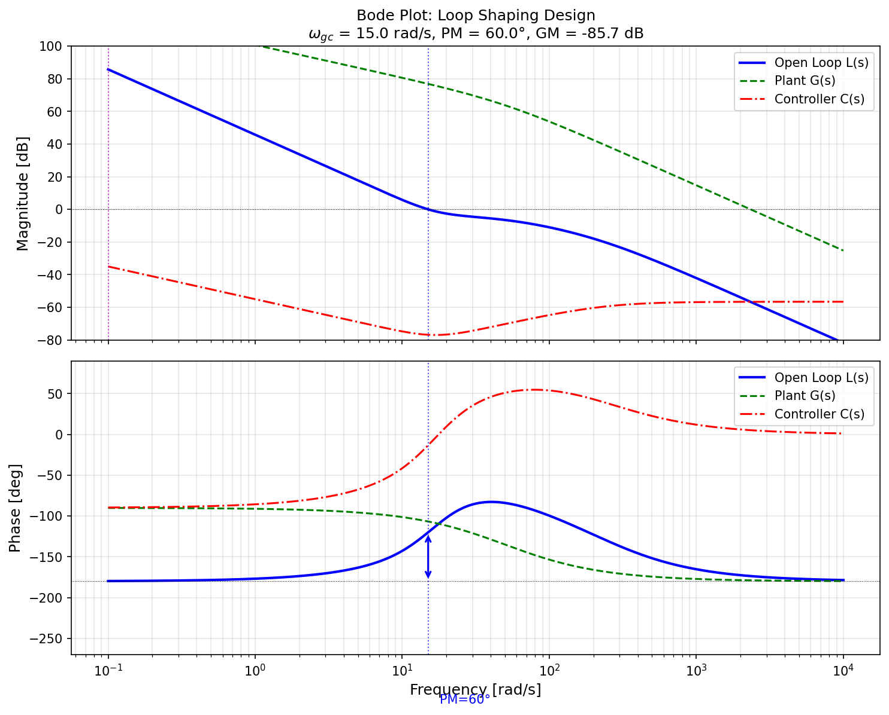
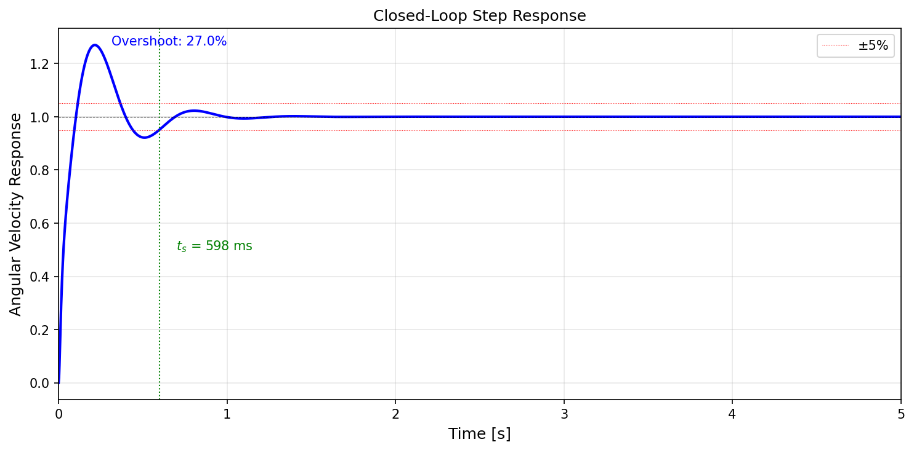

# StampFly 制御系設計

> **Note:** [English version follows after the Japanese section.](#english) / 日本語の後に英語版があります。

## 1. 概要

### このドキュメントについて

本ドキュメントは、StampFlyの制御系設計の数学的基礎を記述する。
マルチコプターの6自由度運動方程式、キネマティクス、姿勢表現について解説し、
シミュレータおよびファームウェアの実装根拠を示す。

### 座標系の定義

本ドキュメントでは **NED（North-East-Down）座標系** を採用する（右手系）：

```
慣性座標系 (Inertial Frame, I)        機体座標系 (Body Frame, B)

       X_I (北)                             X_B (前)
        ↑                                    ↑
        │                                    │
        │                                    │
        └──────→ Y_I (東)                    └──────→ Y_B (右)
         ╲                                    ╲
          ╲                                    ╲
           ↘                                    ↘
            Z_I (下)                             Z_B (下)
```

| 座標系 | 原点 | 軸 | 用途 |
|--------|------|-----|------|
| 慣性座標系 (I) | 地表の固定点 | X:北, Y:東, Z:下 | 位置・速度の記述 |
| 機体座標系 (B) | 機体重心 | X:前, Y:右, Z:下 | 力・モーメントの記述 |

**NED座標系の特徴：**
- 右手系（$\mathbf{X} \times \mathbf{Y} = \mathbf{Z}$）
- 高度が上がると $z$ は負になる
- 航空・ドローン分野で標準的に使用される

### 状態変数

| 記号 | 説明 | 座標系 | 単位 |
|------|------|--------|------|
| **位置** | | | |
| $x, y, z$ | 位置 | 慣性系 | m |
| **速度** | | | |
| $\dot{x}, \dot{y}, \dot{z}$ | 慣性系速度 | 慣性系 | m/s |
| $u, v, w$ | 機体系速度 | 機体系 | m/s |
| **姿勢** | | | |
| $\phi, \theta, \psi$ | オイラー角 (Roll, Pitch, Yaw) | - | rad |
| $q_0, q_1, q_2, q_3$ | クォータニオン | - | - |
| **角速度** | | | |
| $p, q, r$ | 機体角速度 | 機体系 | rad/s |

## 2. 6自由度運動方程式

### 並進運動方程式

機体座標系における並進運動方程式は、ニュートンの第2法則より：

$$
m\left(\frac{d\mathbf{V}_B}{dt} + \boldsymbol{\omega} \times \mathbf{V}_B\right) = \mathbf{F}_B
$$

ここで：
- $m$ : 機体質量 [kg]
- $\mathbf{V}_B = [u, v, w]^\top$ : 機体系速度ベクトル [m/s]
- $\boldsymbol{\omega} = [p, q, r]^\top$ : 機体角速度ベクトル [rad/s]
- $\mathbf{F}_B$ : 機体系に作用する力 [N]

成分で展開すると：

$$
\begin{align}
m(\dot{u} + qw - rv) &= F_x \\
m(\dot{v} + ru - pw) &= F_y \\
m(\dot{w} + pv - qu) &= F_z
\end{align}
$$

整理して：

$$
\begin{align}
\dot{u} &= \frac{F_x}{m} - qw + rv \\
\dot{v} &= \frac{F_y}{m} - ru + pw \\
\dot{w} &= \frac{F_z}{m} - pv + qu
\end{align}
$$

行列形式：

$$
\begin{bmatrix} \dot{u} \\ \dot{v} \\ \dot{w} \end{bmatrix} =
\frac{1}{m}\begin{bmatrix} F_x \\ F_y \\ F_z \end{bmatrix} -
\begin{bmatrix} 0 & -r & q \\ r & 0 & -p \\ -q & p & 0 \end{bmatrix}
\begin{bmatrix} u \\ v \\ w \end{bmatrix}
$$

### 回転運動方程式

機体座標系における回転運動方程式は、オイラーの運動方程式より：

$$
\mathbf{I}\frac{d\boldsymbol{\omega}}{dt} + \boldsymbol{\omega} \times (\mathbf{I}\boldsymbol{\omega}) = \boldsymbol{\tau}
$$

ここで：
- $\mathbf{I}$ : 慣性テンソル [kg·m²]
- $\boldsymbol{\tau} = [L, M, N]^\top$ : 機体系に作用するモーメント [N·m]

StampFlyは対称形状のため、慣性テンソルは対角行列：

$$
\mathbf{I} = \begin{bmatrix} I_{xx} & 0 & 0 \\ 0 & I_{yy} & 0 \\ 0 & 0 & I_{zz} \end{bmatrix}
$$

成分で展開すると：

$$
\begin{align}
I_{xx}\dot{p} + (I_{zz} - I_{yy})qr &= L \\
I_{yy}\dot{q} + (I_{xx} - I_{zz})pr &= M \\
I_{zz}\dot{r} + (I_{yy} - I_{xx})pq &= N
\end{align}
$$

整理して：

$$
\begin{align}
\dot{p} &= \frac{L - (I_{zz} - I_{yy})qr}{I_{xx}} \\
\dot{q} &= \frac{M - (I_{xx} - I_{zz})pr}{I_{yy}} \\
\dot{r} &= \frac{N - (I_{yy} - I_{xx})pq}{I_{zz}}
\end{align}
$$

### 作用する力とモーメント

#### 推力

4つのモーターからの合計推力（機体Z軸負方向＝上向き）：

$$
\mathbf{F}_{thrust} = \begin{bmatrix} 0 \\ 0 \\ -(T_1 + T_2 + T_3 + T_4) \end{bmatrix}
$$

各モーターの推力：

$$
T_i = C_t \omega_i^2
$$

| 記号 | 値 | 単位 | 説明 |
|------|-----|------|------|
| $C_t$ | $1.00 \times 10^{-8}$ | N/(rad/s)² | 推力係数 |

**注意（NED座標系）：** Z軸は下向きが正のため、上向きの推力は負の値となる。

#### 重力

慣性系での重力を機体系に変換：

$$
\mathbf{F}_{gravity}^I = \begin{bmatrix} 0 \\ 0 \\ mg \end{bmatrix} \quad \text{(NED: 下向きが正)}
$$

$$
\mathbf{F}_{gravity}^B = \mathbf{R}^\top \mathbf{F}_{gravity}^I
$$

ここで $\mathbf{R}^\top$ は慣性系から機体系への回転行列（DCMの転置）。

**注意（NED座標系）：** 重力は+Z方向（下向き）に作用する。

#### モーメント

各モーターが生成するモーメント：

$$
\boldsymbol{\tau}_{total} = \sum_i (\mathbf{r}_i \times \mathbf{F}_i) + \sum_i \boldsymbol{\tau}_{reaction,i}
$$

1. **推力によるモーメント（アーム長 × 推力）**

$$
\begin{align}
L &= d(T_3 + T_4 - T_1 - T_2) \quad \text{(Roll)} \\
M &= d(T_1 + T_4 - T_2 - T_3) \quad \text{(Pitch)}
\end{align}
$$

2. **反トルク（モーター回転の反作用）**

$$
N = C_q(\omega_2^2 + \omega_4^2 - \omega_1^2 - \omega_3^2) \quad \text{(Yaw)}
$$

| モーター | 位置 | 回転方向 | Roll寄与 | Pitch寄与 | Yaw寄与 |
|---------|------|---------|---------|----------|---------|
| M1 (FR) | (+,+) | CCW | - | + | + |
| M2 (RR) | (-,+) | CW | - | - | - |
| M3 (RL) | (-,-) | CCW | + | - | + |
| M4 (FL) | (+,-) | CW | + | + | - |

#### 空気抵抗

並進抵抗（速度の2乗に比例）：

$$
\begin{align}
F_{drag,u} &= -C_d \cdot \text{sign}(u) \cdot u^2 \\
F_{drag,v} &= -C_d \cdot \text{sign}(v) \cdot v^2 \\
F_{drag,w} &= -C_d \cdot \text{sign}(w) \cdot w^2
\end{align}
$$

回転抵抗（角速度の2乗に比例）：

$$
\begin{align}
\tau_{drag,p} &= -C_r \cdot \text{sign}(p) \cdot p^2 \\
\tau_{drag,q} &= -C_r \cdot \text{sign}(q) \cdot q^2 \\
\tau_{drag,r} &= -C_r \cdot \text{sign}(r) \cdot r^2
\end{align}
$$

| 記号 | 値 | 単位 | 説明 |
|------|-----|------|------|
| $C_d$ | 0.1 | - | 並進抗力係数 |
| $C_r$ | $1 \times 10^{-5}$ | - | 回転抗力係数 |

## 3. キネマティクス（位置・姿勢の算出）

### 位置の算出

慣性系位置は、機体系速度を回転行列で変換して積分：

$$
\begin{bmatrix} \dot{x} \\ \dot{y} \\ \dot{z} \end{bmatrix} =
\mathbf{R} \begin{bmatrix} u \\ v \\ w \end{bmatrix}
$$

ここで $\mathbf{R}$ は機体系から慣性系への回転行列（DCM: Direction Cosine Matrix）。

### 姿勢の算出

姿勢の時間発展には2つの表現方法がある。

## 4. 姿勢表現：オイラー角

### 定義

オイラー角は3つの連続回転で姿勢を表現する。
本システムでは **Z-Y-X（Yaw-Pitch-Roll）** 順序を採用：

1. $\psi$ (Yaw) : Z軸周りに回転
2. $\theta$ (Pitch) : Y軸周りに回転
3. $\phi$ (Roll) : X軸周りに回転

### 回転行列（DCM）

オイラー角から回転行列への変換：

$$
\mathbf{R} = \mathbf{R}_x(\phi) \cdot \mathbf{R}_y(\theta) \cdot \mathbf{R}_z(\psi)
$$

各軸周りの基本回転行列：

$$
\mathbf{R}_x(\phi) = \begin{bmatrix} 1 & 0 & 0 \\ 0 & \cos\phi & -\sin\phi \\ 0 & \sin\phi & \cos\phi \end{bmatrix}
$$

$$
\mathbf{R}_y(\theta) = \begin{bmatrix} \cos\theta & 0 & \sin\theta \\ 0 & 1 & 0 \\ -\sin\theta & 0 & \cos\theta \end{bmatrix}
$$

$$
\mathbf{R}_z(\psi) = \begin{bmatrix} \cos\psi & -\sin\psi & 0 \\ \sin\psi & \cos\psi & 0 \\ 0 & 0 & 1 \end{bmatrix}
$$

合成した回転行列（機体系→慣性系）：

$$
\mathbf{R} = \begin{bmatrix}
c_\theta c_\psi & c_\theta s_\psi & -s_\theta \\
s_\phi s_\theta c_\psi - c_\phi s_\psi & s_\phi s_\theta s_\psi + c_\phi c_\psi & s_\phi c_\theta \\
c_\phi s_\theta c_\psi + s_\phi s_\psi & c_\phi s_\theta s_\psi - s_\phi c_\psi & c_\phi c_\theta
\end{bmatrix}
$$

（$c_\phi = \cos\phi$, $s_\phi = \sin\phi$ の略記）

### オイラー角の時間微分

角速度 $[p, q, r]^\top$ からオイラー角の時間微分への変換：

$$
\begin{bmatrix} \dot{\phi} \\ \dot{\theta} \\ \dot{\psi} \end{bmatrix} =
\begin{bmatrix}
1 & \sin\phi\tan\theta & \cos\phi\tan\theta \\
0 & \cos\phi & -\sin\phi \\
0 & \sin\phi/\cos\theta & \cos\phi/\cos\theta
\end{bmatrix}
\begin{bmatrix} p \\ q \\ r \end{bmatrix}
$$

**注意：ジンバルロック**

$\theta = \pm 90°$ のとき $\cos\theta = 0$ となり、変換行列が特異になる。
これを **ジンバルロック** と呼び、オイラー角表現の根本的な制限である。

| 条件 | 問題 |
|------|------|
| $\theta \to \pm 90°$ | $\tan\theta \to \infty$, $1/\cos\theta \to \infty$ |
| 結果 | $\dot{\phi}, \dot{\psi}$ が発散、姿勢の一意性喪失 |

→ **解決策：クォータニオンを使用する**

## 5. 姿勢表現：クォータニオン

### 定義

クォータニオンは4つの成分で姿勢を表現する：

$$
\mathbf{q} = q_0 + q_1 i + q_2 j + q_3 k = [q_0, q_1, q_2, q_3]^\top
$$

ここで：
- $q_0$ : スカラー部（実部）
- $q_1, q_2, q_3$ : ベクトル部（虚部）
- 単位クォータニオン制約：$q_0^2 + q_1^2 + q_2^2 + q_3^2 = 1$

### 回転の幾何学的意味

単位クォータニオンは、軸 $\mathbf{n} = [n_x, n_y, n_z]^\top$ 周りの角度 $\theta$ の回転を表す：

$$
\begin{align}
q_0 &= \cos(\theta/2) \\
q_1 &= n_x \sin(\theta/2) \\
q_2 &= n_y \sin(\theta/2) \\
q_3 &= n_z \sin(\theta/2)
\end{align}
$$

### クォータニオンから回転行列への変換

$$
\mathbf{R} = \begin{bmatrix}
q_0^2+q_1^2-q_2^2-q_3^2 & 2(q_1 q_2 - q_0 q_3) & 2(q_1 q_3 + q_0 q_2) \\
2(q_1 q_2 + q_0 q_3) & q_0^2-q_1^2+q_2^2-q_3^2 & 2(q_2 q_3 - q_0 q_1) \\
2(q_1 q_3 - q_0 q_2) & 2(q_2 q_3 + q_0 q_1) & q_0^2-q_1^2-q_2^2+q_3^2
\end{bmatrix}
$$

### オイラー角からクォータニオンへの変換

$$
\begin{align}
q_0 &= \cos(\phi/2)\cos(\theta/2)\cos(\psi/2) + \sin(\phi/2)\sin(\theta/2)\sin(\psi/2) \\
q_1 &= \sin(\phi/2)\cos(\theta/2)\cos(\psi/2) - \cos(\phi/2)\sin(\theta/2)\sin(\psi/2) \\
q_2 &= \cos(\phi/2)\sin(\theta/2)\cos(\psi/2) + \sin(\phi/2)\cos(\theta/2)\sin(\psi/2) \\
q_3 &= \cos(\phi/2)\cos(\theta/2)\sin(\psi/2) - \sin(\phi/2)\sin(\theta/2)\cos(\psi/2)
\end{align}
$$

### クォータニオンからオイラー角への変換

$$
\begin{align}
\phi &= \text{atan2}(2(q_0 q_1 + q_2 q_3), q_0^2 - q_1^2 - q_2^2 + q_3^2) \\
\theta &= \arcsin(2(q_0 q_2 - q_1 q_3)) \\
\psi &= \text{atan2}(2(q_0 q_3 + q_1 q_2), q_0^2 + q_1^2 - q_2^2 - q_3^2)
\end{align}
$$

**注意：** $\arcsin$ の引数が $\pm 1$ を超える場合はクリッピングが必要。

### クォータニオンの時間微分

角速度 $[p, q, r]^\top$ からクォータニオンの時間微分：

$$
\begin{bmatrix} \dot{q}_0 \\ \dot{q}_1 \\ \dot{q}_2 \\ \dot{q}_3 \end{bmatrix} =
\frac{1}{2} \begin{bmatrix}
0 & -p & -q & -r \\
p & 0 & r & -q \\
q & -r & 0 & p \\
r & q & -p & 0
\end{bmatrix}
\begin{bmatrix} q_0 \\ q_1 \\ q_2 \\ q_3 \end{bmatrix}
$$

この微分方程式は **特異点を持たない**（ジンバルロックが発生しない）。

### 正規化

数値積分の誤差蓄積により単位制約が崩れるため、各ステップで正規化：

$$
\mathbf{q} \leftarrow \frac{\mathbf{q}}{|\mathbf{q}|}
$$

### オイラー角とクォータニオンの比較

| 項目 | オイラー角 | クォータニオン |
|------|-----------|---------------|
| パラメータ数 | 3 | 4 |
| 特異点 | あり（ジンバルロック） | なし |
| 直感性 | 高い（角度で理解しやすい） | 低い |
| 計算コスト | 三角関数多用 | 乗算主体 |
| 補間 | 困難 | SLERP可能 |
| 制約 | なし | $\|\mathbf{q}\| = 1$ |
| 用途 | 表示・入出力 | 内部演算・積分 |

**StampFlyでの使い分け：**
- 内部計算（シミュレータ・AHRS）：クォータニオン
- ユーザー表示・ログ出力：オイラー角に変換

## 6. DCモータモデル

### 概要

マルチコプターのアクチュエータであるDCモータ（ブラシレスDCモータ含む）の動特性をモデル化する。
最初に電気系・機械系の完全な微分方程式を導出し、最終的にインダクタンスを無視した近似モデルを示す。

### 等価回路

DCモータの電気系は以下の等価回路で表される：

```
    R          L
   ─┴─       ─┴─
──►│├───────►│├───────►┬────────
   ─┬─       ─┬─       │
    V_a                 │  ┌─────┐
    (印加電圧)           └──┤  e  │  逆起電力
                           │ =Kω │
                           └─────┘
```

### 記号の定義

| 記号 | 説明 | 単位 |
|------|------|------|
| $V_a$ | 印加電圧（Armature voltage） | V |
| $i$ | 電機子電流（Armature current） | A |
| $R$ | 電機子抵抗（Armature resistance） | Ω |
| $L$ | 電機子インダクタンス（Armature inductance） | H |
| $e$ | 逆起電力（Back-EMF） | V |
| $K_e$ | 逆起電力定数（Back-EMF constant） | V/(rad/s) |
| $K_t$ | トルク定数（Torque constant） | N·m/A |
| $\omega$ | 回転角速度（Angular velocity） | rad/s |
| $\tau_m$ | モータトルク（Motor torque） | N·m |
| $J_m$ | ロータ慣性モーメント（Rotor inertia） | kg·m² |
| $b$ | 粘性摩擦係数（Viscous friction） | N·m·s/rad |
| $\tau_L$ | 負荷トルク（Load torque） | N·m |

**注意：** 理想的なDCモータでは $K_e = K_t$ （SI単位系において）。

### 完全な微分方程式

#### 電気系の方程式

キルヒホッフの電圧則より、電機子回路の電圧方程式：

$$
V_a = Ri + L\frac{di}{dt} + e
$$

逆起電力は回転角速度に比例：

$$
e = K_e \omega
$$

したがって：

$$
L\frac{di}{dt} = V_a - Ri - K_e \omega
$$

整理して電流の微分方程式：

$$
\frac{di}{dt} = \frac{1}{L}(V_a - Ri - K_e \omega)
$$

#### 機械系の方程式

ニュートンの回転運動方程式より：

$$
J_m \frac{d\omega}{dt} = \tau_m - b\omega - \tau_L
$$

モータトルクは電流に比例：

$$
\tau_m = K_t i
$$

したがって：

$$
\frac{d\omega}{dt} = \frac{1}{J_m}(K_t i - b\omega - \tau_L)
$$

#### 状態方程式形式

状態変数 $\mathbf{x} = [i, \omega]^\top$、入力 $u = V_a$、外乱 $d = \tau_L$ として：

$$
\frac{d}{dt}\begin{bmatrix} i \\ \omega \end{bmatrix} =
\begin{bmatrix}
-\frac{R}{L} & -\frac{K_e}{L} \\
\frac{K_t}{J_m} & -\frac{b}{J_m}
\end{bmatrix}
\begin{bmatrix} i \\ \omega \end{bmatrix} +
\begin{bmatrix} \frac{1}{L} \\ 0 \end{bmatrix} V_a +
\begin{bmatrix} 0 \\ -\frac{1}{J_m} \end{bmatrix} \tau_L
$$

### 時定数の分析

DCモータには2つの時定数が存在する：

| 時定数 | 式 | 意味 |
|--------|-----|------|
| 電気時定数 | $\tau_e = \frac{L}{R}$ | 電流の応答速度 |
| 機械時定数 | $\tau_m = \frac{J_m R}{K_t K_e}$ | 回転速度の応答速度 |

一般的なDCモータでは：

$$
\tau_e \ll \tau_m
$$

（電気時定数は数ms、機械時定数は数十〜数百ms）

### インダクタンスを無視した近似モデル

#### 近似の妥当性

小型DCモータでは $\tau_e \ll \tau_m$ が成り立つため、電気系の過渡応答は機械系に比べて十分速い。
このとき、電流は瞬時に定常値に達すると仮定できる（準静的近似）：

$$
L\frac{di}{dt} \approx 0
$$

#### 簡略化された電気系

インダクタンスを無視すると：

$$
V_a = Ri + K_e \omega
$$

電流について解くと：

$$
i = \frac{V_a - K_e \omega}{R}
$$

#### 簡略化された機械系

電流の式を機械系に代入：

$$
J_m \frac{d\omega}{dt} = K_t \cdot \frac{V_a - K_e \omega}{R} - b\omega - \tau_L
$$

整理すると：

$$
J_m \frac{d\omega}{dt} = \frac{K_t}{R} V_a - \left(\frac{K_t K_e}{R} + b\right)\omega - \tau_L
$$

#### 1次遅れ系への帰着

負荷トルク $\tau_L = 0$ のとき、等価時定数と等価ゲインを定義：

$$
\tau_{eq} = \frac{J_m R}{K_t K_e + bR}
$$

$$
K_{eq} = \frac{K_t}{K_t K_e + bR}
$$

すると角速度の微分方程式は1次遅れ系となる：

$$
\tau_{eq} \frac{d\omega}{dt} + \omega = K_{eq} V_a
$$

#### 伝達関数

ラプラス変換すると：

$$
\frac{\Omega(s)}{V_a(s)} = \frac{K_{eq}}{\tau_{eq} s + 1}
$$

粘性摩擦が十分小さい場合（$bR \ll K_t K_e$）：

$$
\tau_{eq} \approx \frac{J_m R}{K_t K_e}, \quad K_{eq} \approx \frac{1}{K_e}
$$

### プロペラ負荷の考慮

マルチコプターでは、モータはプロペラを駆動する。プロペラの空力負荷トルクは角速度の2乗に比例：

$$
\tau_L = C_q \omega^2
$$

このとき微分方程式は：

$$
J_m \frac{d\omega}{dt} = \frac{K_t}{R}(V_a - K_e \omega) - b\omega - C_q \omega^2
$$

#### 定常状態

定常状態（$\frac{d\omega}{dt} = 0$）では：

$$
\frac{K_t}{R}(V_a - K_e \omega_{ss}) = b\omega_{ss} + C_q \omega_{ss}^2
$$

これは $\omega_{ss}$ についての2次方程式であり、与えられた電圧 $V_a$ に対する定常回転数を求められる。

### StampFlyでのモータパラメータ

| パラメータ | 記号 | 値 | 単位 |
|-----------|------|-----|------|
| モータ定数 | $K_t = K_e$ | 0.0042 | N·m/A, V/(rad/s) |
| 電機子抵抗 | $R$ | 0.5 | Ω |
| ロータ慣性 | $J_m$ | $1.0 \times 10^{-7}$ | kg·m² |
| 電気時定数 | $\tau_e$ | ~0.1 | ms (無視可能) |

**注意：** 実際のブラシレスDCモータはESC（電子速度コントローラ）で制御されるため、
より複雑な動特性を持つが、制御設計では上記の近似モデルで十分な場合が多い。

### まとめ

| モデル | 特徴 | 用途 |
|--------|------|------|
| 完全モデル（2次系） | 電気・機械両方の過渡応答を表現 | 高精度シミュレーション |
| 近似モデル（1次系） | インダクタンス無視、計算が簡単 | 制御設計、リアルタイムシミュレーション |

制御系設計では近似モデルで十分であり、StampFlyのシミュレータでもこの近似を採用している。

## 7. 線形化と伝達関数

### 概要

制御系設計では、非線形な運動方程式を平衡点周りで線形化し、伝達関数を用いて解析・設計を行う。
本セクションでは、ホバリング状態を平衡点として線形化を行い、角速度制御ループの伝達関数を導出する。

### ホバリング平衡点

ホバリング状態における平衡点を定義する：

| 状態変数 | 平衡値 | 説明 |
|---------|-------|------|
| $\phi_0, \theta_0, \psi_0$ | $0$ | 水平姿勢 |
| $p_0, q_0, r_0$ | $0$ | 角速度ゼロ |
| $u_0, v_0, w_0$ | $0$ | 機体速度ゼロ |
| $T_0$ | $mg/4$ | 各モータの推力（重力釣り合い） |
| $\omega_{m0}$ | $\sqrt{mg/(4C_t)}$ | 各モータの回転速度 |

### 回転運動方程式の線形化

#### 非線形方程式

セクション2で導出した回転運動方程式：

$$
\begin{align}
\dot{p} &= \frac{L - (I_{zz} - I_{yy})qr}{I_{xx}} \\
\dot{q} &= \frac{M - (I_{xx} - I_{zz})pr}{I_{yy}} \\
\dot{r} &= \frac{N - (I_{yy} - I_{xx})pq}{I_{zz}}
\end{align}
$$

#### 小摂動の仮定

平衡点周りの小摂動を仮定：

$$
p = p_0 + \delta p, \quad q = q_0 + \delta q, \quad r = r_0 + \delta r
$$

平衡点 $(p_0, q_0, r_0) = (0, 0, 0)$ において、2次の微小項 $qr$, $pr$, $pq$ を無視すると：

$$
\begin{align}
\delta\dot{p} &= \frac{\delta L}{I_{xx}} \\
\delta\dot{q} &= \frac{\delta M}{I_{yy}} \\
\delta\dot{r} &= \frac{\delta N}{I_{zz}}
\end{align}
$$

#### 線形化されたモーメント

モーメントの摂動は推力の摂動で表される：

$$
\begin{align}
\delta L &= d(\delta T_3 + \delta T_4 - \delta T_1 - \delta T_2) \\
\delta M &= d(\delta T_1 + \delta T_4 - \delta T_2 - \delta T_3) \\
\delta N &= C_q(2\omega_{m0})(\delta\omega_2 + \delta\omega_4 - \delta\omega_1 - \delta\omega_3)
\end{align}
$$

推力の線形化（$T_i = C_t \omega_i^2$ より）：

$$
\delta T_i = 2 C_t \omega_{m0} \cdot \delta\omega_i = k_T \cdot \delta\omega_i
$$

ここで $k_T = 2 C_t \omega_{m0}$ は推力ゲイン。

### システム構成

制御系設計では、以下のシステム構成を想定する：

```
┌────────────────────────────────────────────────────────────────────────┐
│                        プラント（制御対象）                              │
│                                                                        │
│  [u_T]     ┌─────────┐  [T_i]  ┌─────────┐  [ω_mi]  ┌──────────┐      │
│  [u_φ] ───►│ミキサー │────────►│ モータ  │────────►│  機体    │───►[p]│
│  [u_θ]    │ M^(-1)  │  [N]   │ 動特性  │ [rad/s] │ダイナミ  │   [q]│
│  [u_ψ]    └─────────┘        │ 1次遅れ │         │  クス    │   [r]│
│ [N,N·m]                       └─────────┘         └──────────┘      │
└────────────────────────────────────────────────────────────────────────┘
```

- **入力**：全推力 $u_T$ [N] およびモーメント $u_\phi, u_\theta, u_\psi$ [N·m]
- **出力**：機体角速度 $p, q, r$ [rad/s]

### 制御入力の定義

物理的意味を持つ仮想制御入力を定義する：

| 入力 | 記号 | 次元 | 説明 |
|------|------|------|------|
| 全推力 | $u_T$ | N | 4モーターの推力合計 |
| ロールモーメント | $u_\phi$ | N·m | X軸（前方）周りのモーメント |
| ピッチモーメント | $u_\theta$ | N·m | Y軸（右方）周りのモーメント |
| ヨーモーメント | $u_\psi$ | N·m | Z軸（下方）周りのモーメント |

### 制御アロケーション（ミキサー）

#### 推力から制御入力への変換

各モーターの推力 $T_i$ [N] から仮想制御入力への変換（一般形）：

$$
\begin{bmatrix} u_T \\ u_\phi \\ u_\theta \\ u_\psi \end{bmatrix} =
\underbrace{
\begin{bmatrix}
1 & 1 & 1 & 1 \\
y_1 & y_2 & y_3 & y_4 \\
-x_1 & -x_2 & -x_3 & -x_4 \\
\sigma_1 \kappa & \sigma_2 \kappa & \sigma_3 \kappa & \sigma_4 \kappa
\end{bmatrix}
}_{\mathbf{M}}
\begin{bmatrix} T_1 \\ T_2 \\ T_3 \\ T_4 \end{bmatrix}
$$

ここで：
- $(x_i, y_i)$：各モーターの重心からの座標 [m]
- $\sigma_i$：回転方向（CCW: +1, CW: -1）
- $\kappa = C_q / C_t = 9.71 \times 10^{-3}$：トルク/推力比

**対称X配置**（StampFly標準）では $(x_i, y_i) = (\pm d, \pm d)$ となり：

$$
\mathbf{M} = \begin{bmatrix}
1 & 1 & 1 & 1 \\
-d & -d & +d & +d \\
+d & -d & -d & +d \\
+\kappa & -\kappa & +\kappa & -\kappa
\end{bmatrix}
$$

- $d = 0.023$ m：モーメントアーム（X/Y座標オフセット）

#### ミキサー行列（逆変換）

仮想制御入力から各モーター推力への分配（制御アロケーション）：

$$
\begin{bmatrix} T_1 \\ T_2 \\ T_3 \\ T_4 \end{bmatrix} =
\mathbf{M}^{-1}
\begin{bmatrix} u_T \\ u_\phi \\ u_\theta \\ u_\psi \end{bmatrix}
= \frac{1}{4}
\begin{bmatrix}
1 & -1/d & +1/d & +1/\kappa \\
1 & -1/d & -1/d & -1/\kappa \\
1 & +1/d & -1/d & +1/\kappa \\
1 & +1/d & +1/d & -1/\kappa
\end{bmatrix}
\begin{bmatrix} u_T \\ u_\phi \\ u_\theta \\ u_\psi \end{bmatrix}
$$

| モーター | 位置 | 回転方向 | 推力 $T_i$ |
|---------|------|---------|-----------|
| M1 | FR (前右) | CCW | $\frac{1}{4}(u_T - \frac{u_\phi}{d} + \frac{u_\theta}{d} + \frac{u_\psi}{\kappa})$ |
| M2 | RR (後右) | CW | $\frac{1}{4}(u_T - \frac{u_\phi}{d} - \frac{u_\theta}{d} - \frac{u_\psi}{\kappa})$ |
| M3 | RL (後左) | CCW | $\frac{1}{4}(u_T + \frac{u_\phi}{d} - \frac{u_\theta}{d} + \frac{u_\psi}{\kappa})$ |
| M4 | FL (前左) | CW | $\frac{1}{4}(u_T + \frac{u_\phi}{d} + \frac{u_\theta}{d} - \frac{u_\psi}{\kappa})$ |

### モータダイナミクス

#### 所望推力の定義

ミキサー出力 $T_{i,cmd}$ は「所望推力」であり、以下の関係で定義される：

```
┌───────────────────────────────────────────────────────────────────────┐
│                         所望推力の定義                                 │
│                                                                       │
│  Duty δ ──→ 電圧 V = δ·V_bat ──→ 定常回転数 ω_ss ──→ 所望推力 T_d    │
│              (即時)          (V-ω特性から)       (T_d = C_t·ω_ss²)   │
└───────────────────────────────────────────────────────────────────────┘
```

- **Duty $\delta$**：PWMデューティ比（0〜1の無次元量）
- **電圧 $V$**：モータ印加電圧 $V = \delta \cdot V_{bat}$
- **定常回転数 $\omega_{ss}$**：電圧 $V$ で定常状態に達したときの回転数
- **所望推力 $T_d$**：定常回転数で得られる推力 $T_d = C_t \omega_{ss}^2$

#### 所望推力から実推力への伝達関数

モータの慣性により、実際の回転数 $\omega$ は定常回転数 $\omega_{ss}$ に1次遅れで追従する。
この関係から、所望推力から実推力への伝達関数を導出する。

**推力と回転数の関係（定常）：**

$$
T = C_t \omega^2
$$

**ホバリング点での線形化：**

$$
\delta T = 2 C_t \omega_{m0} \cdot \delta\omega = k_T \cdot \delta\omega
$$

$$
\delta T_d = k_T \cdot \delta\omega_{ss}
$$

**回転数のモータ動特性（セクション6より）：**

$$
\frac{\delta\Omega(s)}{\delta\Omega_{ss}(s)} = \frac{1}{\tau_m s + 1}
$$

**推力への変換：**

$$
\frac{\delta T(s)}{\delta T_d(s)} = \frac{k_T \cdot \delta\Omega(s)}{k_T \cdot \delta\Omega_{ss}(s)} = \frac{1}{\tau_m s + 1}
$$

$k_T$ が相殺され、**所望推力から実推力への伝達関数は単純な1次遅れ**となる：

$$
G_T(s) = \frac{T(s)}{T_{cmd}(s)} = \frac{1}{\tau_m s + 1}
$$

ここで $\tau_m = 0.02$ s はモータ時定数（推定値）。

```
┌───────────────────────────────────────────────────────────────────────┐
│                         実推力への遷移                                 │
│                                                                       │
│  所望推力 T_d ────────────────────────────────────────→ 実推力 T      │
│              │                                          ↑            │
│              └──→ ω_ss ──→ 1/(τm·s+1) ──→ ω ──→ C_t·ω² ─┘            │
│                                                                       │
│              （k_T が相殺されて単純な1次遅れに帰着）                    │
└───────────────────────────────────────────────────────────────────────┘
```

### 角速度制御ループの伝達関数

モーメント入力から角速度出力への伝達関数を導出する。
ミキサーと機体ダイナミクスを合わせたプラントを考える。

#### ロール軸の伝達関数

ロールモーメント $u_\phi$ [N·m] から角速度 $p$ [rad/s] への伝達関数：

**回転運動方程式（線形化後）：**

$$
I_{xx} \dot{p} = L
$$

ミキサーを経由して実際に発生するモーメント $L$ は、所望モーメント $u_\phi$ に対してモータの1次遅れを伴う：

$$
L(s) = \frac{1}{\tau_m s + 1} U_\phi(s)
$$

**角速度ダイナミクス（ラプラス変換）：**

$$
s \cdot P(s) = \frac{L(s)}{I_{xx}} = \frac{U_\phi(s)}{I_{xx}(\tau_m s + 1)}
$$

**全体の伝達関数：**

$$
G_p(s) = \frac{P(s)}{U_\phi(s)} = \frac{1/I_{xx}}{s(\tau_m s + 1)} \quad [\mathrm{rad/s \cdot (N \cdot m)^{-1}}]
$$

#### ピッチ軸の伝達関数

同様に、ピッチモーメント $u_\theta$ [N·m] から角速度 $q$ [rad/s] への伝達関数：

$$
G_q(s) = \frac{Q(s)}{U_\theta(s)} = \frac{1/I_{yy}}{s(\tau_m s + 1)} \quad [\mathrm{rad/s \cdot (N \cdot m)^{-1}}]
$$

#### ヨー軸の伝達関数

ヨーモーメント $u_\psi$ [N·m] から角速度 $r$ [rad/s] への伝達関数：

$$
G_r(s) = \frac{R(s)}{U_\psi(s)} = \frac{1/I_{zz}}{s(\tau_m s + 1)} \quad [\mathrm{rad/s \cdot (N \cdot m)^{-1}}]
$$

#### 伝達関数の構造

各軸の角速度伝達関数は **積分器とモータ1次遅れの直列結合** となる：

```
                    ┌─────────────┐     ┌─────────┐
  u [N·m] ──────────►│   Motor     │────►│ 1/I·s   │────► ω [rad/s]
                    │ 1/(τm·s+1)  │     │(積分器) │
                    └─────────────┘     └─────────┘
```

この構造は、角加速度がモーメントに比例し、角速度はその積分であることを反映している。
伝達関数のゲインは $1/I$ [1/(kg·m²)] であり、慣性モーメントのみで決まる。

### 姿勢角への拡張

#### 角速度から姿勢角への関係

小角度の仮定のもと、オイラー角と角速度の関係は単純化される：

$$
\dot{\phi} \approx p, \quad \dot{\theta} \approx q, \quad \dot{\psi} \approx r
$$

したがって、角速度から姿勢角への伝達関数は積分器：

$$
\frac{\Phi(s)}{P(s)} = \frac{1}{s}, \quad \frac{\Theta(s)}{Q(s)} = \frac{1}{s}, \quad \frac{\Psi(s)}{R(s)} = \frac{1}{s}
$$

#### 姿勢角制御ループの伝達関数

モーメント入力から姿勢角までの全体伝達関数（ロール軸の例）：

$$
G_\phi(s) = \frac{\Phi(s)}{U_\phi(s)} = \frac{1/I_{xx}}{s^2(\tau_m s + 1)} \quad [\mathrm{rad \cdot (N \cdot m)^{-1}}]
$$

これは **2次積分器とモータ1次遅れの直列結合** であり、開ループでは不安定である。
安定化にはフィードバック制御（PIDなど）が必要となる。

### 制御設計への応用

#### ブロック線図

角速度制御ループ（レートモード）のブロック線図：

```
              ┌─────────────────────────────────────────┐
              │            角速度制御ループ              │
              │                                         │
 ω_cmd  ──►(+)───►│Controller│───►│Motor│───►│1/I·s│───┬──► ω
           -↑     │  C(s)    │    │G_m(s)│   │     │   │
            │     └──────────┘    └──────┘   └─────┘   │
            │                                          │
            └──────────────────────────────────────────┘
                              （角速度フィードバック）
```

#### PID制御器設計の指針

| パラメータ | 設計指針 |
|-----------|---------|
| $K_p$ (比例ゲイン) | 応答速度を決定。モータ時定数 $\tau_m$ を考慮 |
| $K_i$ (積分ゲイン) | 定常偏差を除去。ただし積分器が既に存在するため注意 |
| $K_d$ (微分ゲイン) | ダンピングを追加。モータ遅れを補償 |

**注意：** プラントに積分器が含まれるため、I制御の追加は慎重に行う必要がある。
典型的には PD または P 制御で設計し、外乱補償が必要な場合のみ I を追加する。

### パラメータ（StampFly実機値）

以下のパラメータは `docs/architecture/stampfly-parameters.md` より転載。

#### 機体パラメータ

| パラメータ | 記号 | 値 | 単位 | 備考 |
|-----------|------|-----|------|------|
| 機体質量 | $m$ | 0.035 | kg | バッテリー込み |
| Roll慣性モーメント | $I_{xx}$ | $9.16 \times 10^{-6}$ | kg·m² | |
| Pitch慣性モーメント | $I_{yy}$ | $13.3 \times 10^{-6}$ | kg·m² | |
| Yaw慣性モーメント | $I_{zz}$ | $20.4 \times 10^{-6}$ | kg·m² | |
| アーム長（半径） | $r$ | 0.0325 | m | 中心→モーター |
| モーメントアーム | $d$ | 0.023 | m | X/Y座標オフセット（$d = r/\sqrt{2}$） |

#### モーター・プロペラパラメータ

| パラメータ | 記号 | 値 | 単位 | 備考 |
|-----------|------|-----|------|------|
| 推力係数 | $C_t$ | $1.00 \times 10^{-8}$ | N/(rad/s)² | $T = C_t \omega^2$ |
| トルク係数 | $C_q$ | $9.71 \times 10^{-11}$ | N·m/(rad/s)² | $Q = C_q \omega^2$ |
| 電圧-回転数 2次係数 | $A_m$ | $5.39 \times 10^{-8}$ | V/(rad/s)² | 実験同定 |
| 電圧-回転数 1次係数 | $B_m$ | $6.33 \times 10^{-4}$ | V/(rad/s) | 実験同定 |
| バッテリー電圧 | $V_{bat}$ | 3.7 | V | 公称値 |
| モータ時定数 | $\tau_m$ | 0.02 | s | 推定値 |

#### ホバリング条件

| パラメータ | 記号 | 値 | 単位 | 計算式 |
|-----------|------|-----|------|--------|
| 1モーターあたり推力 | $T_0$ | 0.0858 | N | $mg/4$ |
| ホバリング角速度 | $\omega_{m0}$ | 2930 | rad/s | $\sqrt{T_0/C_t}$ |
| ホバリング電圧 | $V_0$ | 2.1 | V | 実測 |

### 数値計算例

上記パラメータを用いて、具体的な伝達関数を導出する。

#### 各軸の伝達関数ゲイン

モーメント入力から角速度出力への伝達関数ゲインは慣性モーメントの逆数：

$$
\frac{1}{I_{xx}} = \frac{1}{9.16 \times 10^{-6}} = 1.09 \times 10^{5} \quad \mathrm{[1/(kg \cdot m^2)]}
$$

$$
\frac{1}{I_{yy}} = \frac{1}{13.3 \times 10^{-6}} = 7.52 \times 10^{4} \quad \mathrm{[1/(kg \cdot m^2)]}
$$

$$
\frac{1}{I_{zz}} = \frac{1}{20.4 \times 10^{-6}} = 4.90 \times 10^{4} \quad \mathrm{[1/(kg \cdot m^2)]}
$$

#### 数値入り伝達関数

**ロール軸（$u_\phi \to p$）：**

$$
G_p(s) = \frac{1.09 \times 10^{5}}{s(0.02s + 1)} = \frac{5.45 \times 10^{6}}{s(s + 50)} \quad [\mathrm{rad/s \cdot (N \cdot m)^{-1}}]
$$

**ピッチ軸（$u_\theta \to q$）：**

$$
G_q(s) = \frac{7.52 \times 10^{4}}{s(0.02s + 1)} = \frac{3.76 \times 10^{6}}{s(s + 50)} \quad [\mathrm{rad/s \cdot (N \cdot m)^{-1}}]
$$

**ヨー軸（$u_\psi \to r$）：**

$$
G_r(s) = \frac{4.90 \times 10^{4}}{s(0.02s + 1)} = \frac{2.45 \times 10^{6}}{s(s + 50)} \quad [\mathrm{rad/s \cdot (N \cdot m)^{-1}}]
$$

#### 参考：ミキサーゲインの導出

制御割り当て（ミキサー）の設計に必要なパラメータを参考として記載する。

電圧-回転数特性 $V = A_m \omega^2 + B_m \omega + C_m$ をホバリング点で線形化：

$$
\frac{dV}{d\omega}\bigg|_{\omega_{m0}} = 2 A_m \omega_{m0} + B_m = 2 \times 5.39 \times 10^{-8} \times 2930 + 6.33 \times 10^{-4} = 9.49 \times 10^{-4} \text{ V/(rad/s)}
$$

PWMデューティ $\delta$（0〜1）から回転数への定常ゲイン：

$$
K_m = \frac{V_{bat}}{dV/d\omega} = \frac{3.7}{9.49 \times 10^{-4}} = 3900 \text{ rad/s}
$$

推力ゲイン（回転数変化に対する推力変化）：

$$
k_T = 2 C_t \omega_{m0} = 2 \times 1.00 \times 10^{-8} \times 2930 = 5.86 \times 10^{-5} \text{ N/(rad/s)}
$$

#### 特性まとめ

| 軸 | ゲイン $1/I$ [rad/s / N·m·s] | 極 | 特徴 |
|----|------------------------------|-----|------|
| Roll | $1.09 \times 10^{5}$ | $s=0, -50$ | 積分器 + 時定数20ms |
| Pitch | $7.52 \times 10^{4}$ | $s=0, -50$ | Rollの約69%（$I_{yy} > I_{xx}$） |
| Yaw | $4.90 \times 10^{4}$ | $s=0, -50$ | Rollの約45% |

**考察：**

1. **Roll vs Pitch の差異**：$I_{yy} > I_{xx}$ のため、同じモーメントを加えてもピッチ軸はロール軸より角加速度が小さい。
   これは機体形状の非対称性（前後方向が長い）に起因する。

2. **Yaw軸のゲイン**：$I_{zz}$ が最大のため、同じモーメントに対する応答が最も遅い。

3. **制御設計への示唆**：モーメント入力を基準とした設計では、各軸のプラントゲインは慣性モーメントのみで決まる。
   制御器設計時は各軸の慣性モーメントの違いを考慮してゲイン調整を行う。

### ループ整形法による制御系設計

#### 開ループ伝達関数

フィードバック制御系において、**開ループ伝達関数** $L(s)$ は制御器 $C(s)$ とプラント $G(s)$ の積として定義される：

$$
L(s) = C(s) \cdot G(s)
$$

```
         ┌───────────────────────────────────────┐
         │           開ループ L(s)                │
         │                                       │
 r ──►(+)───►│ C(s) │───►│ G(s) │───┬──► y
      -↑     └──────┘    └──────┘   │
       │         制御器      プラント    │
       └────────────────────────────┘
                   フィードバック
```

閉ループ伝達関数は開ループ伝達関数を用いて表される：

$$
T(s) = \frac{L(s)}{1 + L(s)} = \frac{C(s)G(s)}{1 + C(s)G(s)}
$$

#### ループ整形法の基本思想

ループ整形法は、**開ループ伝達関数 $L(s)$ のボード線図を理想的な形に整形する**ことで、
閉ループ系の安定性と性能を同時に達成する設計法である。

#### なぜ開ループで設計するのか

| 理由 | 説明 |
|------|------|
| 安定性の判別が容易 | ナイキストの安定判別法により、開ループ特性から閉ループの安定性を直接判断できる |
| 設計指針が明確 | ゲイン余裕・位相余裕という直感的な指標で設計できる |
| 制御器の効果が分離可能 | $L(s) = C(s)G(s)$ より、制御器の寄与を独立に評価できる |

#### 理想的な開ループ特性

良好な制御性能を実現するため、開ループ伝達関数 $L(j\omega)$ は以下の特性を持つべきである：

| 周波数域 | 条件 | 目的 | 実現方法 |
|----------|------|------|----------|
| 低周波域（$\omega \ll \omega_{gc}$） | $\|L(j\omega)\| \gg 1$ | 定常偏差を小さくし、低周波外乱を抑制 | 積分器（$1/s$）を含める |
| ゲイン交差付近（$\omega \approx \omega_{gc}$） | $\|L(j\omega_{gc})\| = 1$（0 dB） | 滑らかにゲインが1を横切り、位相余裕を確保 | −20 dB/dec（1次系）の傾き |
| 高周波域（$\omega \gg \omega_{gc}$） | $\|L(j\omega)\| \ll 1$ | 高周波ノイズ・モデル化誤差の影響を抑制 | 高周波ロールオフ |

```
  ゲイン [dB]
      │
   40 ┤         理想的な開ループ特性
      │    ╲
   20 ┤     ╲  ← 低周波：高ゲイン（外乱抑制）
      │      ╲
    0 ┼───────╳──────────────────→ ω
      │        ╲  ← ω_gc で 0dB を横切る
  -20 ┤         ╲    （傾き -20dB/dec が理想）
      │          ╲
  -40 ┤           ╲ ← 高周波：低ゲイン（ノイズ抑制）
      │
```

#### 安定余裕の定義

開ループ特性から閉ループの安定性を評価する指標を以下に示す。

| 指標 | 定義式 | 安定条件 | 意味 |
|------|--------|----------|------|
| ゲイン交差周波数 $\omega_{gc}$ | $\|L(j\omega_{gc})\| = 1$（0 dB） | - | 開ループゲインが1となる周波数。制御帯域の目安 |
| 位相余裕 $\phi_m$ | $\phi_m = 180° + \angle L(j\omega_{gc})$ | $\phi_m > 0$ | ゲイン交差周波数における位相と−180°との差 |
| ゲイン余裕 $G_m$ | $G_m = 1/\|L(j\omega_{pc})\|$（$\angle L(j\omega_{pc}) = -180°$） | $G_m > 1$（> 0 dB） | 位相交差周波数におけるゲインの逆数 |

```
  ゲイン [dB]
      │
   20 ┤
      │    ╲
    0 ┼─────╳───────────────────→ ω
      │      ↑╲
  -20 ┤      │  ╲        ゲイン余裕
      │   ω_gc  ╲    ┌──────┐
  -40 ┤          ╲   │      │
      │           ╲──┴──────╳─→
      │                     ↑
  位相 [deg]               ω_pc
      │
    0 ┤
      │
  -90 ┤        ╲
      │         ╲
 -120 ┼──────────╳─────────────→ ω
      │     ↑     ╲  位相余裕
 -180 ┤     │ φ_m  ╲────────────
      │   ω_gc      ╲
```

#### 制御器の役割

プラント $G(s)$ の特性を補償し、開ループ $L(s)$ を理想的な形に整形するのが制御器 $C(s)$ の役割である。

本システムのプラント：

$$
G(s) = \frac{1/I}{s(\tau_m s + 1)}
$$

| 要素 | 位相特性 |
|------|----------|
| 積分器（$1/s$） | 全周波数で−90°の位相遅れ |
| モータ遅れ（$1/(\tau_m s + 1)$） | 高周波で追加の位相遅れ |

プラント単体では位相余裕が不足するため、PID制御器で位相を補償する。

### PID制御器の設計

本節では、上記のループ整形の考え方に基づきPID制御器を設計する。

#### 不完全微分付きPID制御器

高周波ノイズの増幅を防ぐため、微分項にローパスフィルタを付加した不完全微分付きPID制御器を使用する：

$$
C(s) = K_p \left( 1 + \frac{1}{T_i s} + \frac{T_d s}{\eta T_d s + 1} \right)
$$

| パラメータ | 記号 | 説明 |
|-----------|------|------|
| 比例ゲイン | $K_p$ | 全体のゲイン調整 |
| 積分時間 | $T_i$ | 積分動作の時定数（$1/T_i$ に零点） |
| 微分時間 | $T_d$ | 微分動作の時定数（$1/T_d$ に零点） |
| 微分フィルタ係数 | $\eta$ | 微分の高周波ロールオフ（典型値: 0.1） |

**微分フィルタの効果：**

- $\eta = 0$：理想微分（実現不可、高周波ゲイン無限大）
- $\eta > 0$：周波数 $1/(\eta T_d)$ 以上でゲインが飽和
- 典型値 $\eta = 0.1$ では、微分ゲインは $1/\eta = 10$ 倍で飽和

#### ゲイン交差周波数の選定

ゲイン交差周波数 $\omega_{gc}$ は制御系の応答速度を決定する重要なパラメータである。
ここでは位相余裕の制約から $\omega_{gc}$ の上限を理論的に導出する。

#### 位相制約からの上限導出

**プラントの位相特性**

本システムのプラント：

$$
G(s) = \frac{1/I}{s(\tau_m s + 1)}
$$

$\omega_{gc}$ におけるプラント位相：

$$
\angle G(j\omega_{gc}) = -90° - \arctan(\tau_m \omega_{gc})
$$

第1項 $-90°$ は積分器による位相遅れ（全周波数で一定）、第2項はモータ遅れによる追加の位相遅れである。

**位相余裕の制約**

位相余裕 $\phi_m$ を確保するため、開ループ位相は $\omega_{gc}$ において：

$$
\angle L(j\omega_{gc}) = -180° + \phi_m
$$

開ループ $L = CG$ より、制御器が補償すべき位相は：

$$
\angle C(j\omega_{gc}) = -180° + \phi_m - \angle G(j\omega_{gc}) = -90° + \phi_m + \arctan(\tau_m \omega_{gc})
$$

**制御器位相の実現可能性**

不完全微分付きPID制御器の位相特性を分析する。各要素の位相寄与：

| 要素 | 位相寄与 | 特性 |
|------|---------|------|
| 比例項 | $0°$ | 周波数に依存しない |
| 積分項 $1/(T_i s)$ | $-90° + \arctan(T_i \omega)$ | 低周波で遅れ、高周波で0に漸近 |
| 微分項 $T_d s/(\eta T_d s + 1)$ | $\arctan(T_d \omega) - \arctan(\eta T_d \omega)$ | 位相進みを提供 |

微分項の最大位相進みは $\omega = 1/(T_d\sqrt{\eta})$ で生じ：

$$
\phi_{D,max} = \arctan\left(\frac{1-\eta}{2\sqrt{\eta}}\right)
$$

$\eta = 0.1$ のとき $\phi_{D,max} \approx 55°$。

**上限の導出**

制御器は積分項を含むため、$\omega_{gc}$ において正味の位相遅れを持つ（$\angle C < 0°$）。
設計が実現可能であるためには、要求される制御器位相が制御器の能力範囲内でなければならない。

$\phi_m = 60°$ の場合、要求される制御器位相：

$$
\angle C(j\omega_{gc}) = -30° + \arctan(\tau_m \omega_{gc})
$$

$\omega_{gc}$ を増加させると $\arctan(\tau_m \omega_{gc})$ が増加し、$\angle C$ が正方向に移動する。
しかし積分項の存在により、制御器位相には上限がある。

実現可能な設計では $\angle C \lesssim -10°$ 程度が限界である（積分の遅れと微分の進みのバランス）。
この制約から：

$$
-30° + \arctan(\tau_m \omega_{gc}) \lesssim -10°
$$

$$
\arctan(\tau_m \omega_{gc}) \lesssim 20°
$$

$$
\tau_m \omega_{gc} \lesssim \tan(20°) \approx 0.36
$$

$$
\omega_{gc} \lesssim 0.36 \cdot \omega_m
$$

ここで $\omega_m = 1/\tau_m = 50$ rad/s はモータ帯域幅である。

#### 選定結果

上記の理論的上限 $\omega_{gc} \lesssim 0.36 \cdot \omega_m \approx 18$ rad/s に対し、
設計マージンを考慮して $\omega_{gc} = 15$ rad/s を選定する：

| 項目 | 値 | 備考 |
|------|-----|------|
| モータ帯域幅 $\omega_m$ | 50 rad/s | $1/\tau_m$ |
| 理論的上限 | 18 rad/s | $0.36 \cdot \omega_m$ |
| 選定値 $\omega_{gc}$ | 15 rad/s | 上限の83%、十分なマージン |
| 帯域幅比 | 30% | $\omega_{gc}/\omega_m$ |

#### 位相余裕の妥当性

位相余裕 $\phi_m = 60°$ を設計目標とする。この値の妥当性を以下に示す。

| 位相余裕 $\phi_m$ | 特性 |
|------------------|------|
| < 30° | 振動的な応答、外乱に敏感 |
| 45° | 最小限の安定余裕 |
| **60°（本設計）** | 良好な安定余裕、適度な応答速度 |
| > 75° | 過度に保守的、応答が遅い |

| 観点 | $\phi_m = 60°$ での評価 |
|------|------------------------|
| 閉ループ特性 | $\zeta \approx \phi_m/100 = 0.6$、オーバーシュート約10% |
| ゲイン変動耐性 | 約2倍（6 dB）のゲイン変動まで安定性維持 |
| 実績 | フライトコントローラで $\phi_m = 50° \sim 70°$ が標準的 |

#### ループ整形による設計

**設計仕様**

| 項目 | 値 |
|------|-----|
| ゲイン交差周波数 $\omega_{gc}$ | 15 rad/s |
| 位相余裕 $\phi_m$ | 60° |
| 微分フィルタ係数 $\eta$ | 0.1 |

**プラント特性（ロール軸）**

$$
G(s) = \frac{1/I_{xx}}{s(\tau_m s + 1)} = \frac{1.09 \times 10^5}{s(0.02s + 1)}
$$

$\omega_{gc} = 15$ rad/s におけるプラント特性：

| 項目 | 値 |
|------|-----|
| ゲイン | 76.9 dB |
| 位相 | −106.7° |

**必要な制御器位相**

位相余裕60°を達成するため、開ループ位相が $-120°$ となる必要がある：

$$
\angle C(j\omega_{gc}) = -120° - (-106.7°) = -13.3°
$$

制御器は $\omega_{gc}$ において約13°の位相遅れを持つ必要がある。

**設計結果**

最適化により以下のパラメータを得る：

| パラメータ | 値 | 単位 |
|-----------|-----|------|
| $K_p$ | $1.34 \times 10^{-4}$ | - |
| $T_i$ | 0.0756 | s |
| $T_d$ | 0.0426 | s |
| $\eta$ | 0.1 | - |

#### ボード線図



| 線種 | 説明 |
|------|------|
| 青実線 | 開ループ伝達関数 $L(s) = C(s)G(s)$ |
| 緑破線 | プラント $G(s)$ |
| 赤一点鎖線 | 制御器 $C(s)$ |
| 縦点線 | ゲイン交差周波数 $\omega_{gc} = 15$ rad/s |

**設計検証：**

| 項目 | 設計目標 | 達成値 |
|------|---------|-------|
| ゲイン交差周波数 | 15 rad/s | 15.0 rad/s |
| 位相余裕 | 60° | 60.0° |

#### ステップ応答



閉ループ系のステップ応答を示す。位相余裕60°の設計により、適度なオーバーシュートと速い収束を実現している。

#### 各軸のPIDパラメータ

プラントゲインは慣性モーメントの逆数であるため、各軸の $K_p$ は慣性モーメント比で調整する：

$$
K_{p,pitch} = K_{p,roll} \times \frac{I_{xx}}{I_{yy}}, \quad
K_{p,yaw} = K_{p,roll} \times \frac{I_{xx}}{I_{zz}}
$$

| 軸 | $K_p$ | $T_i$ [s] | $T_d$ [s] | $\eta$ |
|----|-------|-----------|-----------|--------|
| Roll | $1.34 \times 10^{-4}$ | 0.0756 | 0.0426 | 0.1 |
| Pitch | $9.2 \times 10^{-5}$ | 0.0756 | 0.0426 | 0.1 |
| Yaw | $6.0 \times 10^{-5}$ | 0.0756 | 0.0426 | 0.1 |

**注意：** $T_i$, $T_d$, $\eta$ は全軸共通。$K_p$ のみ慣性モーメント比で調整。

#### 離散時間実装

制御周期 $T_s$ での離散時間実装：

**積分項（台形積分）：**

$$
u_i[k] = u_i[k-1] + \frac{K_p}{T_i} \cdot \frac{T_s}{2}(e[k] + e[k-1])
$$

**微分項（双一次変換）：**

$$
u_d[k] = \frac{2\eta T_d - T_s}{2\eta T_d + T_s} u_d[k-1] + \frac{2 K_p T_d}{2\eta T_d + T_s}(e[k] - e[k-1])
$$

**全体：**

$$
u[k] = K_p \cdot e[k] + u_i[k] + u_d[k]
$$

## 8. 実装リファレンス

### シミュレータコード

| 機能 | ファイル | クラス/関数 |
|------|---------|------------|
| 剛体運動 | `simulator/core/physics.py` | `rigidbody` |
| マルチコプター | `simulator/core/dynamics.py` | `multicopter` |
| モーター | `simulator/core/motors.py` | `motor_prop` |

### 主要メソッド

```python
# physics.py
rigidbody.uvw_dot()      # 並進加速度
rigidbody.pqr_dot()      # 角加速度
rigidbody.quat_dot()     # クォータニオン微分
rigidbody.position_dot() # 速度→位置
rigidbody.step()         # RK4積分

# 座標変換
rigidbody.quat_dcm()     # クォータニオン→DCM
rigidbody.euler2quat()   # オイラー角→クォータニオン
rigidbody.quat2euler()   # クォータニオン→オイラー角
```

---

<a id="english"></a>

## 1. Overview

### About This Document

This document describes the mathematical foundations of StampFly's control system design.
It covers the 6-DOF equations of motion, kinematics, and attitude representations,
providing the rationale for simulator and firmware implementations.

### Coordinate System Definitions

This document adopts the **NED (North-East-Down) coordinate system** (right-handed):

```
Inertial Frame (I)                    Body Frame (B)

       X_I (North)                          X_B (Front)
        ↑                                    ↑
        │                                    │
        │                                    │
        └──────→ Y_I (East)                  └──────→ Y_B (Right)
         ╲                                    ╲
          ╲                                    ╲
           ↘                                    ↘
            Z_I (Down)                           Z_B (Down)
```

| Frame | Origin | Axes | Usage |
|-------|--------|------|-------|
| Inertial (I) | Fixed point on ground | X:North, Y:East, Z:Down | Position, velocity |
| Body (B) | Vehicle CG | X:Front, Y:Right, Z:Down | Forces, moments |

**NED Coordinate System Characteristics:**
- Right-handed ($\mathbf{X} \times \mathbf{Y} = \mathbf{Z}$)
- Altitude increase results in negative $z$
- Standard in aviation and drone applications

### State Variables

| Symbol | Description | Frame | Unit |
|--------|-------------|-------|------|
| **Position** | | | |
| $x, y, z$ | Position | Inertial | m |
| **Velocity** | | | |
| $\dot{x}, \dot{y}, \dot{z}$ | Inertial velocity | Inertial | m/s |
| $u, v, w$ | Body velocity | Body | m/s |
| **Attitude** | | | |
| $\phi, \theta, \psi$ | Euler angles (Roll, Pitch, Yaw) | - | rad |
| $q_0, q_1, q_2, q_3$ | Quaternion | - | - |
| **Angular velocity** | | | |
| $p, q, r$ | Body angular velocity | Body | rad/s |

## 2. 6-DOF Equations of Motion

### Translational Equations

From Newton's second law in the body frame:

$$
m\left(\frac{d\mathbf{V}_B}{dt} + \boldsymbol{\omega} \times \mathbf{V}_B\right) = \mathbf{F}_B
$$

Where:
- $m$ : Vehicle mass [kg]
- $\mathbf{V}_B = [u, v, w]^\top$ : Body velocity vector [m/s]
- $\boldsymbol{\omega} = [p, q, r]^\top$ : Body angular velocity vector [rad/s]
- $\mathbf{F}_B$ : Forces in body frame [N]

Expanded:

$$
\begin{align}
\dot{u} &= \frac{F_x}{m} - qw + rv \\
\dot{v} &= \frac{F_y}{m} - ru + pw \\
\dot{w} &= \frac{F_z}{m} - pv + qu
\end{align}
$$

### Rotational Equations

From Euler's equation of motion in the body frame:

$$
\mathbf{I}\frac{d\boldsymbol{\omega}}{dt} + \boldsymbol{\omega} \times (\mathbf{I}\boldsymbol{\omega}) = \boldsymbol{\tau}
$$

For diagonal inertia tensor (symmetric vehicle):

$$
\begin{align}
\dot{p} &= \frac{L - (I_{zz} - I_{yy})qr}{I_{xx}} \\
\dot{q} &= \frac{M - (I_{xx} - I_{zz})pr}{I_{yy}} \\
\dot{r} &= \frac{N - (I_{yy} - I_{xx})pq}{I_{zz}}
\end{align}
$$

### Forces and Moments

#### Thrust

Total thrust from 4 motors (negative Z in body frame = upward):

$$
\mathbf{F}_{thrust} = \begin{bmatrix} 0 \\ 0 \\ -(T_1 + T_2 + T_3 + T_4) \end{bmatrix}
$$

$$
T_i = C_t \omega_i^2
$$

**Note (NED):** Z-axis is positive downward, so upward thrust is negative.

#### Gravity

Gravity in inertial frame transformed to body frame:

$$
\mathbf{F}_{gravity}^I = \begin{bmatrix} 0 \\ 0 \\ mg \end{bmatrix} \quad \text{(NED: positive downward)}
$$

$$
\mathbf{F}_{gravity}^B = \mathbf{R}^\top \mathbf{F}_{gravity}^I
$$

**Note (NED):** Gravity acts in +Z direction (downward).

#### Moments

$$
\begin{align}
L &= d(T_3 + T_4 - T_1 - T_2) \quad \text{(Roll)} \\
M &= d(T_1 + T_4 - T_2 - T_3) \quad \text{(Pitch)} \\
N &= C_q(\omega_2^2 + \omega_4^2 - \omega_1^2 - \omega_3^2) \quad \text{(Yaw)}
\end{align}
$$

## 3. Kinematics

### Position Update

Position in inertial frame from body velocity:

$$
\begin{bmatrix} \dot{x} \\ \dot{y} \\ \dot{z} \end{bmatrix} =
\mathbf{R} \begin{bmatrix} u \\ v \\ w \end{bmatrix}
$$

Where $\mathbf{R}$ is the DCM (Direction Cosine Matrix) from body to inertial frame.

## 4. Attitude Representation: Euler Angles

### Definition

Euler angles represent attitude as three sequential rotations.
This system uses **Z-Y-X (Yaw-Pitch-Roll)** order:

1. $\psi$ (Yaw): Rotation about Z-axis
2. $\theta$ (Pitch): Rotation about Y-axis
3. $\phi$ (Roll): Rotation about X-axis

### Rotation Matrix (DCM)

Combined rotation matrix (body → inertial):

$$
\mathbf{R} = \begin{bmatrix}
c_\theta c_\psi & c_\theta s_\psi & -s_\theta \\
s_\phi s_\theta c_\psi - c_\phi s_\psi & s_\phi s_\theta s_\psi + c_\phi c_\psi & s_\phi c_\theta \\
c_\phi s_\theta c_\psi + s_\phi s_\psi & c_\phi s_\theta s_\psi - s_\phi c_\psi & c_\phi c_\theta
\end{bmatrix}
$$

### Euler Angle Derivatives

$$
\begin{bmatrix} \dot{\phi} \\ \dot{\theta} \\ \dot{\psi} \end{bmatrix} =
\begin{bmatrix}
1 & \sin\phi\tan\theta & \cos\phi\tan\theta \\
0 & \cos\phi & -\sin\phi \\
0 & \sin\phi/\cos\theta & \cos\phi/\cos\theta
\end{bmatrix}
\begin{bmatrix} p \\ q \\ r \end{bmatrix}
$$

**Gimbal Lock:** At $\theta = \pm 90°$, $\cos\theta = 0$ causes singularity.

## 5. Attitude Representation: Quaternion

### Definition

Quaternion represents attitude with 4 components:

$$
\mathbf{q} = [q_0, q_1, q_2, q_3]^\top
$$

With unit constraint: $q_0^2 + q_1^2 + q_2^2 + q_3^2 = 1$

### Quaternion to DCM

$$
\mathbf{R} = \begin{bmatrix}
q_0^2+q_1^2-q_2^2-q_3^2 & 2(q_1 q_2 - q_0 q_3) & 2(q_1 q_3 + q_0 q_2) \\
2(q_1 q_2 + q_0 q_3) & q_0^2-q_1^2+q_2^2-q_3^2 & 2(q_2 q_3 - q_0 q_1) \\
2(q_1 q_3 - q_0 q_2) & 2(q_2 q_3 + q_0 q_1) & q_0^2-q_1^2-q_2^2+q_3^2
\end{bmatrix}
$$

### Quaternion Derivatives

$$
\begin{bmatrix} \dot{q}_0 \\ \dot{q}_1 \\ \dot{q}_2 \\ \dot{q}_3 \end{bmatrix} =
\frac{1}{2} \begin{bmatrix}
0 & -p & -q & -r \\
p & 0 & r & -q \\
q & -r & 0 & p \\
r & q & -p & 0
\end{bmatrix}
\begin{bmatrix} q_0 \\ q_1 \\ q_2 \\ q_3 \end{bmatrix}
$$

This equation has **no singularity** (no gimbal lock).

### Comparison

| Aspect | Euler Angles | Quaternion |
|--------|--------------|------------|
| Parameters | 3 | 4 |
| Singularity | Yes (gimbal lock) | None |
| Intuition | High | Low |
| Computation | Trigonometric | Multiplication |
| Interpolation | Difficult | SLERP possible |
| Constraint | None | $\|\mathbf{q}\| = 1$ |
| Usage | Display/I/O | Internal/integration |

## 6. DC Motor Model

### Overview

This section models the dynamics of DC motors (including brushless DC motors) used as actuators in multicopters.
We first derive the complete differential equations for electrical and mechanical systems, then present the simplified model that ignores inductance.

### Equivalent Circuit

The electrical system of a DC motor is represented by the following equivalent circuit:

```
    R          L
   ─┴─       ─┴─
──►│├───────►│├───────►┬────────
   ─┬─       ─┬─       │
    V_a                 │  ┌─────┐
    (Applied voltage)   └──┤  e  │  Back-EMF
                           │ =Kω │
                           └─────┘
```

### Symbol Definitions

| Symbol | Description | Unit |
|--------|-------------|------|
| $V_a$ | Armature voltage | V |
| $i$ | Armature current | A |
| $R$ | Armature resistance | Ω |
| $L$ | Armature inductance | H |
| $e$ | Back-EMF | V |
| $K_e$ | Back-EMF constant | V/(rad/s) |
| $K_t$ | Torque constant | N·m/A |
| $\omega$ | Angular velocity | rad/s |
| $\tau_m$ | Motor torque | N·m |
| $J_m$ | Rotor inertia | kg·m² |
| $b$ | Viscous friction coefficient | N·m·s/rad |
| $\tau_L$ | Load torque | N·m |

**Note:** For an ideal DC motor, $K_e = K_t$ (in SI units).

### Complete Differential Equations

#### Electrical Equation

From Kirchhoff's voltage law, the armature circuit equation:

$$
V_a = Ri + L\frac{di}{dt} + e
$$

Back-EMF is proportional to angular velocity:

$$
e = K_e \omega
$$

Therefore:

$$
\frac{di}{dt} = \frac{1}{L}(V_a - Ri - K_e \omega)
$$

#### Mechanical Equation

From Newton's rotational equation:

$$
J_m \frac{d\omega}{dt} = \tau_m - b\omega - \tau_L
$$

Motor torque is proportional to current:

$$
\tau_m = K_t i
$$

Therefore:

$$
\frac{d\omega}{dt} = \frac{1}{J_m}(K_t i - b\omega - \tau_L)
$$

#### State-Space Form

With state $\mathbf{x} = [i, \omega]^\top$, input $u = V_a$, and disturbance $d = \tau_L$:

$$
\frac{d}{dt}\begin{bmatrix} i \\ \omega \end{bmatrix} =
\begin{bmatrix}
-\frac{R}{L} & -\frac{K_e}{L} \\
\frac{K_t}{J_m} & -\frac{b}{J_m}
\end{bmatrix}
\begin{bmatrix} i \\ \omega \end{bmatrix} +
\begin{bmatrix} \frac{1}{L} \\ 0 \end{bmatrix} V_a +
\begin{bmatrix} 0 \\ -\frac{1}{J_m} \end{bmatrix} \tau_L
$$

### Time Constant Analysis

DC motors have two time constants:

| Time Constant | Formula | Meaning |
|---------------|---------|---------|
| Electrical | $\tau_e = \frac{L}{R}$ | Current response speed |
| Mechanical | $\tau_m = \frac{J_m R}{K_t K_e}$ | Velocity response speed |

For typical DC motors:

$$
\tau_e \ll \tau_m
$$

(Electrical: ~ms, Mechanical: ~tens to hundreds of ms)

### Simplified Model (Ignoring Inductance)

#### Validity of Approximation

For small DC motors where $\tau_e \ll \tau_m$, the electrical transient is much faster than the mechanical system.
The current can be assumed to reach steady-state instantaneously (quasi-static approximation):

$$
L\frac{di}{dt} \approx 0
$$

#### Simplified Electrical System

Ignoring inductance:

$$
V_a = Ri + K_e \omega
$$

Solving for current:

$$
i = \frac{V_a - K_e \omega}{R}
$$

#### Simplified Mechanical System

Substituting into the mechanical equation:

$$
J_m \frac{d\omega}{dt} = \frac{K_t}{R} V_a - \left(\frac{K_t K_e}{R} + b\right)\omega - \tau_L
$$

#### First-Order System

With $\tau_L = 0$, defining equivalent time constant and gain:

$$
\tau_{eq} = \frac{J_m R}{K_t K_e + bR}, \quad K_{eq} = \frac{K_t}{K_t K_e + bR}
$$

The angular velocity follows a first-order system:

$$
\tau_{eq} \frac{d\omega}{dt} + \omega = K_{eq} V_a
$$

#### Transfer Function

In Laplace domain:

$$
\frac{\Omega(s)}{V_a(s)} = \frac{K_{eq}}{\tau_{eq} s + 1}
$$

When viscous friction is small ($bR \ll K_t K_e$):

$$
\tau_{eq} \approx \frac{J_m R}{K_t K_e}, \quad K_{eq} \approx \frac{1}{K_e}
$$

### Propeller Load

For multicopters, the aerodynamic load torque from propellers is proportional to the square of angular velocity:

$$
\tau_L = C_q \omega^2
$$

The differential equation becomes:

$$
J_m \frac{d\omega}{dt} = \frac{K_t}{R}(V_a - K_e \omega) - b\omega - C_q \omega^2
$$

### Summary

| Model | Characteristics | Application |
|-------|----------------|-------------|
| Complete (2nd order) | Captures both electrical and mechanical transients | High-fidelity simulation |
| Simplified (1st order) | Ignores inductance, simpler computation | Control design, real-time simulation |

The simplified model is sufficient for control design and is used in the StampFly simulator.

## 7. Linearization and Transfer Functions

### Overview

In control system design, nonlinear equations of motion are linearized around an equilibrium point,
and transfer functions are used for analysis and design.
This section linearizes around the hovering state and derives the transfer functions for the angular velocity control loop.

### Hovering Equilibrium Point

Define the equilibrium point at hovering state:

| State Variable | Equilibrium Value | Description |
|---------------|-------------------|-------------|
| $\phi_0, \theta_0, \psi_0$ | $0$ | Level attitude |
| $p_0, q_0, r_0$ | $0$ | Zero angular velocity |
| $u_0, v_0, w_0$ | $0$ | Zero body velocity |
| $T_0$ | $mg/4$ | Thrust per motor (gravity balance) |
| $\omega_{m0}$ | $\sqrt{mg/(4C_t)}$ | Motor angular velocity |

### Linearization of Rotational Equations

#### Nonlinear Equations

From Section 2, the rotational equations of motion:

$$
\begin{align}
\dot{p} &= \frac{L - (I_{zz} - I_{yy})qr}{I_{xx}} \\
\dot{q} &= \frac{M - (I_{xx} - I_{zz})pr}{I_{yy}} \\
\dot{r} &= \frac{N - (I_{yy} - I_{xx})pq}{I_{zz}}
\end{align}
$$

#### Small Perturbation Assumption

Assume small perturbations around the equilibrium:

$$
p = p_0 + \delta p, \quad q = q_0 + \delta q, \quad r = r_0 + \delta r
$$

At equilibrium $(p_0, q_0, r_0) = (0, 0, 0)$, ignoring second-order terms $qr$, $pr$, $pq$:

$$
\begin{align}
\delta\dot{p} &= \frac{\delta L}{I_{xx}} \\
\delta\dot{q} &= \frac{\delta M}{I_{yy}} \\
\delta\dot{r} &= \frac{\delta N}{I_{zz}}
\end{align}
$$

#### Linearized Moments

Moment perturbations expressed in terms of thrust perturbations:

$$
\begin{align}
\delta L &= d(\delta T_3 + \delta T_4 - \delta T_1 - \delta T_2) \\
\delta M &= d(\delta T_1 + \delta T_4 - \delta T_2 - \delta T_3) \\
\delta N &= C_q(2\omega_{m0})(\delta\omega_2 + \delta\omega_4 - \delta\omega_1 - \delta\omega_3)
\end{align}
$$

Thrust linearization (from $T_i = C_t \omega_i^2$):

$$
\delta T_i = 2 C_t \omega_{m0} \cdot \delta\omega_i = k_T \cdot \delta\omega_i
$$

Where $k_T = 2 C_t \omega_{m0}$ is the thrust gain.

### Coupling with Motor Dynamics

#### Motor Transfer Function

From the first-order model in Section 6 (ignoring inductance):

$$
\frac{\Omega_i(s)}{V_{a,i}(s)} = \frac{K_{eq}}{\tau_{eq} s + 1}
$$

Relationship from PWM duty $\delta_i$ to angular velocity (considering battery voltage $V_{bat}$):

$$
\frac{\Omega_i(s)}{\Delta_i(s)} = \frac{K_m}{\tau_m s + 1}
$$

Where:
- $K_m = K_{eq} \cdot V_{bat}$ : Motor gain [rad/s]
- $\tau_m = \tau_{eq}$ : Motor time constant [s]

#### System Configuration

```
┌────────────────────────────────────────────────────────────────────────┐
│                           Plant (Controlled System)                     │
│  [u_T]     ┌─────────┐  [T_i]  ┌─────────┐  [ω_mi]  ┌──────────┐       │
│  [u_φ] ───►│ Mixer   │────────►│ Motor   │────────►│ Vehicle  │───►[p] │
│  [u_θ]    │ M^(-1)  │  [N]   │ Dynamics│ [rad/s] │ Dynamics │   [q] │
│  [u_ψ]    └─────────┘        │ 1st-ord │         │          │   [r] │
│ [N,N·m]                       └─────────┘         └──────────┘       │
└────────────────────────────────────────────────────────────────────────┘
```

#### Control Input Definition

Control inputs are defined with physical dimensions:

| Symbol | Description | Unit |
|--------|-------------|------|
| $u_T$ | Total thrust command | N |
| $u_\phi$ | Roll moment command | N·m |
| $u_\theta$ | Pitch moment command | N·m |
| $u_\psi$ | Yaw moment command | N·m |

$$
\mathbf{u} = \begin{bmatrix} u_T \\ u_\phi \\ u_\theta \\ u_\psi \end{bmatrix}
$$

#### Control Allocation (Mixer)

The mixer matrix $M$ relates individual motor thrusts to control inputs:

$$
\mathbf{u} = M \mathbf{T} =
\begin{bmatrix}
1 & 1 & 1 & 1 \\
-d & -d & d & d \\
d & -d & -d & d \\
-\kappa & \kappa & -\kappa & \kappa
\end{bmatrix}
\begin{bmatrix} T_1 \\ T_2 \\ T_3 \\ T_4 \end{bmatrix}
$$

Where $\kappa = C_q/C_t$ is the torque-to-thrust ratio [m].

Inverse mixer for motor command calculation:

$$
\mathbf{T} = M^{-1} \mathbf{u}
$$

This transforms moment/thrust commands with physical dimensions to individual motor thrust commands.

### Motor Dynamics

#### Definition of Desired Thrust

The mixer output $T_{i,cmd}$ is the "desired thrust", defined by the following relationship:

```
┌───────────────────────────────────────────────────────────────────────┐
│                      Definition of Desired Thrust                      │
│                                                                       │
│  Duty δ ──→ Voltage V = δ·V_bat ──→ Steady-state ω_ss ──→ Desired T_d │
│           (instantaneous)        (from V-ω curve)     (T_d = C_t·ω_ss²) │
└───────────────────────────────────────────────────────────────────────┘
```

- **Duty $\delta$**: PWM duty ratio (dimensionless, 0 to 1)
- **Voltage $V$**: Motor applied voltage $V = \delta \cdot V_{bat}$
- **Steady-state angular velocity $\omega_{ss}$**: Angular velocity when reaching steady state at voltage $V$
- **Desired thrust $T_d$**: Thrust at steady-state angular velocity $T_d = C_t \omega_{ss}^2$

#### Transfer Function from Desired to Actual Thrust

Due to motor inertia, actual angular velocity $\omega$ follows steady-state $\omega_{ss}$ with first-order lag.
From this relationship, we derive the transfer function from desired to actual thrust.

**Thrust-angular velocity relationship (steady state):**

$$
T = C_t \omega^2
$$

**Linearization at hover:**

$$
\delta T = 2 C_t \omega_{m0} \cdot \delta\omega = k_T \cdot \delta\omega
$$

$$
\delta T_d = k_T \cdot \delta\omega_{ss}
$$

**Motor dynamics for angular velocity (from Section 6):**

$$
\frac{\delta\Omega(s)}{\delta\Omega_{ss}(s)} = \frac{1}{\tau_m s + 1}
$$

**Conversion to thrust:**

$$
\frac{\delta T(s)}{\delta T_d(s)} = \frac{k_T \cdot \delta\Omega(s)}{k_T \cdot \delta\Omega_{ss}(s)} = \frac{1}{\tau_m s + 1}
$$

Since $k_T$ cancels out, **the transfer function from desired to actual thrust is a simple first-order lag**:

$$
G_T(s) = \frac{T(s)}{T_{cmd}(s)} = \frac{1}{\tau_m s + 1}
$$

Where $\tau_m = 0.02$ s is the motor time constant (estimated).

```
┌───────────────────────────────────────────────────────────────────────┐
│                      Transition to Actual Thrust                       │
│                                                                       │
│  Desired T_d ────────────────────────────────────────→ Actual T       │
│              │                                          ↑            │
│              └──→ ω_ss ──→ 1/(τm·s+1) ──→ ω ──→ C_t·ω² ─┘            │
│                                                                       │
│              (k_T cancels out, reducing to simple first-order lag)    │
└───────────────────────────────────────────────────────────────────────┘
```

### Angular Velocity Control Loop Transfer Functions

Derive transfer functions from moment input to angular velocity output.
The motor dynamics derived above apply to the thrust, which in turn affects moments.

#### Roll Axis Transfer Function

From roll moment input $u_\phi$ to roll rate $p$:

**Angular velocity dynamics (Laplace transform):**

$$
s \cdot P(s) = \frac{U_\phi(s)}{I_{xx}} \cdot G_m(s)
$$

**Overall transfer function:**

$$
G_p(s) = \frac{P(s)}{U_\phi(s)} = \frac{1/I_{xx}}{s(\tau_m s + 1)} \quad [\mathrm{rad/s \cdot (N \cdot m)^{-1}}]
$$

#### Pitch Axis Transfer Function

By symmetry, the pitch axis has the same form:

$$
G_q(s) = \frac{Q(s)}{U_\theta(s)} = \frac{1/I_{yy}}{s(\tau_m s + 1)} \quad [\mathrm{rad/s \cdot (N \cdot m)^{-1}}]
$$

#### Yaw Axis Transfer Function

The yaw axis is controlled by reaction torque:

$$
G_r(s) = \frac{R(s)}{U_\psi(s)} = \frac{1/I_{zz}}{s(\tau_m s + 1)} \quad [\mathrm{rad/s \cdot (N \cdot m)^{-1}}]
$$

#### Transfer Function Structure

Each axis angular velocity transfer function is a **series connection of integrator and motor first-order lag**:

```
                    ┌─────────────┐     ┌─────────┐
  u [N·m] ──────────►│   Motor     │────►│ 1/I·s   │────► ω [rad/s]
                    │ 1/(τm·s+1)  │     │(integr.)│
                    └─────────────┘     └─────────┘
```

This structure reflects that angular acceleration is proportional to moment, and angular velocity is its integral.
The transfer function gain is $1/I$ [1/(kg·m²)], determined only by the moment of inertia.

### Extension to Attitude Angles

#### Angular Velocity to Attitude Angle Relationship

Under small angle assumption, Euler angles and angular velocity are simply related:

$$
\dot{\phi} \approx p, \quad \dot{\theta} \approx q, \quad \dot{\psi} \approx r
$$

Therefore, the transfer function from angular velocity to attitude angle is an integrator:

$$
\frac{\Phi(s)}{P(s)} = \frac{1}{s}, \quad \frac{\Theta(s)}{Q(s)} = \frac{1}{s}, \quad \frac{\Psi(s)}{R(s)} = \frac{1}{s}
$$

#### Attitude Angle Control Loop Transfer Function

Overall transfer function from moment input to attitude angle (roll axis example):

$$
G_\phi(s) = \frac{\Phi(s)}{U_\phi(s)} = \frac{1/I_{xx}}{s^2(\tau_m s + 1)} \quad [\mathrm{rad \cdot (N \cdot m)^{-1}}]
$$

This is a **series connection of double integrator and motor first-order lag**, which is unstable in open loop.
Feedback control (such as PID) is required for stabilization.

### Application to Control Design

#### Block Diagram

Block diagram of angular velocity control loop (rate mode):

```
              ┌─────────────────────────────────────────┐
              │     Angular Velocity Control Loop       │
              │                                         │
 ω_cmd  ──►(+)───►│Controller│───►│Motor│───►│1/I·s│───┬──► ω
           -↑     │  C(s)    │    │G_m(s)│   │     │   │
            │     └──────────┘    └──────┘   └─────┘   │
            │                                          │
            └──────────────────────────────────────────┘
                         (angular velocity feedback)
```

#### PID Controller Design Guidelines

| Parameter | Design Guideline |
|-----------|-----------------|
| $K_p$ (Proportional gain) | Determines response speed. Consider motor time constant $\tau_m$ |
| $K_i$ (Integral gain) | Eliminates steady-state error. Note: integrator already exists in plant |
| $K_d$ (Derivative gain) | Adds damping. Compensates motor delay |

**Note:** Since the plant contains an integrator, adding I control requires caution.
Typically, design with PD or P control, adding I only when disturbance rejection is needed.

### Parameters (StampFly Actual Values)

The following parameters are from `docs/architecture/stampfly-parameters.md`.

#### Vehicle Parameters

| Parameter | Symbol | Value | Unit | Notes |
|-----------|--------|-------|------|-------|
| Vehicle mass | $m$ | 0.035 | kg | Including battery |
| Roll moment of inertia | $I_{xx}$ | $9.16 \times 10^{-6}$ | kg·m² | |
| Pitch moment of inertia | $I_{yy}$ | $13.3 \times 10^{-6}$ | kg·m² | |
| Yaw moment of inertia | $I_{zz}$ | $20.4 \times 10^{-6}$ | kg·m² | |
| Arm length | $d$ | 0.0325 | m | Center to motor |

#### Motor & Propeller Parameters

| Parameter | Symbol | Value | Unit | Notes |
|-----------|--------|-------|------|-------|
| Thrust coefficient | $C_t$ | $1.00 \times 10^{-8}$ | N/(rad/s)² | $T = C_t \omega^2$ |
| Torque coefficient | $C_q$ | $9.71 \times 10^{-11}$ | N·m/(rad/s)² | $Q = C_q \omega^2$ |
| Voltage-speed quadratic coeff. | $A_m$ | $5.39 \times 10^{-8}$ | V/(rad/s)² | Experimental |
| Voltage-speed linear coeff. | $B_m$ | $6.33 \times 10^{-4}$ | V/(rad/s) | Experimental |
| Battery voltage | $V_{bat}$ | 3.7 | V | Nominal |
| Motor time constant | $\tau_m$ | 0.02 | s | Estimated |

#### Hover Conditions

| Parameter | Symbol | Value | Unit | Formula |
|-----------|--------|-------|------|---------|
| Thrust per motor | $T_0$ | 0.0858 | N | $mg/4$ |
| Hover angular velocity | $\omega_{m0}$ | 2930 | rad/s | $\sqrt{T_0/C_t}$ |
| Hover voltage | $V_0$ | 2.1 | V | Measured |

### Numerical Example

Using the above parameters, derive concrete transfer functions.

#### Transfer Function Gains for Each Axis

The transfer function gain from moment input to angular velocity output is the reciprocal of the moment of inertia:

$$
\frac{1}{I_{xx}} = \frac{1}{9.16 \times 10^{-6}} = 1.09 \times 10^{5} \quad \mathrm{[1/(kg \cdot m^2)]}
$$

$$
\frac{1}{I_{yy}} = \frac{1}{13.3 \times 10^{-6}} = 7.52 \times 10^{4} \quad \mathrm{[1/(kg \cdot m^2)]}
$$

$$
\frac{1}{I_{zz}} = \frac{1}{20.4 \times 10^{-6}} = 4.90 \times 10^{4} \quad \mathrm{[1/(kg \cdot m^2)]}
$$

#### Transfer Functions with Numerical Values

**Roll axis ($u_\phi \to p$):**

$$
G_p(s) = \frac{1.09 \times 10^{5}}{s(0.02s + 1)} = \frac{5.45 \times 10^{6}}{s(s + 50)} \quad [\mathrm{rad/s \cdot (N \cdot m)^{-1}}]
$$

**Pitch axis ($u_\theta \to q$):**

$$
G_q(s) = \frac{7.52 \times 10^{4}}{s(0.02s + 1)} = \frac{3.76 \times 10^{6}}{s(s + 50)} \quad [\mathrm{rad/s \cdot (N \cdot m)^{-1}}]
$$

**Yaw axis ($u_\psi \to r$):**

$$
G_r(s) = \frac{4.90 \times 10^{4}}{s(0.02s + 1)} = \frac{2.45 \times 10^{6}}{s(s + 50)} \quad [\mathrm{rad/s \cdot (N \cdot m)^{-1}}]
$$

#### Reference: Mixer Gain Derivation

Parameters needed for control allocation (mixer) design are provided as reference.

Linearize the voltage-speed relationship $V = A_m \omega^2 + B_m \omega + C_m$ at hover:

$$
\frac{dV}{d\omega}\bigg|_{\omega_{m0}} = 2 A_m \omega_{m0} + B_m = 2 \times 5.39 \times 10^{-8} \times 2930 + 6.33 \times 10^{-4} = 9.49 \times 10^{-4} \text{ V/(rad/s)}
$$

Steady-state gain from PWM duty $\delta$ (0 to 1) to angular velocity:

$$
K_m = \frac{V_{bat}}{dV/d\omega} = \frac{3.7}{9.49 \times 10^{-4}} = 3900 \text{ rad/s}
$$

Thrust gain (thrust change per angular velocity change):

$$
k_T = 2 C_t \omega_{m0} = 2 \times 1.00 \times 10^{-8} \times 2930 = 5.86 \times 10^{-5} \text{ N/(rad/s)}
$$

#### Characteristics Summary

| Axis | Gain $1/I$ [rad/s / N·m·s] | Poles | Characteristics |
|------|------------------------------|-------|-----------------|
| Roll | $1.09 \times 10^{5}$ | $s=0, -50$ | Integrator + 20ms time constant |
| Pitch | $7.52 \times 10^{4}$ | $s=0, -50$ | ~69% of Roll ($I_{yy} > I_{xx}$) |
| Yaw | $4.90 \times 10^{4}$ | $s=0, -50$ | ~45% of Roll |

**Discussion:**

1. **Roll vs Pitch difference**: Since $I_{yy} > I_{xx}$, the same moment produces smaller angular acceleration for pitch.
   This is due to the vehicle's asymmetric shape (longer in the fore-aft direction).

2. **Yaw axis gain**: Since $I_{zz}$ is the largest, yaw has the slowest response for the same moment.

3. **Control design implications**: With moment-based input design, plant gains are determined only by moments of inertia.
   Consider each axis's moment of inertia differences when tuning controller gains.

### Loop Shaping Control Design

#### Open-Loop Transfer Function

In a feedback control system, the **open-loop transfer function** $L(s)$ is defined as the product of controller $C(s)$ and plant $G(s)$:

$$
L(s) = C(s) \cdot G(s)
$$

```
         ┌───────────────────────────────────────┐
         │           Open Loop L(s)              │
         │                                       │
 r ──►(+)───►│ C(s) │───►│ G(s) │───┬──► y
      -↑     └──────┘    └──────┘   │
       │       Controller   Plant     │
       └────────────────────────────┘
                   Feedback
```

The closed-loop transfer function is expressed using the open-loop transfer function:

$$
T(s) = \frac{L(s)}{1 + L(s)} = \frac{C(s)G(s)}{1 + C(s)G(s)}
$$

#### Fundamental Concept of Loop Shaping

Loop shaping is a design method that achieves both stability and performance of the closed-loop system by **shaping the Bode plot of the open-loop transfer function $L(s)$ into an ideal form**.

#### Why Design with Open-Loop

| Reason | Description |
|--------|-------------|
| Easy stability assessment | Nyquist stability criterion allows direct stability assessment from open-loop characteristics |
| Clear design guidelines | Intuitive design using gain margin and phase margin |
| Controller effects separable | From $L(s) = C(s)G(s)$, controller contribution can be evaluated independently |

#### Ideal Open-Loop Characteristics

For good control performance, the open-loop transfer function $L(j\omega)$ should have the following characteristics:

| Frequency Range | Condition | Purpose | Implementation |
|-----------------|-----------|---------|----------------|
| Low frequency ($\omega \ll \omega_{gc}$) | $\|L(j\omega)\| \gg 1$ | Reduce steady-state error, suppress low-freq disturbances | Include integrator ($1/s$) |
| Near crossover ($\omega \approx \omega_{gc}$) | $\|L(j\omega_{gc})\| = 1$ (0 dB) | Smoothly cross unity, ensure phase margin | −20 dB/dec (first-order) slope |
| High frequency ($\omega \gg \omega_{gc}$) | $\|L(j\omega)\| \ll 1$ | Suppress high-freq noise and modeling errors | High-frequency rolloff |

```
  Gain [dB]
      │
   40 ┤         Ideal Open-Loop Characteristics
      │    ╲
   20 ┤     ╲  ← Low freq: High gain (disturbance rejection)
      │      ╲
    0 ┼───────╳──────────────────→ ω
      │        ╲  ← Cross 0dB at ω_gc
  -20 ┤         ╲    (ideal slope: -20dB/dec)
      │          ╲
  -40 ┤           ╲ ← High freq: Low gain (noise rejection)
      │
```

#### Stability Margin Definitions

Metrics to evaluate closed-loop stability from open-loop characteristics:

| Metric | Definition | Stability Condition | Meaning |
|--------|------------|---------------------|---------|
| Gain crossover frequency $\omega_{gc}$ | $\|L(j\omega_{gc})\| = 1$ (0 dB) | - | Frequency where open-loop gain equals unity. Indicates control bandwidth |
| Phase margin $\phi_m$ | $\phi_m = 180° + \angle L(j\omega_{gc})$ | $\phi_m > 0$ | Difference between phase at gain crossover frequency and −180° |
| Gain margin $G_m$ | $G_m = 1/\|L(j\omega_{pc})\|$ ($\angle L(j\omega_{pc}) = -180°$) | $G_m > 1$ (> 0 dB) | Reciprocal of gain at phase crossover frequency |

```
  Gain [dB]
      │
   20 ┤
      │    ╲
    0 ┼─────╳───────────────────→ ω
      │      ↑╲
  -20 ┤      │  ╲        Gain Margin
      │   ω_gc  ╲    ┌──────┐
  -40 ┤          ╲   │      │
      │           ╲──┴──────╳─→
      │                     ↑
  Phase [deg]              ω_pc
      │
    0 ┤
      │
  -90 ┤        ╲
      │         ╲
 -120 ┼──────────╳─────────────→ ω
      │     ↑     ╲  Phase Margin
 -180 ┤     │ φ_m  ╲────────────
      │   ω_gc      ╲
```

#### Role of Controller

The role of controller $C(s)$ is to compensate plant $G(s)$ characteristics and shape the open-loop $L(s)$ into ideal form.

This system's plant:

$$
G(s) = \frac{1/I}{s(\tau_m s + 1)}
$$

| Element | Phase Characteristic |
|---------|---------------------|
| Integrator ($1/s$) | −90° phase lag at all frequencies |
| Motor lag ($1/(\tau_m s + 1)$) | Additional phase lag at high frequency |

The plant alone has insufficient phase margin, so a PID controller compensates the phase.

### PID Controller Design

This section designs a PID controller based on the loop shaping concepts above.

#### PID Controller with Derivative Filter

To prevent high-frequency noise amplification, we use a PID controller with a low-pass filter on the derivative term:

$$
C(s) = K_p \left( 1 + \frac{1}{T_i s} + \frac{T_d s}{\eta T_d s + 1} \right)
$$

| Parameter | Symbol | Description |
|-----------|--------|-------------|
| Proportional gain | $K_p$ | Overall gain adjustment |
| Integral time | $T_i$ | Integral time constant (zero at $1/T_i$) |
| Derivative time | $T_d$ | Derivative time constant (zero at $1/T_d$) |
| Derivative filter coefficient | $\eta$ | High-frequency rolloff (typical: 0.1) |

**Effect of derivative filter:**

- $\eta = 0$: Ideal differentiation (unrealizable, infinite high-frequency gain)
- $\eta > 0$: Gain saturates above frequency $1/(\eta T_d)$
- For typical $\eta = 0.1$, derivative gain saturates at $1/\eta = 10$ times

#### Gain Crossover Frequency Selection

The gain crossover frequency $\omega_{gc}$ is a key parameter determining control system response speed.
Here we derive the theoretical upper bound on $\omega_{gc}$ from the phase margin constraint.

#### Upper Bound from Phase Constraint

**Plant Phase Characteristics**

This system's plant:

$$
G(s) = \frac{1/I}{s(\tau_m s + 1)}
$$

Plant phase at $\omega_{gc}$:

$$
\angle G(j\omega_{gc}) = -90° - \arctan(\tau_m \omega_{gc})
$$

The first term $-90°$ is the phase lag from the integrator (constant at all frequencies), and the second term is additional phase lag from motor dynamics.

**Phase Margin Constraint**

To ensure phase margin $\phi_m$, the open-loop phase at $\omega_{gc}$ must be:

$$
\angle L(j\omega_{gc}) = -180° + \phi_m
$$

From $L = CG$, the controller must provide:

$$
\angle C(j\omega_{gc}) = -180° + \phi_m - \angle G(j\omega_{gc}) = -90° + \phi_m + \arctan(\tau_m \omega_{gc})
$$

**Controller Phase Capability**

Analyzing the phase characteristics of the PID controller with derivative filter:

| Element | Phase Contribution | Characteristic |
|---------|-------------------|----------------|
| Proportional | $0°$ | Frequency independent |
| Integral $1/(T_i s)$ | $-90° + \arctan(T_i \omega)$ | Lag at low freq, approaches 0 at high freq |
| Derivative $T_d s/(\eta T_d s + 1)$ | $\arctan(T_d \omega) - \arctan(\eta T_d \omega)$ | Provides phase lead |

Maximum derivative phase lead occurs at $\omega = 1/(T_d\sqrt{\eta})$:

$$
\phi_{D,max} = \arctan\left(\frac{1-\eta}{2\sqrt{\eta}}\right)
$$

For $\eta = 0.1$: $\phi_{D,max} \approx 55°$.

**Derivation of Upper Bound**

Since the controller includes an integral term, it has net phase lag at $\omega_{gc}$ ($\angle C < 0°$).
For a feasible design, the required controller phase must be within the controller's capability.

For $\phi_m = 60°$, the required controller phase:

$$
\angle C(j\omega_{gc}) = -30° + \arctan(\tau_m \omega_{gc})
$$

As $\omega_{gc}$ increases, $\arctan(\tau_m \omega_{gc})$ increases, pushing $\angle C$ toward positive values.
However, due to the integral term, controller phase has an upper limit.

For a realizable design, $\angle C \lesssim -10°$ is approximately the limit (balance between integral lag and derivative lead).
From this constraint:

$$
-30° + \arctan(\tau_m \omega_{gc}) \lesssim -10°
$$

$$
\arctan(\tau_m \omega_{gc}) \lesssim 20°
$$

$$
\tau_m \omega_{gc} \lesssim \tan(20°) \approx 0.36
$$

$$
\omega_{gc} \lesssim 0.36 \cdot \omega_m
$$

where $\omega_m = 1/\tau_m = 50$ rad/s is the motor bandwidth.

#### Selection Result

Given the theoretical upper bound $\omega_{gc} \lesssim 0.36 \cdot \omega_m \approx 18$ rad/s,
we select $\omega_{gc} = 15$ rad/s with design margin:

| Item | Value | Note |
|------|-------|------|
| Motor bandwidth $\omega_m$ | 50 rad/s | $1/\tau_m$ |
| Theoretical upper bound | 18 rad/s | $0.36 \cdot \omega_m$ |
| Selected $\omega_{gc}$ | 15 rad/s | 83% of upper bound, sufficient margin |
| Bandwidth ratio | 30% | $\omega_{gc}/\omega_m$ |

#### Phase Margin Justification

We target phase margin $\phi_m = 60°$. The validity of this choice is shown below.

| Phase Margin $\phi_m$ | Characteristic |
|-----------------------|----------------|
| < 30° | Oscillatory response, sensitive to disturbances |
| 45° | Minimum stability margin |
| **60° (this design)** | Good stability margin, moderate response speed |
| > 75° | Overly conservative, slow response |

| Aspect | Evaluation at $\phi_m = 60°$ |
|--------|------------------------------|
| Closed-loop characteristics | $\zeta \approx \phi_m/100 = 0.6$, about 10% overshoot |
| Gain variation tolerance | Stability maintained up to 2x (6 dB) gain variation |
| Track record | Flight controllers typically use $\phi_m = 50° \sim 70°$ |

#### Loop Shaping Design

**Design Specifications**

| Item | Value |
|------|-------|
| Gain crossover frequency $\omega_{gc}$ | 15 rad/s |
| Phase margin $\phi_m$ | 60° |
| Derivative filter coefficient $\eta$ | 0.1 |

**Plant Characteristics (Roll Axis)**

$$
G(s) = \frac{1/I_{xx}}{s(\tau_m s + 1)} = \frac{1.09 \times 10^5}{s(0.02s + 1)}
$$

Plant characteristics at $\omega_{gc} = 15$ rad/s:

| Item | Value |
|------|-------|
| Gain | 76.9 dB |
| Phase | −106.7° |

**Required Controller Phase**

To achieve 60° phase margin, open-loop phase must be $-120°$:

$$
\angle C(j\omega_{gc}) = -120° - (-106.7°) = -13.3°
$$

The controller must have approximately 13° phase lag at $\omega_{gc}$.

**Design Result**

Optimization yields the following parameters:

| Parameter | Value | Unit |
|-----------|-------|------|
| $K_p$ | $1.34 \times 10^{-4}$ | - |
| $T_i$ | 0.0756 | s |
| $T_d$ | 0.0426 | s |
| $\eta$ | 0.1 | - |

#### Bode Plot


| Line | Description |
|------|-------------|
| Blue solid | Open-loop transfer function $L(s) = C(s)G(s)$ |
| Green dashed | Plant $G(s)$ |
| Red dash-dot | Controller $C(s)$ |
| Vertical dotted | Gain crossover frequency $\omega_{gc} = 15$ rad/s |

**Design Verification:**

| Item | Target | Achieved |
|------|--------|----------|
| Gain crossover frequency | 15 rad/s | 15.0 rad/s |
| Phase margin | 60° | 60.0° |

#### Step Response


Closed-loop step response is shown. The 60° phase margin design achieves moderate overshoot and fast settling.

#### PID Parameters for Each Axis

Since plant gain is the reciprocal of moment of inertia, $K_p$ for each axis is adjusted by the inertia ratio:

$$
K_{p,pitch} = K_{p,roll} \times \frac{I_{xx}}{I_{yy}}, \quad
K_{p,yaw} = K_{p,roll} \times \frac{I_{xx}}{I_{zz}}
$$

| Axis | $K_p$ | $T_i$ [s] | $T_d$ [s] | $\eta$ |
|------|-------|-----------|-----------|--------|
| Roll | $1.34 \times 10^{-4}$ | 0.0756 | 0.0426 | 0.1 |
| Pitch | $9.2 \times 10^{-5}$ | 0.0756 | 0.0426 | 0.1 |
| Yaw | $6.0 \times 10^{-5}$ | 0.0756 | 0.0426 | 0.1 |

**Note:** $T_i$, $T_d$, $\eta$ are common across all axes. Only $K_p$ is adjusted by inertia ratio.

#### Discrete-Time Implementation

For control period $T_s$:

**Integral term (trapezoidal integration):**

$$
u_i[k] = u_i[k-1] + \frac{K_p}{T_i} \cdot \frac{T_s}{2}(e[k] + e[k-1])
$$

**Derivative term (bilinear transform):**

$$
u_d[k] = \frac{2\eta T_d - T_s}{2\eta T_d + T_s} u_d[k-1] + \frac{2 K_p T_d}{2\eta T_d + T_s}(e[k] - e[k-1])
$$

**Overall:**

$$
u[k] = K_p \cdot e[k] + u_i[k] + u_d[k]
$$

## 8. Implementation Reference

### Simulator Code

| Function | File | Class/Method |
|----------|------|--------------|
| Rigid body | `simulator/core/physics.py` | `rigidbody` |
| Multicopter | `simulator/core/dynamics.py` | `multicopter` |
| Motor | `simulator/core/motors.py` | `motor_prop` |

### Key Methods

```python
# physics.py
rigidbody.uvw_dot()      # Translational acceleration
rigidbody.pqr_dot()      # Angular acceleration
rigidbody.quat_dot()     # Quaternion derivative
rigidbody.position_dot() # Velocity to position
rigidbody.step()         # RK4 integration

# Coordinate transforms
rigidbody.quat_dcm()     # Quaternion to DCM
rigidbody.euler2quat()   # Euler to Quaternion
rigidbody.quat2euler()   # Quaternion to Euler
```
