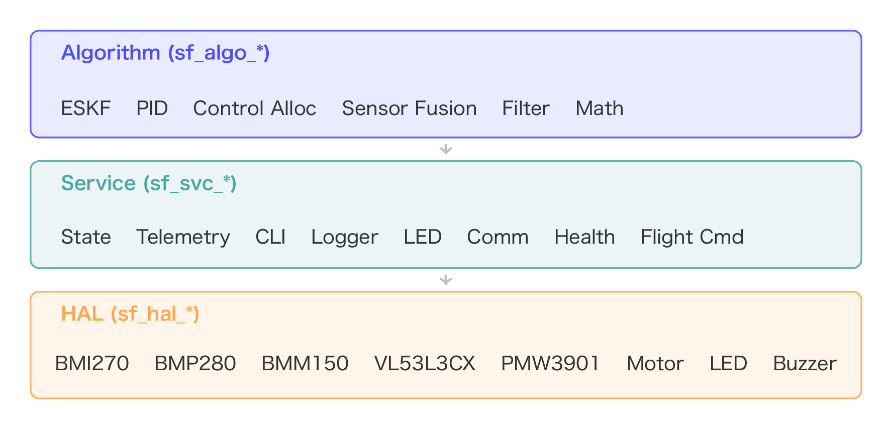
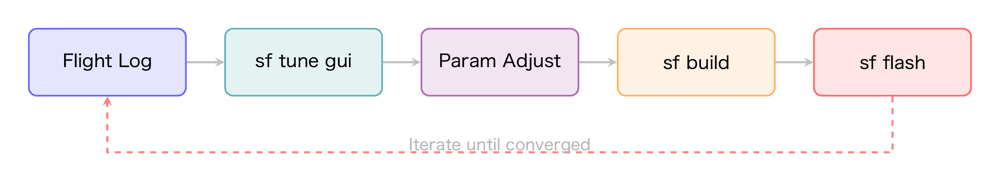
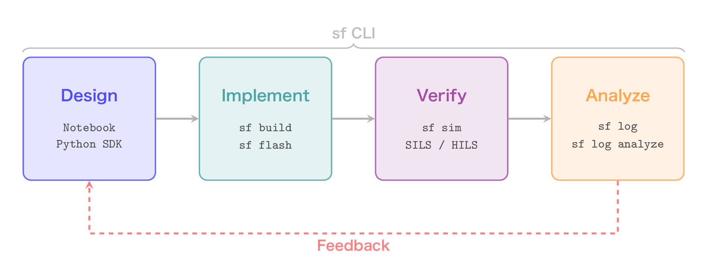

# StampFly Ecosystem
## ドローン制御を「学び、作り、飛ばす」オープンプラットフォーム


---

# なぜ作ったのか？

---

## ドローン制御を学びたい人の壁

```
「PID制御を教科書で学んだ。
 でも、実際に飛ぶものを作るにはどうすれば...？」
```

- 市販ドローンはブラックボックス
- 自作はハードウェアから全部やる必要がある
- シミュレータと実機の間に大きなギャップ
- 教科書の理論と実装の間を埋める教材がない
- 慣れた教材が突然入手不能に — 販売終了・部品枯渇でカリキュラムが崩壊

---

## 私たちの答え

**「制御だけに集中できる」プラットフォーム**

- ハードウェアは完成品を提供
- ソフトウェアは「スケルトン」を提供
- 段階的カリキュラムで理論から実装まで導く
- オープンソース — 特定ベンダーに依存しない持続可能な教材
- **設計 → 実装 → 実験 → 解析 → 教育** を一貫して支援

---

# StampFly Ecosystem とは？

---

## 5つの柱

| 柱 | 内容 |
|---|------|
| **ハードウェア** | 37g マイクロドローン + 専用コントローラ |
| **ファームウェア** | ESP-IDF + FreeRTOS、4種の飛行モード |
| **シミュレータ** | VPython（軽量）+ Genesis（高精度物理） |
| **開発ツール** | sf CLI、チューニング GUI、ログ解析 |
| **教育教材** | 14レッスンのワークショップ + Jupyter Notebook |

---

# ハードウェア

---

## StampFly 機体


- **質量**: 37g
- **MCU**: ESP32-S3 (M5Stamp S3)
- **センサ**:
  - IMU (BMI270) 400Hz
  - 気圧計 (BMP280) 50Hz
  - 地磁気 (BMM150)
  - ToF (VL53L3CX)
  - 光学フロー (PMW3901)
  - 電源監視 (INA3221)

---

## 専用コントローラ

- **M5Atom S3** ベースの送信機
- **ESP-NOW TDMA**: 最大10台同時接続
- **USB HID モード**: PC接続でシミュレータ操作
- **メニューシステム**: 飛行モード切替・設定変更

---

# ファームウェア

---

## コンポーネントアーキテクチャ（27モジュール）



---

## 4つの飛行モード

| モード | 制御内容 | 難易度 |
|--------|---------|--------|
| **ACRO** | 角速度制御（レートPID） | 上級 |
| **STABILIZE** | 姿勢制御（カスケード） | 中級 |
| **ALT_HOLD** | 高度維持 + 姿勢制御 | 初級 |
| **POS_HOLD** | 位置保持 + 高度維持 | 自動 |

全モード実装済み。学習段階に応じて選択可能

---

## 状態推定：ESKF

**Error-State Kalman Filter（15状態）**

- IMU + 気圧 + ToF + 光学フロー + 地磁気を統合
- **active_mask** によるセンサ ON/OFF 管理
- イノベーションゲートで外れ値を自動棄却
- 適応的 R スケーリング（動的加速度補償）

```
状態ベクトル: [位置(3), 速度(3), 姿勢誤差(3),
              ジャイロバイアス(3), 加速度バイアス(3)]
```

---

## テレメトリシステム

| 通信モード | プロトコル | レート | 用途 |
|-----------|----------|--------|------|
| **ESP-NOW** | TDMA | 50Hz | コントローラ通信 |
| **WiFi UDP** | JSONL | 400Hz | リアルタイム解析 |
| **バイナリログ** | 独自 | 400Hz | オンボード記録 |

- 統一パケットで制御信号・センサ値・推定値を一括配信
- P行列対角線も送信可能（推定器の健全性監視）

---

# シミュレータ

---

## 2つのシミュレータ

| | VPython | Genesis |
|---|---------|---------|
| **特徴** | 軽量・ブラウザ表示 | 高精度物理エンジン |
| **物理演算** | 簡易剛体モデル | 2000Hz 精密演算 |
| **センサモデル** | IMU/気圧/ToF/フロー | 物理ベース |
| **用途** | 教育・操作練習 | 研究・SIL検証 |
| **状態** | ✅ 完成 | 🔧 開発中 |

---

## VPython シミュレータ


- コントローラを USB HID で接続して操作
- 3D ビューでリアルタイム飛行
- **SIL テスト**: 制御コードをPC上で検証
- ボクセルワールド（ランダム地形）
- リングワールド（レースコース）
- シード指定で再現性保証

---

# 開発ツール

---

## sf CLI — 統合開発ツール（20コマンド）

```bash
sf doctor            # 環境診断
sf build vehicle     # ビルド
sf flash vehicle -m  # 書き込み＋モニタ
sf log wifi          # 400Hz テレメトリ取得
sf log analyze       # フライトログ解析
sf sim run vpython   # シミュレータ起動
sf cal gyro          # ジャイロキャリブレーション
sf sysid run         # システム同定
sf lesson switch 5   # レッスン切替
```

---

## パラメータ管理 — config.hpp SSOT

- **config.hpp** を SSOT（Single Source of Truth）として一元管理
- PID ゲイン・フィルタ定数・制御リミットを単一ファイルに集約
- 制御系パラメータの変更はフライトログシミュレーションで数値検証



---

## ログ解析・可視化

- **sf log wifi**: WiFi 経由 400Hz テレメトリキャプチャ
- **sf log capture**: USB 経由バイナリログ取得
- **sf log viz**: インタラクティブビジュアライザ
  - 姿勢・角速度・加速度の時系列
  - PID ゲイン・スラスト・バッテリ電圧
  - 制御入力 vs 実測値の比較

---

# 教育教材

---

## ワークショップ：14レッスン

| Lesson | テーマ | 内容 |
|--------|--------|------|
| L0 | セットアップ | 環境構築・ビルド・書き込み |
| L1-L3 | 基礎 | モータ / コントローラ / LED |
| L4-L5 | センサと初フライト | IMU 読み取り → P制御で飛行 |
| L6-L7 | モデリング | システムモデル → 同定実験 |
| L8-L9 | 制御設計 | PID 制御 → 姿勢推定 |
| L10-L11 | 応用 | API リファレンス → カスタム FW |
| L12 | Python SDK | プログラムによる自動飛行 |
| L13 | 競技会 | 精密着陸コンテスト |

---

## ワークショップ教材の構成

- **LaTeX Beamer スライド**: 全レッスン統合PDF
  - TikZ 図版 40+ 枚（ブロック図・ボード線図等）
  - コードスニペット自動抽出
- **講師ガイド**: 運営マニュアル・タイムテーブル
- **競技ルール**: 精密着陸競技会の規定
- **PowerPoint 出力**: 自動変換スクリプト対応

---

## Jupyter Notebook カリキュラム（15セッション）

| No. | テーマ | No. | テーマ |
|-----|--------|-----|--------|
| 01 | Hello StampFly | 09 | カスケード姿勢制御 |
| 02 | 自動飛行 | 10 | 高度制御 |
| 03 | フィードバック基礎 | 11 | 位置制御 |
| 04 | PID 制御理論 | 12 | ウェイポイント飛行 |
| 05 | レート制御チューニング | 13 | カスタム制御器 |
| 06 | ドローン動力学 | 14 | プロジェクトテンプレート |
| 07 | システム同定 | 15 | 解析ツールキット |
| 08 | センサフュージョン | | |

---

## Python SDK: stampfly_edu

- **リアルタイム接続**: WiFi 経由でセンサ・制御データ取得
- **動力学モデル**: ドローンの運動方程式シミュレーション
- **ESKF 実装**: Python で学べるカルマンフィルタ
- **Jupyter ウィジェット**: PID チューナー等のインタラクティブ UI
- **教育用サンプル**: 8種の実行可能サンプルプロジェクト

---

# 誰のためのプロジェクト？

---

## ターゲットユーザー

| ユーザー | ニーズ | エコシステムの答え |
|---------|--------|------------------|
| **学生** | 制御工学の実践学習 | ワークショップ + Notebook |
| **研究者** | 飛行実験基盤 | ESKF + ログ解析 + SIL |
| **教育者** | 制御理論の教材 | スライド + 競技会 |
| **ホビイスト** | 自作飛行制御 | スケルトン設計 + sf CLI |

---

## 教育での活用実績

### ワークショップ実施済み

1. **L0-L5**: 環境構築からP制御での初フライトまで
2. **L6-L9**: モデリング・同定・PID・姿勢推定
3. **L12**: Python SDK でプログラム飛行
4. **L13**: 精密着陸競技会

**座学 → シミュレーション → 実機 → 競技** の流れを実証

---

# 開発ワークフロー

---

## 設計から実験までの一貫した流れ



全ステップを **sf CLI** で統一操作

---

## リポジトリ構成

```
stampfly_ecosystem/
├── firmware/          # 機体 + コントローラ + 共通コード
│   ├── vehicle/       #   27コンポーネント（HAL/算法/サービス）
│   ├── controller/    #   ESP-NOW TDMA 送信機
│   └── common/        #   共有プロトコル・数学
├── simulator/         # VPython + Genesis シミュレータ
├── lib/               # sf CLI (20cmd) + stampfly_edu SDK
├── control/           # 制御設計（ループ整形ツール）
├── analysis/          # Jupyter Notebook + データセット
├── tools/             # チューニング・システム同定・校正
├── docs/              # ワークショップ・セットアップガイド
├── protocol/          # 通信プロトコル仕様 (SSOT)
└── examples/          # 教育用サンプルプロジェクト
```

---

# まとめ

---

## StampFly Ecosystem


**「制御を学びたい」すべての人へ**

✅ 4種の飛行モードで段階的に学べる
✅ シミュレータで安全に検証してから実機へ
✅ 14レッスン + 15ノートブックの体系的カリキュラム
✅ sf CLI で設計から解析まで一貫操作
✅ オープンソースで自由に改変可能

---

# Thank You

### GitHub: M5Fly-kanazawa/stampfly_ecosystem
### Contact: kouhei.ito@itolab-ktc.com

**一緒に、ドローン制御の学びを変えましょう**

---

# 補足資料

---

## 技術仕様

| 項目 | 仕様 |
|------|------|
| MCU | ESP32-S3 (M5Stamp S3) |
| フレームワーク | ESP-IDF v5.5.2 + FreeRTOS |
| 姿勢推定 | ESKF 15状態（active_mask 方式） |
| 制御 | カスケード PID（物理単位） |
| 通信 | ESP-NOW TDMA + WiFi UDP (400Hz) |
| センサ | BMI270, BMM150, BMP280, VL53L3CX, PMW3901 |
| ログ | バイナリ (400Hz) + JSONL (UDP) |

---

## クイックスタート

```bash
# インストール
git clone https://github.com/M5Fly-kanazawa/stampfly_ecosystem.git
cd stampfly_ecosystem
./install.sh          # ESP-IDF + 依存関係を自動セットアップ
source setup_env.sh   # 開発環境をアクティブ化

# ファームウェアをビルド＆書き込み
sf build vehicle
sf flash vehicle -m

# シミュレータを試す
sf sim run vpython
```

---

## sf CLI コマンド一覧

| コマンド | 説明 | コマンド | 説明 |
|---------|------|---------|------|
| `sf doctor` | 環境診断 | `sf log wifi` | テレメトリ取得 |
| `sf build` | ビルド | `sf log analyze` | ログ解析 |
| `sf flash` | 書き込み | `sf log viz` | 可視化 |
| `sf monitor` | モニタ | `sf log capture` | バイナリログ取得 |
| `sf sim run` | シミュレータ | `sf sysid run` | システム同定 |
| `sf cal gyro` | 校正 | `sf lesson switch` | レッスン切替 |
| `sf flight` | 飛行制御 | `sf cal accel` | 加速度校正 |
