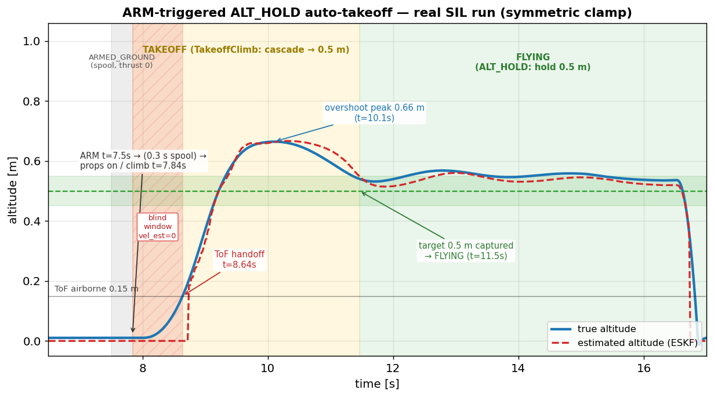
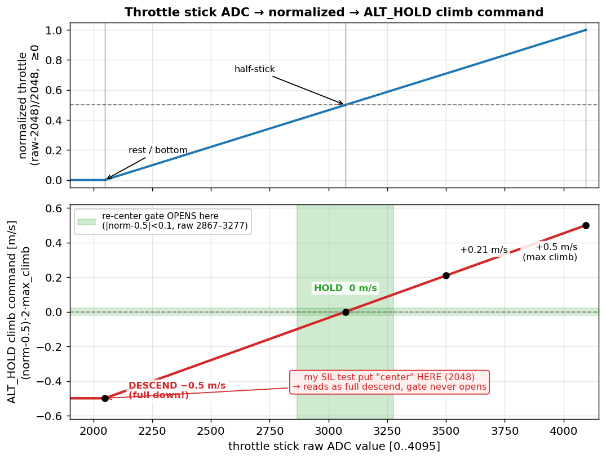
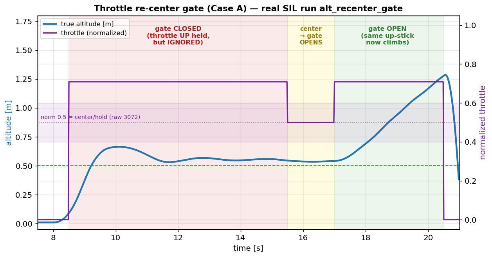

# ALT_HOLD/POS_HOLD 自動離陸 — シーケンスと 2 つの落とし穴

> **Note:** [English version follows after the Japanese section.](#english) / 日本語の後に英語版があります。

## 1. 概要

### このドキュメントについて

2026-06-14 の ALT_HOLD/POS_HOLD 離陸シーケンス再設計（ARM 起動離陸・目標 0.5m 捕捉・スロットル再センターゲート）の実装中に表面化した、**2 つの落とし穴**を実測データの図とともに解説する。どちらも「制御則そのものは正しく、前提（テスト用の数値・クランプの向き）が誤っていた」もので、SIL（ソフトウェア・イン・ザ・ループ＝実ファームをホストで走らせ MuJoCo で物理を閉じる試験環境）が炙り出した。

図はすべて **実際の SIL トラジェクトリ**（`trajectory.csv`）から matplotlib で描いた実測グラフ、または mermaid で描いた状態遷移図である。

### 対象読者

vehicle_new の制御・状態機械を読む人、および同種のドローン離陸ロジックを設計する人。

### 全体シーケンス

ALT_HOLD/POS_HOLD の離陸は **ARM 自体がトリガ**になる（スロットル操作不要）。短いスプール整定の後、制御器が高度カスケードで目標 0.5m まで上昇して**目標値を捕捉**し、状態機械へ完了を通知して FLYING へ移る。ToF の 0.15m 空中検知は ESKF 鉛直ハンドオフ専用で、状態遷移のトリガには使わない。


## 2. 離陸シーケンスと時系列（実測）

下図は実 SIL ラン（`alt_auto_takeoff` シナリオ、ノイズ off、決定論的）の高度時系列である。真値（青）と ESKF 推定（赤破線）、フェーズ帯（ARMED_GROUND／TAKEOFF／FLYING）、地上ブラインド窓、ToF ハンドオフ、行き過ぎピーク、目標捕捉を重ねた。



各イベントの時刻・高度・モードを表にまとめる（上図と対応）：

| フェーズ／イベント | 時刻 | 高度（真値） | 状態・モード | 動作 |
|------|------|------|------|------|
| ARM 受理 | 7.50 s | 0 m | IDLE_GROUND → ARMED_GROUND | プロペラ 0（Grounded フェーズ）、スプール整定 0.3 s 開始 |
| スプール完了 → 離陸 | 7.84 s | 0 m | ARMED_GROUND → TAKEOFF | `notifyTakeoff()`、props on・上昇開始（TakeoffClimb フェーズ） |
| ToF ハンドオフ | 8.64 s | 0.15 m | TAKEOFF | ESKF 鉛直リセット（クラスB, ImuTask）。推定が真値の追従を開始 |
| 行き過ぎピーク | 10.1 s | **0.66 m** | TAKEOFF（TakeoffClimb） | 地上ブラインド窓由来の運動量で目標 0.5m を超過 |
| 目標捕捉 → FLYING | 11.5 s | **0.5 m**（→ ~0.54 m 整定） | TAKEOFF → FLYING | 制御器が目標を捕捉し `takeoff_reached` 通知 → ALT_HOLD 係合 |

ポイントは、**最終的な保持高度が「行き過ぎたピーク 0.66m」ではなく「目標値 0.5m（実測 ~0.54m）」になる**こと。旧仕様は ToF 0.15m で運動量任せに高度を捕捉していたが、新仕様は目標値で捕捉するため決定論的に 0.5m へ収束する。

## 3. 落とし穴 1 — スロットルの「中央」は raw 3072 であって 2048 ではない

### 正規化規約

スロットルの生 ADC（0〜4095）はファーム（`sf_command/command.cpp`）で次のように正規化される：

```
norm = (raw − 2048) / 2048      （負側は 0 にクリップ）
```

つまり**スティックの上半分（2048〜4095）だけ**を [0,1] に写し、下半分は 0 に潰す。`2048` は norm **0.0（最下端）**であって 0.5 ではない。

### ALT_HOLD のホールド点と再センターゲート

ALT_HOLD のスロットル→上昇率の制御則は `climb = (norm − 0.5)·2·max_climb` なので、**ホールド（climb=0）は norm 0.5 = raw 3072**。下図がその写像で、各点が ADC・正規化・上昇率指令にどう対応するかを示す。



| 生 ADC | norm | climb 指令 | 意味 |
|------|------|------|------|
| 2048 | 0.0 | −0.5 m/s | 全力降下（最下端） |
| 3072 | 0.5 | 0 | **ホールド（中央）** |
| 3500 | 0.71 | +0.21 m/s | 上昇 |
| 4095 | 1.0 | +0.5 m/s | 最大上昇 |

### なぜテストが空振りしたか

再センターゲートの「開く」判定は `|norm − 0.5| < deadzone(0.1)`（＝中央を通った）。SIL シナリオで「中央へ戻す」を **raw 2048** で書いたところ、2048 は norm 0.0 なので `|0.0 − 0.5| = 0.5 > 0.1` となり**ゲートは一度も開かなかった**。ファームは正しく、テスト定数（中央＝3072）の取り違えだった。シナリオを 3072 に直したらゲートは期待どおり開いた。

### ゲートの実動作

下図は実 SIL ラン（`alt_recenter_gate` シナリオ）。左軸が高度、右軸がスロットル正規化値。離陸後にスロットルを上げたまま保持しても（ゲート閉）高度は 0.5m に留まり、スロットルを一度中央（3072）に通すとゲートが開き、同じ上げスティックで初めて上昇する。



## 4. 落とし穴 2 — TakeoffClimb の速度クランプは対称でなければならない

### カスケード構造

TakeoffClimb は通常の ALT_HOLD と同じ 2 段カスケードを、目標 0.5m に向けて回す：

```
外側(位置)ループ:  vel_sp = alt_pos.compute(目標 0.5m, 高度推定)
                  （vel_sp を ±takeoff_climb_rate = ±0.3 m/s にクランプ）
内側(速度)ループ:  thrust_corr = alt_vel.compute(vel_sp, 鉛直速度推定)
```

目標近傍で外側ループの誤差が小さくなり vel_sp が 0 へ落ちる → 減速して**目標を捕捉**、という算段。

### 地上ブラインド窓（観測不能性）

ESKF は離陸前、鉛直の位置・速度を **0 に固定（hold）**している。鉛直を見られる唯一のセンサ ToF が **約 0.15m 以上**でしか安定ロックしないためで、0.15m を超えた瞬間にハンドオフして実値へ切り替える。

問題は、**離陸の最初の 0.15m（約 0.25 秒）の間、機体は物理的に加速して上がっているのに鉛直速度推定は 0 に凍っている**こと。内側ループは「指令 +0.3 m/s、推定速度 0」の誤差を出しっぱなしにして推力補正を上限まで張り付かせ、その間に機体は **~0.6 m/s** まで加速する。ハンドオフ後に推定速度が実値へ飛ぶと、運動量で目標 0.5m を **~0.66m まで超過**する（これは ESKF 設計に内在する過渡で、バグではない）。

### climb-only クランプが捕捉に失敗する理由

最初の版は「離陸＝上昇」という思い込みで片側クランプ（`vel_sp < 0 → 0`、降下指令を 0 で潰す）にしていた。すると 0.66m に行き過ぎた後、外側ループが「降りて戻れ」という負の vel_sp を出しても 0 に潰され、**機体は 0.66m に居座ったまま降りてこられない**。捕捉判定 `|0.5 − 高度| < 0.05m` に永久に入らず、`Auto-takeoff complete` が出ず、TAKEOFF→FLYING が発火しない。

下図が両クランプの実 SIL ラン比較。**climb-only（赤）は ≈0.59m で居座り捕捉に失敗**、**対称クランプ（青）は行き過ぎ後に緩降下して 0.5m を捕捉**する。


### 修正

```
if (vel_sp >  takeoff_climb_rate) vel_sp =  takeoff_climb_rate;
if (vel_sp < -takeoff_climb_rate) vel_sp = -takeoff_climb_rate;   // ← 緩降下も許す
```

要は「**離陸＝目標へ整定する閉ループ**であって片道の上昇ではない」ので、行き過ぎを下方修正できる両方向の自由度が必須。これで peak 0.66m → 目標 0.5m へ減速 → ~0.54m で安定保持（alt_rmse 1.5cm）。残る ~0.16m の overshoot 自体はブラインド窓由来の過渡で、実機で大きければソフトスタートで抑えられる（実機チューニング項目）。

## 5. まとめ・教訓

| # | 落とし穴 | 真因 | 教訓 |
|---|---------|------|------|
| 1 | ゲートが開かない | テストで「中央＝2048」と取り違え（実際は 3072） | ファームの正規化規約を確認してからテスト値を決める。`(raw−2048)/2048` で中央は 3072 |
| 2 | 目標を捕捉できない | 速度クランプを片側（上昇のみ）にした | 捕捉は片道でなく**双方向の整定問題**。観測不能窓の行き過ぎを下げて戻す自由度が要る |

どちらも制御則自体は正しく、**SIL が前提ミスを的確に炙り出した**。数値で裏付けてから実装・コミットする（CLAUDE.md 規約）プロセスが機能した例である。

---

<a id="english"></a>

## 1. Overview

### About This Document

During the 2026-06-14 redesign of the ALT_HOLD/POS_HOLD takeoff sequence (ARM-triggered takeoff, 0.5 m target capture, throttle re-center gate), **two pitfalls** surfaced. This document explains them with figures plotted from real SIL data. In both, the control law itself was correct — the wrong assumption was in the test constant or the clamp direction — and SIL surfaced them.

All figures are real measurements: matplotlib plots of actual SIL `trajectory.csv`, or a mermaid state diagram.

### Overall Sequence

In ALT_HOLD/POS_HOLD, **ARM itself triggers the takeoff** (no throttle input). After a short spool dwell, the controller climbs the altitude cascade to the 0.5 m target, **captures the target value**, notifies the state machine, and moves to FLYING. The ToF 0.15 m airborne detection is for the ESKF vertical handoff only, not the state-transition trigger.


## 2. Takeoff Sequence and Timeline (measured)

The figure below is a real SIL run (`alt_auto_takeoff`, noise off, deterministic): true altitude (blue) and ESKF estimate (red dashed), with phase bands, the ground blind window, the ToF handoff, the overshoot peak, and the target capture.


| Phase / event | Time | Altitude (true) | State / mode | Action |
|------|------|------|------|------|
| ARM accepted | 7.50 s | 0 m | IDLE_GROUND → ARMED_GROUND | props 0 (Grounded phase), 0.3 s spool dwell starts |
| spool done → takeoff | 7.84 s | 0 m | ARMED_GROUND → TAKEOFF | `notifyTakeoff()`, props on, climb starts |
| ToF handoff | 8.64 s | 0.15 m | TAKEOFF | ESKF vertical reset (class-B, ImuTask); estimate tracks truth |
| overshoot peak | 10.1 s | **0.66 m** | TAKEOFF (TakeoffClimb) | blind-window momentum overshoots the 0.5 m target |
| target captured → FLYING | 11.5 s | **0.5 m** (settles ~0.54 m) | TAKEOFF → FLYING | controller captures target, `takeoff_reached` → ALT_HOLD |

The key point: the final hold altitude is the **0.5 m target value (≈0.54 m measured), not the 0.66 m overshoot peak**. The old spec captured whatever altitude momentum carried it to at ToF 0.15 m; the new spec captures the target value deterministically.

## 3. Pitfall 1 — Throttle "center" is raw 3072, not 2048

### Normalization

`norm = (raw − 2048) / 2048`, lower half clipped to 0. Only the upper stick half (2048–4095) maps to [0,1]; `2048` is norm **0.0 (bottom)**, not 0.5.

### Hold point and the re-center gate

The ALT_HOLD law is `climb = (norm − 0.5)·2·max_climb`, so **hold (climb=0) is at norm 0.5 = raw 3072**.


### Why the test silently failed

The gate-open test is `|norm − 0.5| < deadzone(0.1)`. The SIL scenario used raw 2048 for "center", which is norm 0.0 → `|0.0 − 0.5| = 0.5 > 0.1` → the gate never opened. The firmware was correct; the test constant was wrong. Using 3072 fixed it.


## 4. Pitfall 2 — The TakeoffClimb velocity clamp must be symmetric

### Cascade

TakeoffClimb runs the ALT_HOLD cascade toward 0.5 m, with the position-loop velocity clamped to ±takeoff_climb_rate. Near the target the error shrinks, vel_sp falls to 0, and the craft captures the target.

### Ground blind window

The ESKF holds vertical position/velocity at 0 on the ground (ToF only locks above ~0.15 m). For the first ~0.25 s of climb the velocity estimate is frozen at 0 while the craft physically accelerates; the velocity loop saturates the thrust correction and the craft reaches ~0.6 m/s by the handoff, then overshoots to ~0.66 m. This is inherent to the ESKF design, not a bug.

### Why climb-only fails to capture

A one-sided clamp (`vel_sp < 0 → 0`) cannot bring the craft back down after the overshoot — it sits at 0.66 m, never enters the ±0.05 m capture band, so "Auto-takeoff complete" never fires.


### Fix

Clamp symmetrically (±takeoff_climb_rate) so the cascade can gently descend back to the target. Takeoff = a closed-loop settle, not a one-way climb. Result: peak 0.66 m → settles ~0.54 m (alt_rmse 1.5 cm). The ~0.16 m overshoot is a blind-window transient — a hardware tuning item.

## 5. Lessons

| # | Pitfall | Root cause | Lesson |
|---|---------|------------|--------|
| 1 | Gate never opens | test treated 2048 as "center" (actually 3072) | Check the firmware normalization before choosing test values: `(raw−2048)/2048`, center = 3072 |
| 2 | Target not captured | velocity clamp was one-sided (climb only) | Capture is a bidirectional settle, not a one-way climb; allow correcting the unobservable-window overshoot back down |

In both cases the control law was correct and **SIL surfaced the wrong assumption** — the "back it with simulation before implementing" process (CLAUDE.md) working as intended.
