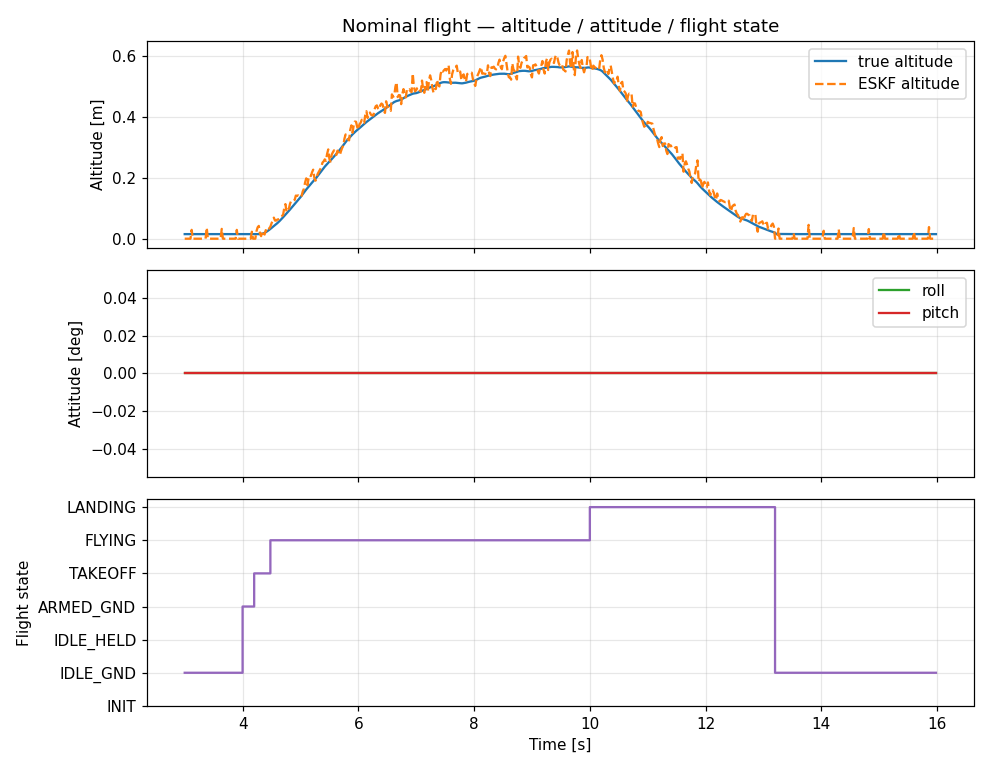
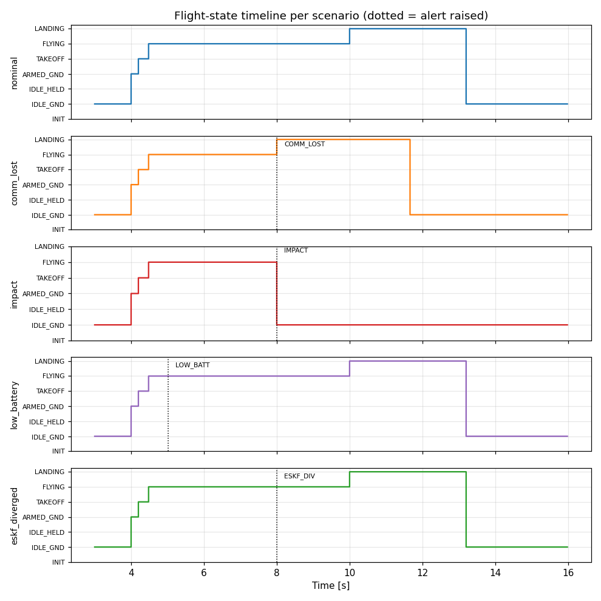
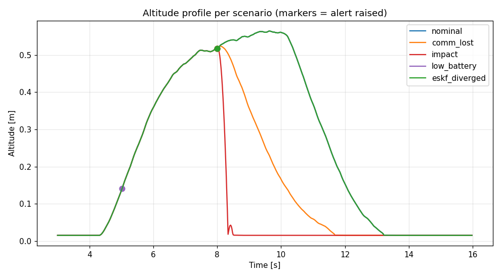

# StampFly 統合SIL 検証レポート（M1〜M3）

> **Note:** [English version follows after the Japanese section.](#english) / 日本語の後に英語版があります。

## 1. 概要

### このドキュメントについて

vehicle_new（次世代機体ファームウェア）の **状態遷移管理を SIL（Software-in-the-Loop）の検証範囲に組み込む** 取り組みの第一段階（マイルストーン M1〜M3）の成果と検証結果をまとめる。

旧 `firmware/vehicle/` では状態遷移管理に起因する不明バグが発生し、これがファームウェア刷新（vehicle_new）の最大の動機となった。しかし従来の SIL は ESKF + PID の制御ループ検証専用で、肝心の状態遷移管理が検証の枠外（盲点）になっていた。本取り組みはこの盲点を解消し、**状態遷移を PC 上で決定論的に検証可能**にする。

### 対象読者

- vehicle_new の開発者（人間 + AI）
- SIL を用いて制御・状態機械を検証する研究者・学生

### 達成サマリー

| マイルストーン | 内容 | 検証結果 |
|--------------|------|---------|
| **M1** | PC化基盤（ESP-IDF 互換シム + トピック実体） | ビルド・リンク成功、`git diff firmware/` 空 |
| **M2** | 状態遷移ユニットテスト | **47/47 全PASS** |
| **M3** | StateManager 駆動 統合SIL | 5シナリオ決定論的に検証 |

## 2. 設計原則 — 参照による Code Identity

本取り組みの中核は **「分離しているのに本体と同じコードが走る」** ことである。

- SIL ハーネスは `simulator/sil/` に独立配置するが、ファーム本体（`eskf_core.cpp` / `state_manager.cpp` / `failsafe.cpp` 等）を **コピーせず相対パス参照でコンパイル**する
- ESP-IDF 依存（FreeRTOS / esp_timer / esp_log）は `compat/` シムで吸収し、**本体ソースは1行も改変しない**
- 全工程を通じて `git diff firmware/` が空であることを Code Identity の判定基準とした

```
firmware/vehicle_new/        ← 実機ファーム（無改変）
   ├ components/sf_state/state_manager.cpp   ┐
   ├ components/sf_failsafe/failsafe.cpp     │ 相対パス参照でコンパイル
   └ components/sf_estimator_eskf/eskf_core.cpp ┘
simulator/sil/               ← SILハーネス（独立ツール環境）
   ├ compat/                 ← ESP-IDF互換シム（本体を無改変で通す）
   ├ sil_topics.cpp          ← トピックextern実体（params.cpp と同期）
   ├ integrated_sil.cpp      ← StateManager駆動 統合ループ
   └ scenario.hpp / battery_model.hpp
```

## 3. M1 — PC化基盤

### 成果物

| ファイル | 役割 |
|---------|------|
| `compat/freertos/FreeRTOS.h` | `TickType_t` / `pdTRUE` / `portMAX_DELAY` 等の基本型・定数 |
| `compat/freertos/semphr.h` | `SemaphoreHandle_t` を `std::mutex` にマップ |
| `compat/freertos/queue.h` | `QueueHandle_t` を byte-copy `std::deque` にマップ |
| `compat/esp_timer.h` | `esp_timer_get_time()` を `std::chrono` で実装 |
| `compat/esp_log.h` | `ESP_LOGx` を stderr へ（CSV stdout を汚染しない） |
| `sil_topics.cpp` | トピックextern実体12個 + `topics_init()`（`params.cpp` と同期） |

### 検証

`make check` で最小 main が無改変の StateManager を駆動し、`INIT → IDLE_GROUND → ARMED_GROUND` を正しく遷移（"M1 OK"）。`git diff firmware/` は空。

## 4. M2 — 状態遷移ユニットテスト

`firmware/vehicle_new/test/test_state_manager.cpp` に決定論ユニットテスト47件を実装。**全47件 PASS**。

| カテゴリ | 件数 | 検証内容 |
|---------|-----|---------|
| A. 正常遷移 | 11 | INIT→IDLE→ARMED→TAKEOFF→FLYING→LANDING→IDLE の全エッジ + disarm / soft-landing / held↔ |
| B. ガード拒否 | 12 | 不正な現在状態からの遷移要求が `false` / 状態不変（二重ARM、INITからARM 等） |
| C. モード変更 | 3 | FLYING 内 `requestModeChange` 全モード、同一モード冪等 |
| D. 全Alert分岐 | 10 | IMPACT/GYRO_ANOMALY×(空中/地上)、COMM_LOST×(FLYING/非FLYING)、LOW_BATTERY/USB_POWER/ESKF_DIVERGED/NONE |
| E. コールバック | 5 | onExit→onEnter 順序、同一遷移で非発火、onModeChange、複数登録順、MAX_CALLBACKS(8)上限 |
| F. Failsafe閾値 | 5 | impact 4G ラッチ、gyro 1000dps、battery WARNING(3.3V)/EMERGENCY(3.0V)/未接続(≤0.1V) |
| G. エンドツーエンド | 1 | FLYING→高G→`failsafe.update`→`system_alert`→`handleAlert`→IDLE_GROUND |
| **合計** | **47** | **全PASS** |

> **補足:** 既存 `test_main.cpp` の `pid_integral` が1件 FAIL（0.95 vs 1.0）。本作業より前から存在する別件（PID実装またはテスト許容値の問題）で、状態遷移テストとは無関係。

## 5. M3 — StateManager 駆動 統合SIL

### 構成

旧 `sil_main.cpp` の偽状態管理（`bool armed` + ハードコード時刻 `T_ARM`）を撤廃し、**無改変の本物の StateManager / Failsafe をループで駆動**する。物理 + ESKF + PID + 状態遷移 + failsafe が一気通貫で動作し、フライト状態がモーター制御ゲートと制御モードの唯一の真実となる。固定シード（`srand(1)`）で決定論的。

### シナリオ別 検証結果

| シナリオ | 注入 | 期待挙動 | 遷移数 | 最終状態 |
|---------|------|---------|:---:|---------|
| nominal | なし | 正常飛行（離陸→ホバー→着陸） | 6 | IDLE_GROUND |
| comm_lost | t=8s COMM_LOST | FLYING → LANDING → 着陸 | 6 | IDLE_GROUND |
| impact | t=8s 8G | **緊急 IDLE**（再離陸なし） | 5 | IDLE_GROUND |
| low_battery | 3.3V低下 | 警告のみ（**状態不変**）→ 通常着陸 | 6 | IDLE_GROUND |
| eskf_diverged | t=8s ESKF発散 | reset要求のみ（**状態不変**）→ 通常着陸 | 6 | IDLE_GROUND |

### 図1: 正常飛行の詳細（高度・姿勢・状態遷移）



真値高度と ESKF 推定高度が良好に追従（離陸 → 0.5m ホバー → 着陸）。姿勢が平坦なのは外乱なしのトリム飛行＋制御に真値姿勢を用いるため（ESKF 姿勢はオープンループ推定）。下段の状態遷移が高度プロファイルと正しく対応している。

### 図2: 全シナリオの状態遷移タイムライン



点線がアラート発生時刻。**異常系（comm_lost / impact）はアラートで即座に状態遷移**し、**警告系（low_battery / eskf_diverged）は状態を変えず飛行を継続**することが一目で対比できる。これは `handleAlert` の設計（IMPACT/COMM_LOST は遷移、LOW_BATTERY/ESKF_DIVERGED は通知のみ）が正しく機能している証拠である。

### 図3: 全シナリオの高度プロファイル



impact（赤）が t=8s で急降下（緊急着陸）、comm_lost（橙）が緩やかに自動着陸降下する一方、警告系3シナリオ（nominal / low_battery / eskf_diverged）は飛行軌道が完全に一致して重なる。これは「警告は飛行に影響しない（状態不変）」ことを軌道レベルで裏付けている。

## 6. 再現手順

```bash
cd simulator/sil

# M1: PC化基盤のリンク確認
make check                       # → "M1 OK"

# M2: 状態遷移ユニットテスト（別ディレクトリ）
cd ../../firmware/vehicle_new/test && make test   # → 47/47 passed

# M3: 統合SIL（決定論）
cd ../../../simulator/sil
make integrated_sil
./integrated_sil                          # nominal、CSV を stdout に
./integrated_sil --scenario impact 2>&1 >/dev/null | grep Transition

# グラフ再生成
python3 plot_sil_results.py               # docs/assets/*.png を出力
```

## 7. 既知の課題・次のステップ

- **M4**: 状態列CSVを `simulator/tools/compare_simulators/sim_io.py` 互換形式へ整形（Genesis可視化の素地）
- **Genesis (A) ビューア連携**: CSV状態列を Genesis の StampFly STL機体で再生（`set_pos`/`set_quat` API の存在検証が初手）
- **M5**: 物理モデルを `simulator/sil/physics/` へ移設、host CMake化、旧 `sil_main.cpp` 退役
- **別件**: 既存 `test_main.cpp` の `pid_integral` FAIL の要因調査

---

<a id="english"></a>

## 1. Overview

### About This Document

This report summarizes the first stage (milestones M1–M3) of bringing the **flight-state management of vehicle_new into the SIL (Software-in-the-Loop) verification scope**.

The legacy `firmware/vehicle/` suffered an unidentified bug rooted in state-transition management, which was the primary motivation for the firmware rewrite (vehicle_new). Yet the previous SIL only verified the ESKF + PID control loop, leaving state-transition management — the very motivation — outside the verification scope (a blind spot). This effort closes that gap and makes **state transitions deterministically verifiable on a PC**.

### Achievement Summary

| Milestone | Content | Result |
|-----------|---------|--------|
| **M1** | Host build base (ESP-IDF compat shim + topic instances) | Builds & links, `git diff firmware/` empty |
| **M2** | State-transition unit tests | **47/47 pass** |
| **M3** | StateManager-driven integrated SIL | 5 scenarios verified deterministically |

## 2. Design Principle — Code Identity by Reference

The core idea is that **the SIL runs the exact same code as the firmware despite being separated**.

- The SIL harness lives independently in `simulator/sil/` but compiles the firmware core (`eskf_core.cpp` / `state_manager.cpp` / `failsafe.cpp`) **by relative-path reference, not by copy**.
- ESP-IDF dependencies (FreeRTOS / esp_timer / esp_log) are absorbed by `compat/` shims; the **firmware sources are never edited**.
- An empty `git diff firmware/` was the acceptance criterion for Code Identity throughout.

## 3. M1 — Host Build Base

A `compat/` directory provides minimal ESP-IDF-compatible headers (FreeRTOS mutex → `std::mutex`, queue → `std::deque`, `esp_timer_get_time` → `std::chrono`, `ESP_LOGx` → stderr). `sil_topics.cpp` defines the 12 topic extern instances (kept in sync with `params.cpp`). `make check` drives the unmodified StateManager through `INIT → IDLE_GROUND → ARMED_GROUND` ("M1 OK"); `git diff firmware/` stays empty.

## 4. M2 — State-Transition Unit Tests

47 deterministic unit tests in `test_state_manager.cpp`, **all passing**: 11 normal transitions, 12 guard rejections, 3 mode changes, 10 alert-branch cases, 5 callback cases, 5 failsafe-threshold cases, and 1 end-to-end case. (An unrelated pre-existing `pid_integral` failure in `test_main.cpp` is out of scope.)

## 5. M3 — StateManager-Driven Integrated SIL

The legacy `bool armed` + hardcoded `T_ARM` fake state is replaced by the **real, unmodified StateManager / Failsafe driven through the loop**. Physics + ESKF + PID + state machine + failsafe run end-to-end; flight state is the single source of truth for motor gating and control mode. Deterministic via a fixed seed.

| Scenario | Injection | Expected | Transitions | Final |
|----------|-----------|----------|:---:|-------|
| nominal | none | normal flight | 6 | IDLE_GROUND |
| comm_lost | COMM_LOST @8s | FLYING → LANDING | 6 | IDLE_GROUND |
| impact | 8G @8s | **emergency IDLE** | 5 | IDLE_GROUND |
| low_battery | 3.3V sag | warning only (**no state change**) | 6 | IDLE_GROUND |
| eskf_diverged | divergence @8s | reset only (**no state change**) | 6 | IDLE_GROUND |

See **Figure 1** (nominal altitude / attitude / state), **Figure 2** (per-scenario state timelines — fault scenarios transition immediately, warning scenarios keep flying), and **Figure 3** (altitude overlay — warning scenarios overlap exactly, confirming "warnings do not affect flight") in the Japanese section above.

## 6. Reproduction

See the command block in the Japanese section (§6).

## 7. Known Issues / Next Steps

- **M4**: reshape the state-log CSV to be `sim_io.py`-compatible (groundwork for Genesis).
- **Genesis (A) viewer**: replay the CSV state log on the StampFly STL model (first verify `set_pos`/`set_quat` API availability).
- **M5**: move the physics model into `simulator/sil/physics/`, add host CMake, retire `sil_main.cpp`.
- **Separate**: investigate the pre-existing `pid_integral` test failure.
