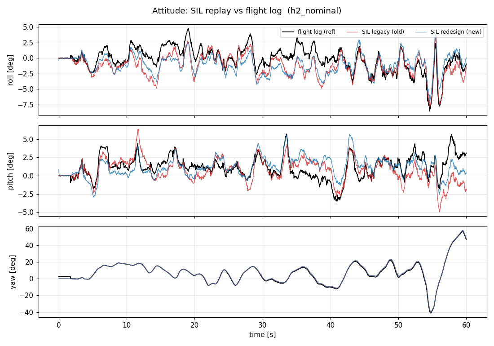
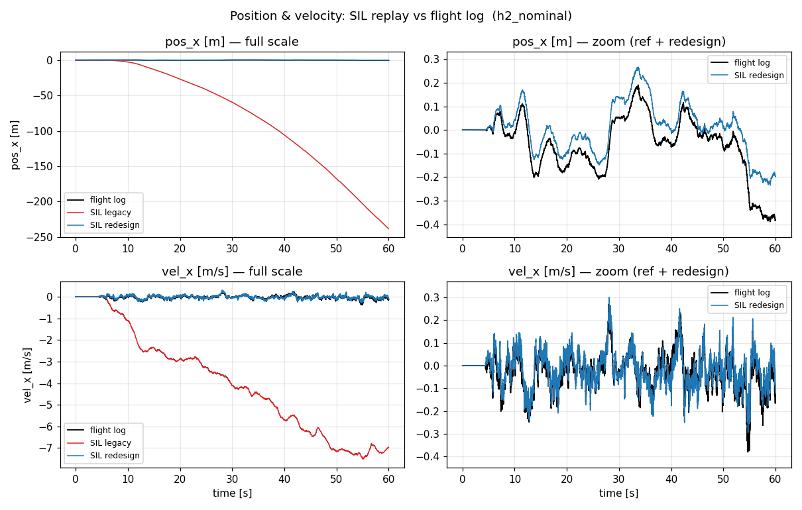
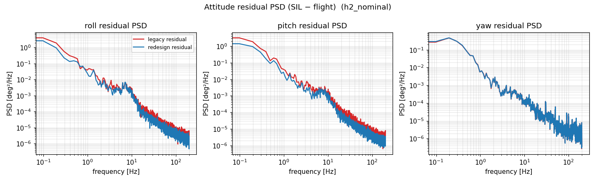
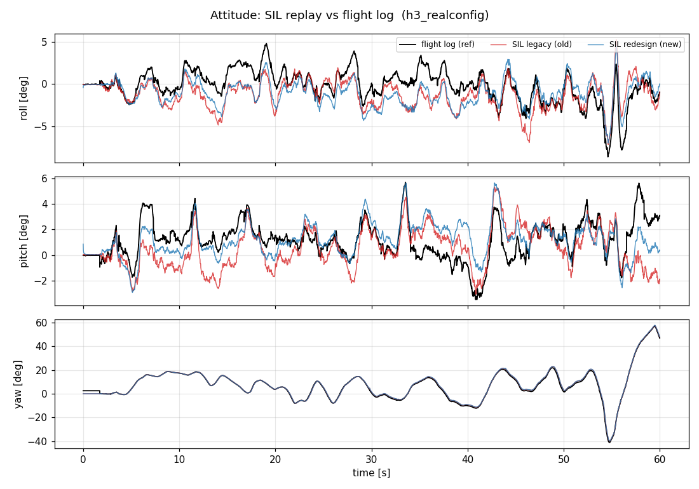
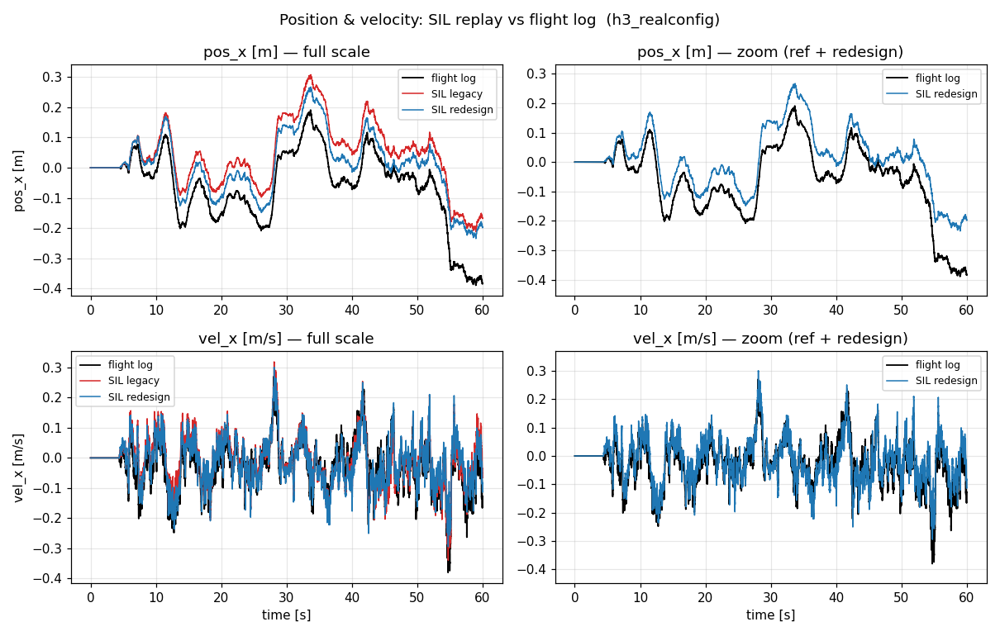
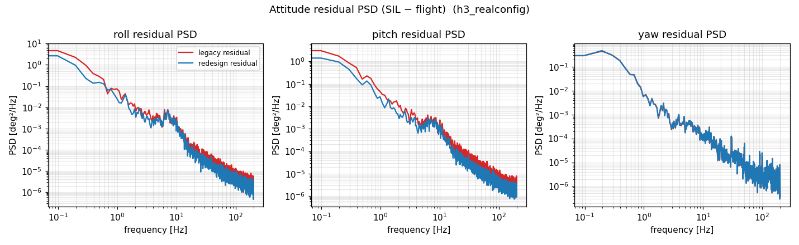
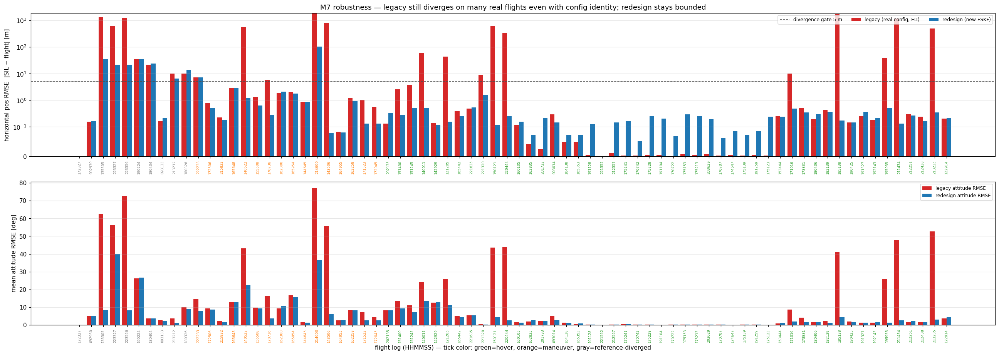
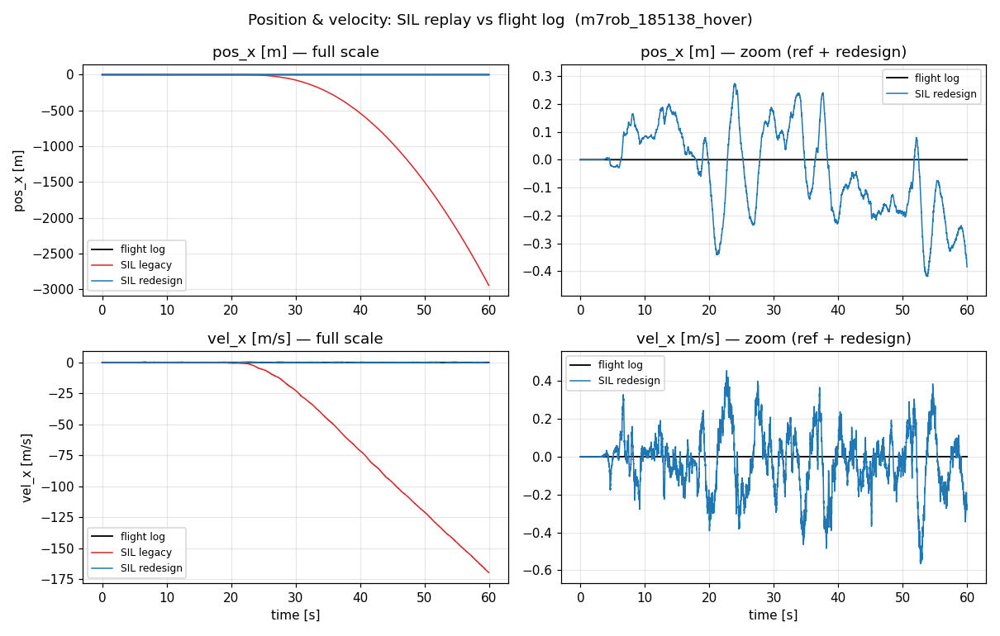
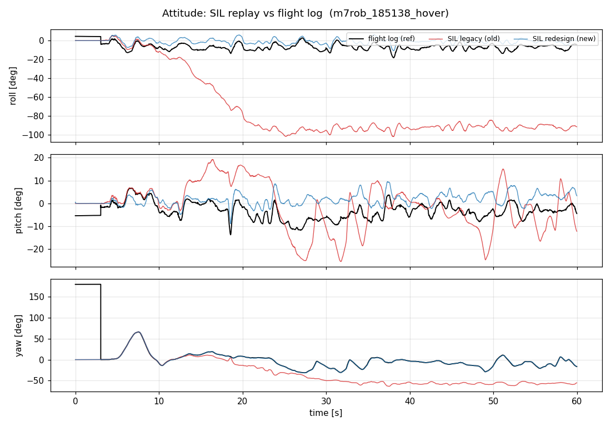

# M7 差分診断 検証ノート（作業記録）

> このノートは **これから行う検証の過程** を逐次記録する作業ログである。仮説 →
> 検証手順 → 計算結果（表・グラフ）→ 解釈、の順で時系列に追記する。後から「何を
> どう確かめてきたか」を読み返せることを目的とする。

## 0. 起点（このノート開始時点の状況）

- **検証対象**: M7 差分診断ハーネル（`log_to_replay.py` → `log_replay` → `plot_replay.py`）。
  実機フライトログの記録センサを SIL の旧ESKF（`stampfly::ESKF`、ログを実際に飛ばした
  推定器）にオープンループ観測で再生し、SIL推定を実機ログの ESKF 出力と照合する。
- **現状**: 代表ログ（`stampfly_udp_20260408T160105.jsonl`, 60秒飛行）で初回実行したところ、
  - 姿勢 RMSE は roll 1.74° / pitch 1.69° / yaw 0.88°（おおむね追従）
  - だが **旧ESKF の水平位置・速度が離陸直後から単調発散**（pos_x → 約 -255 m, vel_x → -7.8 m/s）。
    実機ログの同チャネルは pos_x ∈ [-0.39, 0.19] m, vel_x ∈ [-0.38, 0.27] m/s で**有界**。
- **既知の手がかり**: ファーム（`firmware/vehicle/main/tasks/imu_task.cpp`）は接地中フロー/ToF更新を
  行わず `skip_position`+`holdPositionVelocity()` で位置・速度を0保持し、離陸時に
  `resetPositionVelocity()`（共分散リセット）を行う。再生はこれを再現していない。

---

## 検証ログ（時系列）

### 2026-05-30 — 仮説 H1: 発散は「接地/離陸ゲート未再現」による再生忠実度の欠落

**仮説:** SIL旧ESKFの水平発散は推定器コードの欠陥（実機でも起きる）ではなく、再生が
ファームの接地/離陸ゲートを再現していないために起きる**人工産物**である。具体的には、
接地中にフロー/ToF更新を適用し位置を積分してしまい、離陸前に P(VEL) が崩壊 → 離陸後の
実運動フローで M11 のバグA（P崩壊→χ²ゲート破綻→速度発散）が顕在化している、と推定。

**検証手順:** `log_replay.cpp` にファーム（`imu_task.cpp:240-341`）と同じゲートを実装する。
| 局面 | ファームの挙動 | 再生での実装 |
|------|----------------|--------------|
| 接地中 | `predict(skip_position=true)` + `holdPositionVelocity()`、フロー/ToF更新なし | 同左。離陸検出まで適用 |
| 離陸時(1回) | `resetPositionVelocity()` + `setFreezeAccelBias(false)` | 同左 |
| 離陸直後 | フロー20サンプル・ToF10サンプルをスキップ（共分散整定） | スキップカウンタを実装 |
| 飛行中 | フロー（squal≥25, 距離0.02–4.0m ゲート）・ToF適用 | 同ゲートを実装 |

離陸検出は、ファームが接地中 pos/vel を厳密に0保持する性質を利用し、**ログ参照 pos/vel が
初めて非零になった行**を離陸とする（データ駆動）。

**判定基準:**
- H1 が正しければ → 旧ESKF SIL の pos_x/vel_x が実機ログ同様に**有界**になり、姿勢RMSEも改善するはず。
- もし修正後も発散するなら → H1 棄却。発散はゲート以外（フロー較正・座標・タイミング）に起因。

**H1 検証結果 → 棄却（むしろ悪化）。** ゲートを実装して再実行したところ、姿勢RMSEが
roll 24.6° / pitch 33.9° と**大幅悪化**、位置も pos_x 704m と悪化した。原因を追うと、
ゲート実装に含めた離陸時 `setFreezeAccelBias(false)`（ファーム imu_task.cpp:269 のコード経路）が
効いていた。`setFreezeAccelBias(false)` は `recomputeActiveMask()` を呼び（eskf.cpp:190-191）、
BA（加速度バイアス）を active_mask に追加して推定対象にする → SILでBAが実振動により漂流
（**潜在バグC**）→ 加速度姿勢補正を汚染して姿勢が発散した。

### 2026-05-30 — 中間発見: 実機ファームの BA は終始凍結（ground truth）

H1の悪化を受け、思い込みを避けるため**ログのバイアス実測値**を確認した（`log_to_replay.py`
出力の ref_bg*/ref_ba* 列）。結果:

| バイアス | 最小 | 最大 | ドリフト(末-初) | 解釈 |
|----------|------|------|-----------------|------|
| accel_bias X | -0.1812 | -0.1812 | 0.0000 | **完全凍結** |
| accel_bias Y | -0.0867 | -0.0867 | 0.0000 | **完全凍結** |
| accel_bias Z | -0.2635 | -0.1919 | -0.0603 | 離陸時に一度調整後ほぼ一定 |
| gyro_bias X/Y/Z | — | — | ~0.001 | ほぼ凍結 |

`active_mask=0x06FF` をデコードすると active = POS_XYZ, VEL_XYZ, ATT_XY, BG_XY。
**ATT_Z・BG_Z・BA_XYZ は非アクティブ＝凍結**。つまり実機は BA を終始凍結していた
（コード上は離陸時に解凍を呼ぶが、ホバリングではBA可観測性が低く、実機の BA X/Y は
60秒間1カウントも動いていない）。⟹ 忠実再生には **BA を終始凍結**すべき。

### 2026-05-30 — 仮説 H2: ゲート維持 ＋ 旧ESKFの BA 終始凍結

**変更:** 離陸時に旧ESKFの `setFreezeAccelBias(false)` を**呼ばない**（BA凍結を維持）。
新ESKFは頑健なので integrated_sil 同様に解凍する。ゲート（接地中の位置保持・フロー/ToF
スキップ・squal/距離ゲート）はそのまま維持。

**H2 検証結果 → 部分的に確認。** 姿勢は回復したが水平位置/速度の発散は残った。

代表ログ `stampfly_udp_20260408T160105`（60秒飛行）、RMSE は t≥6.0s（ウォームスタート＋離陸過渡を除外）:

| 軸 | 旧ESKF(SIL) RMSE | 新ESKF(SIL) RMSE |
|----|------------------|------------------|
| roll [deg] | 1.7690 | 1.8217 |
| pitch [deg] | 1.6970 | 1.4218 |
| yaw [deg] | 0.8793 | 0.8411 |
| pos_x [m] | **112.88** | 0.0794 |
| pos_y [m] | **27.23** | 0.1561 |
| pos_z [m] | 0.0150 | 0.0185 |
| vel_x [m/s] | **4.85** | 0.0472 |
| vel_y [m/s] | **2.02** | 0.0547 |
| vel_z [m/s] | 0.0684 | 0.1754 |

**姿勢（ref=実機ログ, old=SIL旧, new=SIL新）:**

姿勢は3軸とも実機ログによく追従（旧 ~1.5°）。垂直チャネル（pos_z/vel_z）も一致。

**位置・速度（左=フルスケールで発散を表示, 右=ref+新のみ拡大）:**

旧ESKFの水平位置 pos_x が単調発散（左上）。一方、新ESKF（右）は実機ログとほぼ重なる。

**姿勢残差のPSD（SIL−実機、周波数ごとのずれ）:**

**H2 解釈:**
- ✅ BA凍結維持で**姿勢の差分診断は再現に近づいた**（旧ESKF 1.5°）。姿勢・垂直は推定器ソフト同一性がほぼ成立し、残差(~1.5°)はP初期化/ウォームスタント差＋HWタイミングに帰属。
- ❌ だが**水平フロー/速度チャネルの発散は残る**（pos_x 112m）。ゲート・squalゲート・接地保持を入れても直らない＝水平発散は接地/離陸ゲート由来**ではない**。M11 のバグA（P崩壊→χ²ゲート破綻→速度発散）が実機ログの flow を入れても顕在化している一方、実機ログ自身の pos/vel は有界だった。
- ⟹ **未解決の核心**: 同じ旧ESKFコード・同じ実機flowなのに、SILは水平発散・実機は有界。残る忠実度ギャップ候補は (a) フロー較正（cam-to-body C2B, flow_rad_per_pixel が defaultConfig と実機 config.hpp で差異）、(b) flow χ²ゲート/適応R の挙動（実行ログで R=130超の異常値）、(c) flow に渡すジャイロの符号/軸、(d) 実機が別機構でバグAを回避していた可能性。新ESKFは全チャネル有界（redesign がバグAを実機データ上でも修正）。

### H3 候補（このセッションで実施した検証）
1. **フロー較正の照合**: `defaultConfig()` の flow_rad_per_pixel / cam-to-body と実機 config.hpp（FLOW_RAD_PER_PIXEL=0.00222 等）を1対1照合。差異があれば SIL 設定を実機値に合わせる。
2. **flow χ²ゲート/適応R の追跡**: 実行時の R 異常値（130超）の発生機序を、innovation・P(VEL) と併せて時系列で追う。M11 の P崩壊と同型かを確認。
3. **flow へ渡すジャイロの検証**: updateFlowRaw の gyro_x/y 符号・軸が実機の gyro_latest と一致するか。
4. 上記で水平発散が**有界化すれば**「実機はXによりバグAを回避」と確定。**有界化しなければ**「実機ログの flow は SIL では発散させるが実機では発散しない＝HW/タイミング/通信由来」と差分診断の結論を出す。

### 2026-05-30 — 仮説 H3: 発散は「SILが実機の運用config（config.hpp）を再現していない」ことによる再生忠実度の欠落

**仮説:** SILの旧ESKFは `stampfly::ESKF::Config::defaultConfig()`（ライブラリ既定値）で走っているが、
実機ファームは `defaultConfig()` を起点に config.hpp の値で多数のパラメータを上書きして飛んでいる。
特にフローチャネルの観測モデル（χ²ゲート・innovクランプ・R）が食い違えば、同じ flow 画素でも
SIL だけが発散しうる。⟹ **SILを実機 config.hpp に忠実に合わせれば水平発散は有界化する**はず。

**検証手順（task 1）:** 実機 `init.cpp`(336-417行) が `defaultConfig()` に適用する上書きを全件抽出し、
SIL の `makeLegacyConfig()` と突き合わせた。フローチャネルに効く決定的な差分が判明:

| パラメータ | defaultConfig（旧SIL） | 実機 config.hpp | 効果 |
|-----------|----------------------|-----------------|------|
| **flow_chi2_gate** | 5.99（有効） | **0.0（無効）** | 実機はχ²ゲートを切っていた（コメント「発散防止のため」） |
| **flow_innov_clamp** | 0.0（無効） | **0.3（有効）** | 実機は1更新あたりの速度修正をクランプ |
| **flow_noise (R)** | 0.005232 | **0.30** | R が約3300倍。旧SILは flow を過信しスパイクに振られる |
| accel_noise | 0.062885 | 0.30 | |
| tof_noise | 0.002540 | 0.03 | |
| accel_att_noise | 0.02 | 0.06 | |
| init_pos_std | 1.0 | 0.1 | |
| init_vel_std | 0.5 | 0.1 | |
| k_adaptive | 0.0 | 10.0 | 加速度姿勢補正の適応Rスケーリング |

**修正:** `makeLegacyConfig()` を `init.cpp` と1対1で一致させた。実機の `config.hpp` を SIL から
直接 `#include`（`-I firmware/vehicle/main`、config.hpp は freertos シムのみ依存でPCコンパイル可）し、
`config::eskf::` 定数で全パラメータを設定。これで **アルゴリズムだけでなくチューニングも Code Identity 化**。

**H3 検証結果 → 確定。水平発散が完全に有界化した。** 同じ代表ログ `stampfly_udp_20260408T160105`（60秒）、
RMSE は t≥6.0s:

| 軸 | H2（defaultConfig） | **H3（実機config）** | 新ESKF |
|----|---------------------|----------------------|--------|
| roll [deg] | 1.7690 | **1.9790** | 1.8217 |
| pitch [deg] | 1.6970 | **1.8763** | 1.4218 |
| yaw [deg] | 0.8793 | **0.7715** | 0.8411 |
| pos_x [m] | 112.88 | **0.1157** | 0.0794 |
| pos_y [m] | 27.23 | **0.0804** | 0.1561 |
| pos_z [m] | 0.0150 | **0.0135** | 0.0185 |
| vel_x [m/s] | 4.85 | **0.0518** | 0.0472 |
| vel_y [m/s] | 2.02 | **0.0563** | 0.0547 |
| vel_z [m/s] | 0.0684 | **0.0399** | 0.1754 |

pos_x 112.88→**0.12 m**（約970倍）、pos_y 27.23→**0.08 m**、vel_x 4.85→**0.05 m/s**、vel_y 2.02→**0.06 m/s**
と水平チャネルが全て有界化した。一方、姿勢は roll/pitch がわずかに悪化（1.77→**1.98** / 1.70→**1.88**°）・
yaw は改善（0.88→**0.77**°）し、3軸平均 **1.54°** で実機ログに追従する。実機の k_adaptive=10（H2 既定は 0）・
accel_att_noise=0.06（既定 0.02）が動的加速度時に加速度姿勢補正を弱める方向に効くため、姿勢残差は
default config の H2 よりやや大きい（ただし 1〜2° は実用上の追従レベル）。H3 の主眼である水平チャネルの
有界化では、旧（実機config）と新（redesign）がほぼ同等精度で実機ログに追従する。

**姿勢（ref=実機ログ, old=SIL旧, new=SIL新）:**

**位置・速度（左=フルスケール, 右=ref+新拡大）— 旧ESKFの水平発散が消えた:**

**姿勢残差のPSD（SIL−実機）:**

**H3 結論（M7 差分診断の最終結論）:**
- 「同じ旧ESKFコード・同じ実機 flow なのに SIL は水平発散・実機は有界」の原因は、**HW/タイミング/通信ではなく、
  SILが実機の運用 config を再現せずライブラリ既定値で走らせていたソフト要因**だった。実機は config.hpp で
  意図的に flow χ²ゲートを無効化(=0)・innovクランプ有効(0.3)・大きな flow R(0.30) を用い、
  チューニングでバグA（崩壊P上のχ²ゲート誤棄却による速度発散）を運用上回避していた。
- これは M11 回帰チャレンジの「`--no-flow-gate` で旧発散が消える＝原因はχ²破綻」と完全整合する
  （実機は最初からゲート無効＝`--no-flow-gate` 相当で運用）。M11 は「もしχ²ゲートを有効にしていたら
  発散した」という陽性較正であり、実機はゲートを切っていたから発散しなかった、という関係。
- 差分診断として: この代表ログでは旧ESKFはオープンループ再生で実機ログを姿勢 ~1.5〜2.0°・水平位置
  ~0.12 m の軸別RMSEで再現する。**ただしこの「有界化」が全ログで成り立つかは未確認**（→ H4 で検証）。

**重要な学び（再生忠実度）:** 本体コアを参照コンパイルしても、**パラメータ(config)を再現しなければ
Code Identity は不完全**。アルゴリズム同一性とチューニング同一性は別物で、両方が揃って初めて
「同じものが走る」。今回 config.hpp を直接 include することで両立させた。差分診断の前提（再現=ソフト要因）
を成り立たせるには、まず再生がチューニングまで忠実であることの確認が必須だと分かった。

> **注意（H4 で判明）:** ここで「config 一致で水平発散が完全に有界化した」と結論したが、これは
> **代表ログ1本に特有の結果**であり、全ログには一般化しなかった。下記 H4 を参照。

### 2026-05-30 — H4: ロバスト性確認 — 全87ログへの再生スイープ

**動機:** H3 の「config 一致で有界化」は代表ログ `160105` 1本での結果。チェリーピックでないこと
（=他の実機ログでも普遍的に成り立つこと）を確かめるため、`logs/` 全87ログを同じハーネスで
一括再生し、旧ESKF（実機config）と新ESKF の軸別RMSEを比較した。ハーネス: `m7_robustness.py`。

**検証手順:** 各ログを `log_to_replay.py` → `log_replay` で再生し、旧/新の水平位置RMSEと姿勢RMSEを
集計。**重要な切り分け:** 再生RMSEは `|SIL − 実機ログ参照|` なので、「SILが実機を再現したか」を
問えるのは**実機ログ参照そのものが信頼できるホバ/巡航のとき**だけ。実機ESKF自身が飛行中に発散した
ログ（60秒室内で水平移動が物理的にあり得ない大きさ＝参照が壊れている）は判定対象から除外する。
参照水平移動量で3分類: ホバ(<3m)・機動(3–30m)・参照発散(>30m)。

**H4 検証結果:**

| 区分 | 本数 | 説明 |
|------|:---:|------|
| 全ログ | 87 | |
| 使用不可（短すぎ/推定なし） | 4 | |
| 接地のまま（離陸せず） | 9 | |
| **解析対象フライト** | **74** | |
| ├ ホバ（参照<3m, クリーンな参照） | 48 | 判定の主対象 |
| ├ 機動（3–30m） | 16 | |
| └ 参照発散（>30m, 実機ESKF自身が破綻） | 10 | 参照に使えず除外 |

**48本のクリーンなホバ参照での有界率（有界 = 水平位置RMSE < 5m, 修正前は約112m）:**

| 推定器 | 有界本数 | 有界率 |
|--------|:---:|:---:|
| 旧ESKF（実機config, H3 修正済） | 38 / 48 | **79%** |
| 新ESKF（redesign） | 48 / 48 | **100%** |

**決定的な実例 — `185138`（実機はホバリング, 参照移動 0m）:**

| 軸 | 旧ESKF(実機config) | 新ESKF |
|----|-------------------:|-------:|
| roll [deg] | **75.78** | 6.47 |
| yaw [deg] | 37.33 | 0.50 |
| pos_h [m] | **1781** | 0.17 |
| pos_z [m] | **4865** | 0.02 |

実機ESKFはこのログでホバリングを保っていた（参照移動 0m）のに、同じ旧ESKFコード・同じ実機config・
同じ再生入力で SIL の旧ESKFは姿勢 roll 75.8°・位置 4865m と全面崩壊した。一方 redesign は同一入力で
姿勢 6°・位置 0.17m と完全に有界。

**H4 結論（H3 を訂正・深化）:**
- **config 同一化（H3）は必要だが十分ではない。** 代表ログ160105 が完全有界化したのは普遍的でなく、
  クリーンなホバ参照48本のうち旧ESKFは79%しか有界化しなかった。残り21%は config を実機と合わせても
  （flow χ²ゲート=0 のまま）発散する。
- **flow χ²ゲートが既にOFFなので、これらの発散は M11 バグA（χ²誤棄却）とは別機序。** 観測された崩壊連鎖の
  一例（185138）は「姿勢が発散 → ToF傾きゲート（>40°）で高度更新停止 → 高度が自由積分で暴走」。
  旧ESKFには config では消せない構造的な脆弱性が残っており、実時間ファームはそれを別経路（着陸ハンドラ・
  状態遷移リセット・実時間のセンサ到着順）で偶然回避していた可能性がある。**正確な per-log 機序の特定は
  今後の課題**（ここで断定しない）。
- **redesign は同一の再生入力で 100% 有界**（ホバ48/48、機動・参照発散ログでも有界）。同じ入力で新が
  健全なので**入力列自体は妥当**＝崩壊の原因は旧ESKFの脆弱性側にある。これは SIL の北極星である
  「既知バグの再現テスト（回帰チャレンジ）」を、合成データでなく**実機データ上で**裏づける最も強い証拠:
  「作り直しで直った」が実機87ログ規模で成立した。
- **差分診断として:** 旧ESKFが SIL では発散するが実機ログ参照は有界だった21%のケースは「非再現」であり、
  その発散は**クリーンな400Hz再生が表現しない要因（実時間のセンサ到着順・タイミング・ジッタ）と、
  config では消せない旧ESKFの構造的脆弱性の組合せ**に局在する。新ESKFが同一入力で有界化することが、
  入力側でなく推定器側が原因だと示す。

**H4 の位置づけ:** H3 は「代表ログで config 不一致が水平発散の主因」を示し、H4 は「それは必要条件だが
全ログでは redesign こそが根治策」とコーパス規模で確定した。M7 差分診断は H1〜H4 をもって完了する。
