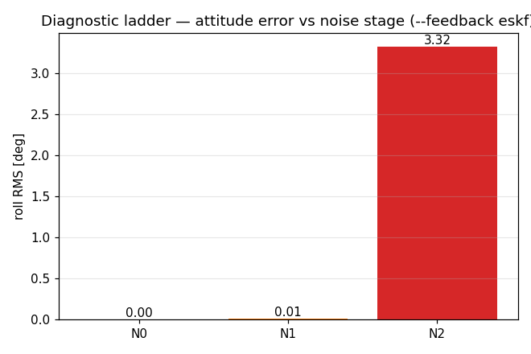
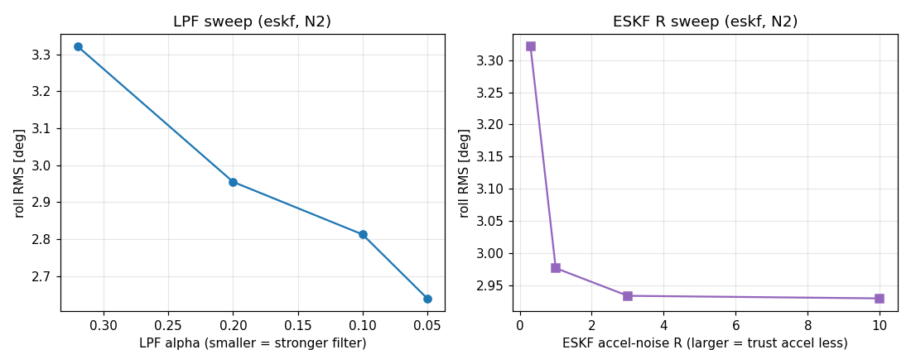
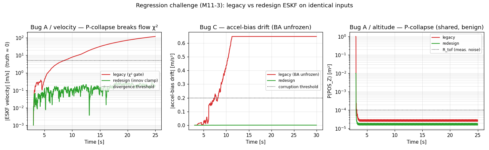

# StampFly 統合SIL 検証レポート（M1〜M11）

> **Note:** [English version follows after the Japanese section.](#english) / 日本語の後に英語版があります。

## 1. 概要

### このドキュメントについて

このレポートは、StampFly の SIL（Software-in-the-Loop。PC 上でファームを動かす検証環境）を、単なる動作確認の場から「バグの原因を切り分けるための診断ツール」として使えるところまで育ててきた開発（M1〜M11）の成果と検証結果をまとめたものである。M1〜M3 だけを扱っていた旧レポート（`M1-M3_validation_report.md`）を置き換える。

旧ファーム `firmware/vehicle/` では、状態推定（ESKF）と状態遷移の管理が原因とみられる不明なバグが起きており、これがファームを作り直す（vehicle_new）一番の動機になった。この開発では、ファーム本体の C++ コードを一切書き換えずに参照コンパイルし（Code Identity）、PC 上で制御則と状態遷移を毎回同じ結果になる形で検証する。そのうえで、旧ファームで実際に起きた既知のバグを SIL で再現できるかどうかを試し（プロジェクト内での呼称「回帰チャレンジ」）、SIL 自体がどこまでバグを捕まえられるかを見極める。

### 対象読者

- vehicle_new の開発者（人間・AI）
- SIL を使って制御系や状態遷移を設計・検証する研究者・学生
- 旧機の不明バグの原因を追っている人

### これまでの達成

**表1: マイルストーンと達成状況**

| マイルストーン | 内容 | 状態 |
|--------------|------|:---:|
| **M1** | PC で動かす土台（ESP-IDF 互換シム + トピックの実体定義） | ✅ |
| **M2** | 状態遷移のユニットテスト 47件 | ✅ |
| **M3** | StateManager を中心に据えた統合SIL（5シナリオ） | ✅ |
| **M4** | 閉ループ化（`--feedback truth\|eskf`）と突風の注入 | ✅ |
| **M5** | 段階的な要因の切り分け（ノイズ N0〜N2） | ✅ |
| **M6** | 制御設計の検証（評価指標・A/B比較・`control/` への記録） | ✅ |
| **M11-1** | 旧 ESKF（active_mask 型）を PC 上で無改変のままコンパイル | ✅ |
| **M11-2** | 旧バグ A/C を SIL で再現、並行処理由来の D/E は再現しないことを確認 | ✅ |
| **M11-3** | 新 ESKF を旧と同じ入力で並べ、A/C が直っていることを定量的に示した | ✅ |
| **M7** | 差分診断（実機ログを再生し、実機と SIL の差を測る） | ✅ |
| M8 | Model Fidelity（実機ログと照合し SIL の再現度を測る） | ⬜ 未着手 |
| M9 | ファーム全体の検証（起動・failsafe 連鎖・状態遷移の網羅） | ⬜ 未着手 |
| M10 | sf CLI への統合（PC-SIL バックエンド） | ⬜ 未着手 |

### SIL をどう使うか — 3つの考え方

**表2: SIL の使い方の3つの考え方**

| 考え方 | 内容 | 本レポートでの実証 |
|-------|------|------------------|
| **既知バグの再現テスト（回帰チャレンジ）** | 旧ファームで起きたバグを SIL で再現・検出できるか。SIL の実力を測る最も重要な検証 | §6（M11） |
| **差分診断** | 本体と同じコード・同じパラメータで動くので、実機で出たバグが「SIL で再現する＝ソフトが原因」「再現しない＝ハード・並行処理・通信が原因」と切り分けられる | §6.2、§7 |
| **段階的な要因の切り分け** | ノイズや非線形の要素を一段ずつ加えていき、どの段階で問題が出るかで原因を特定する | §5（M5/M6） |

## 2. 設計の柱 — 参照による Code Identity

この開発の中心にあるのは、**「ファーム本体と切り離した場所に置いているのに、走っているのは本体とまったく同じコードである」** という状態を保つことである。

- SIL は `simulator/sil/` に独立して置くが、ファーム本体（`eskf_core.cpp` / `state_manager.cpp` / `failsafe.cpp` など）を**コピーせず、相対パスで参照してコンパイルする**。
- ESP-IDF 依存（FreeRTOS / esp_timer / esp_log、旧 ESKF 用の `esp_err.h`）は `compat/` のシムが肩代わりし、**本体のソースは1行も書き換えない**。
- 全工程を通じて `git diff firmware/` が空であることを、コードが同一だと判定する基準とした。この基準は新ファーム（vehicle_new）だけでなく、再現テストで参照する旧ファーム（vehicle）にも同じく適用している。

```
firmware/vehicle_new/        ← 新ファーム（無改変）
   ├ components/sf_state/state_manager.cpp       ┐
   ├ components/sf_failsafe/failsafe.cpp         │ 相対パスで参照してコンパイル
   └ components/sf_estimator_eskf/eskf_core.cpp  ┘
firmware/vehicle/            ← 旧ファーム（無改変、再現テスト用）
   └ components/sf_algo_eskf/eskf.cpp            ┐ compat/esp_err.h 経由で参照
simulator/sil/               ← SIL（独立したツール環境）
   ├ compat/                 ← ESP-IDF 互換シム（新旧の本体を無改変で通す）
   ├ sil_topics.cpp          ← トピックの実体定義（params.cpp と同期）
   ├ integrated_sil.cpp      ← StateManager 中心の統合ループ（M3〜M6）
   ├ old_eskf_regression.cpp ← 旧/新 ESKF を並べる比較（M11）
   └ scenario.hpp / battery_model.hpp
```

## 3. 開発の道筋と進捗

目指すゴールは2つ —（1）ファーム全体の振る舞いの検証、（2）制御設計の正しさの検証。この2つから逆算した依存関係に沿って、土台のできたものから順に進めている。

```
M3(済)─┬─M4 閉ループ化──M5 要因の切り分け─┬─M6 制御設計の検証(ゴール2)
       │                                  └─M7 差分診断──M8 Model Fidelity
       └─M9 ファーム全体の検証(ゴール1, M4と並行可)
                          M5,M7,M8──M10 sf CLI 統合
            M5,M7,M9,M10──────────────M11 既知バグの再現テスト(中核)
```

最も重要な M11（既知バグの再現テスト）を先に実施した。これにより、**「SIL でバグを見つける → 直す → SIL で直ったことを確かめる」という一連の流れが、旧→新の実例で一周した**。実機ログを必要とする M7〜M8 と、ツール化の M10 は残っている（§8）。

## 4. M1〜M3 — 土台と状態遷移

### M1 — PC で動かす土台

`compat/` に最小限の ESP-IDF 互換ヘッダを用意した。

**表3: compat が用意した互換ヘッダ**

| ファイル | 役割 |
|---------|------|
| `compat/freertos/FreeRTOS.h` | `TickType_t` / `pdTRUE` / `portMAX_DELAY` などの基本型・定数 |
| `compat/freertos/semphr.h` | `SemaphoreHandle_t` を `std::mutex` に置き換え |
| `compat/freertos/queue.h` | `QueueHandle_t` をバイトコピーの `std::deque` に置き換え |
| `compat/esp_timer.h` | `esp_timer_get_time()` を `std::chrono` で実装 |
| `compat/esp_log.h` | `ESP_LOGx` を stderr へ（標準出力の CSV を汚さない） |
| `compat/esp_err.h` | `esp_err_t` / `ESP_OK` など（M11 で旧 ESKF 用に追加） |
| `sil_topics.cpp` | トピックの実体定義12個と `topics_init()`（`params.cpp` と同期） |

`make check` で、無改変の StateManager が `INIT → IDLE_GROUND → ARMED_GROUND` と正しく遷移する（"M1 OK"）。`git diff firmware/` は空。

### M2 — 状態遷移のユニットテスト

`firmware/vehicle_new/test/test_state_manager.cpp` に、毎回同じ結果になるユニットテストを47件用意した。**47件すべて PASS**。

**表4: 状態遷移ユニットテストの内訳**

| 種別 | 件数 | 検証内容 |
|------|:---:|---------|
| A. 正常な遷移 | 11 | INIT→IDLE→ARMED→TAKEOFF→FLYING→LANDING→IDLE の全エッジ、disarm、ソフトランディング、held の往復 |
| B. ガードによる拒否 | 12 | 不正な状態からの遷移要求が `false` を返し、状態が変わらない（二重 ARM、INIT からの ARM など） |
| C. モード変更 | 3 | FLYING 中の `requestModeChange` 全モード、同一モードへの要求は無変化 |
| D. アラート分岐 | 10 | IMPACT/GYRO_ANOMALY ×（空中/地上）、COMM_LOST ×（FLYING/非FLYING）、LOW_BATTERY/USB_POWER/ESKF_DIVERGED/NONE |
| E. コールバック | 5 | onExit→onEnter の順序、同一遷移では発火しない、onModeChange、複数登録の順序、上限 8 件 |
| F. Failsafe 閾値 | 5 | 衝撃 4G のラッチ、ジャイロ 1000dps、電圧 WARNING(3.3V)/EMERGENCY(3.0V)/未接続(≤0.1V) |
| G. 端から端まで | 1 | FLYING→高G→`failsafe.update`→`system_alert`→`handleAlert`→IDLE_GROUND |
| **合計** | **47** | **全 PASS** |

> **補足:** 既存の `test_main.cpp` にある `pid_integral` が1件 FAIL（0.95 と 1.0）。これはこの作業より前からあった別件で、状態遷移テストとは関係しない。

### M3 — StateManager を中心に据えた統合SIL

旧 `sil_main.cpp` では状態管理が `bool armed` と固定時刻 `T_ARM` で代用されていた。これをやめ、**本物の StateManager / Failsafe を無改変のままループで動かす**形に変えた。物理・ESKF・PID・状態遷移・failsafe が通しで動き、飛行状態がモーター制御のゲートと制御モードを決める唯一の基準になる。乱数の種を固定（`srand(1)`）しているので結果は毎回同じになる。

**表5: シナリオ別の検証結果**

| シナリオ | 注入する事象 | 期待する動き | 遷移数 | 最終状態 |
|---------|------|---------|:---:|---------|
| nominal | なし | 正常な飛行（離陸→ホバー→着陸） | 6 | IDLE_GROUND |
| comm_lost | t=8s に COMM_LOST | FLYING → LANDING → 着陸 | 6 | IDLE_GROUND |
| impact | t=8s に 8G | **緊急停止して IDLE**（再離陸しない） | 5 | IDLE_GROUND |
| low_battery | 3.3V まで低下 | 警告だけ（**状態は変えず**）→ 通常着陸 | 6 | IDLE_GROUND |
| eskf_diverged | t=8s に ESKF 発散 | リセット要求だけ（**状態は変えず**）→ 通常着陸 | 6 | IDLE_GROUND |


**図1: 正常飛行の詳細（高度・姿勢・状態遷移）。** 真値の高度と ESKF が推定した高度がよく一致している（離陸 → 0.5m ホバー → 着陸）。姿勢がほぼ平らなのは、外乱のないトリム飛行で、かつ制御に真値の姿勢を使っているためである（M3 の時点では ESKF の姿勢は制御に戻していないオープンループ推定。閉ループ化は M4）。下段の状態遷移が高度の動きと正しく対応している。


**図2: 全シナリオの状態遷移タイムライン。** 点線がアラートの発生時刻。異常系（comm_lost / impact）はアラートですぐに状態が遷移し、警告系（low_battery / eskf_diverged）は状態を変えずに飛行を続けることが一目で分かる。これは `handleAlert` の設計（IMPACT/COMM_LOST は遷移させ、LOW_BATTERY/ESKF_DIVERGED は通知だけにする）が正しく働いていることを示している。


**図3: 全シナリオの高度プロファイル。** impact（赤）が t=8s で急降下し（緊急着陸）、comm_lost（橙）は緩やかに自動着陸する。一方、警告系の3シナリオ（nominal / low_battery / eskf_diverged）は飛行の軌道が完全に重なる。「警告は飛行に影響しない（状態が変わらない）」ことが、軌道のレベルで裏付けられている。

## 5. M4〜M6 — 閉ループ化と制御設計の検証

制御設計の詳しい検証結果は `control/validation/sil_control_validation.md` に記録している。本節はその要点だけをまとめる。

### M4 — 閉ループ化

制御に真値の姿勢ではなく、**ESKF が推定した姿勢を戻す本来の閉ループ**にした。`integrated_sil.cpp` に `--feedback {truth|eskf}` を追加し、`truth` は M3 と数値が一致する（比較の基準点）、`eskf` が本来の閉ループになる。突風の注入も移植した。

- **確認できたこと:** `--feedback truth` が M3 とビット単位で一致し、`--feedback eskf` の閉ループでもホバリングが安定する（発散しない）。

### M5 — 段階的な要因の切り分け

`--feedback eskf`（ESKF 推定姿勢を戻した閉ループ）で、ノイズの要素を一段ずつ加えていき、姿勢誤差の原因がどこにあるかを切り分けた（プロジェクト内での呼称「診断の梯子」）。

**表6: ノイズの段階ごとの姿勢誤差**

| ノイズの段階 | roll RMS | 分かったこと |
|---------|:---:|------|
| N0（ノイズなし） | 0.000° | 閉ループ自体は健全（線形化の誤差は外乱がなければ出ない） |
| N1（白色ノイズ＋バイアス） | 0.013° | 白色ノイズはほとんど効かない |
| N2（振動を含むフル） | 3.321° | **スロットルに連動した振動が姿勢誤差の主因** |



**図4: ノイズの段階ごとの姿勢誤差（roll RMS）。** 段階を切り替えるだけで「ESKF の構造の問題か、ノイズの問題か」を数値で切り分けられた。

### M6 — 制御設計の検証（A/B比較）

主因と分かった振動に対して、ESKF 系の LPF 係数 α と加速度の観測ノイズ R を A/B 比較した（`--feedback eskf --noise-stage N2`）。結果は毎回同じになる。

**表7: 制御パラメータの A/B 比較**

| パラメータ | 範囲 | roll RMS | 効果 |
|-----------|------|:---:|------|
| LPF α | 0.32 → 0.05 | 3.32 → 2.64° | フィルタを強めると約20%改善 |
| ESKF R | 0.3 → 10 | 3.32 → 2.93° | 約12%改善、R≥3 で頭打ち |



**図5: 制御パラメータの A/B 比較（左: LPF α、右: ESKF R）。** 突風を加えても α=0.05 で roll RMS が 3.43→2.74°、roll の最大が 4.43→4.00° になった（この外乱の強さでは、フィルタを強めたことによる位相遅れの副作用はまだ目立たない）。

**分かったことと留保:** 振動による姿勢誤差は、LPF を強めても R を増やしても**改善は約20%にとどまり、根本的にはなくならない**。これは旧機の実機での知見（「元のゲインが一番よく、ノッチフィルタは効かない」）とも合っている。なお、この SIL は外乱が軽く激しい操作もないため、**フィルタを強めたときの位相遅れの副作用はまだ十分には現れていない**。強い外乱や速い操作での再評価が必要になる。**SIL で得た改善が実機でも効くかどうかは、Model Fidelity（M8、実機ログとの照合）で確かめてから判断する**（SIL での設計検証 → Model Fidelity → 実機適用 の順を守り、いきなり実機に入れることはしない）。

## 6. M11 — 既知バグの再現テスト（回帰チャレンジ）

SIL に価値があるかどうかは、結局「**本物の推定器バグを捕まえられるか**」で決まる。M11 では、旧 `firmware/vehicle/` の ESKF（active_mask 型）を SIL に載せ、既知のバグを再現し（陽性確認）、新しい ESKF では同じ入力でそれが直っていることを示す。

### M11-1 — 旧 ESKF をそのままコンパイルする土台

旧 ESKF が依存している ESP-IDF は `esp_err.h` だけである（FreeRTOS や NVS には依存しない）。`compat/esp_err.h` を1つ足すだけで、**無改変のまま参照コンパイルできた**（初期化後に `active_mask=0x06c0`、`pos_var=0.03`、"M11 link OK"）。`git diff firmware/` は空。

### M11-2 — 旧バグ A/C の再現（陽性確認）と、D/E が再現しないことの確認（陰性確認）

`old_eskf_regression.cpp` で、旧 ESKF を quad の物理 + 真値ベースの PID ホバリングのもとで動かした。ただし旧 ESKF の出力は制御には戻さず、横で推定だけを走らせている（オープンループ推定）。軌道は真値で毎回同じなので、旧と新の比較はそのまま厳密な A/B になる。

陽性確認として、再現すべき推定器バグが SIL で再現することを示した。

**表8: 旧バグの陽性確認（SIL で再現できたバグ）**

| バグ | モード | 何が起きるか | 意味 |
|------|--------|------|------|
| A / 速度 | `--mode flow` | ホバリング中に実機相当のオプティカルフローを与えると P(VEL) が縮みきり、正しいフロー更新が χ² ゲートで誤って棄却され、**ESKF の速度が 119.7 m/s まで発散する**（真値はほぼ 0） | 実運用では致命的な結果になる |
| A / 高度 | `--mode pcollapse` | 地上で静止したまま ToF を長く観測すると、P(POS_Z) が 1.0 から 2.4e-5（観測ノイズ R_tof=1e-4 を下回る）まで縮む | 共分散の値として再現できた |
| C | `--mode ba --free-ba` | 加速度バイアスを再び凍結する処理を省くと、バイアスが較正値から 0.65 m/s² ずれていく（既定どおり凍結すれば 0） | ファームがバイアスを凍結している理由を裏付ける |

**切り分けのための対照（`--no-flow-gate`）:** χ² ゲートを切ると、旧の速度発散は 0.54 m/s に収まる。これは、**発散の原因が χ² ゲートの破綻（P が縮みきったことの帰結）であって、こちらが人工的に作り出したものではない**ことを示している。

**陰性確認（`--mode negcal`）:** 並行処理が絡むバグ D（着陸検出のタイミング）・E（arbiter の競合）は、次の3つの理由から **SIL では扱えない**。(1) リンクの範囲（`eskf.cpp` だけをリンクし、`landing_handler` や `control_arbiter` はリンクしない）、(2) 依存関係（ESKF は FreeRTOS に依存しないが、D/E は mutex や状態の文脈に依存する）、(3) 単一スレッドで動かすため、競合（レース）は原理的に起きない。**これらが再現しないのは想定どおりの結果**であり、差分診断の裏返し（再現する＝ソフトが原因／再現しない＝ハードや並行処理が原因）になっている。

### M11-3 — 旧/新の A/B（新 ESKF で A/C が直っていることを定量的に示す）

同じハーネスに新 ESKF（`sf::EskfCore`）を載せ、旧と**まったく同じセンサ列で並べて動かした**（どちらも推定だけで、軌道は変わらない）。新側はファームと同じ設定（ToF + 適応 R + イノベーションのクランプ + ToF による速度観測）を使う。

**表9: 旧 ESKF と新 ESKF の比較（図6 の各パネルに対応）**

| 比較項目 | 旧（赤） | 新（緑） | 判定 |
|--------|---------|---------|------|
| バグA / 速度（縦軸は対数） | 119.7 m/s に発散 | 0.31 m/s に収まる（`flow_innov_clamp` + `updateToFVelocity`） | **作り直しで解消 ✅** |
| バグC（加速度バイアスのずれ） | 0.65 m/s² | 0.0009 m/s² | **作り直しで解消 ✅** |
| バグA / 高度（対数、P(POS_Z)） | 2.4e-5 まで縮む | 1.5e-5 まで縮む | **旧・新とも縮む（共通の現象）** |



**図6: 旧 ESKF と新 ESKF を同じ入力で比較（左: バグA/速度、中: バグC、右: バグA/高度）。** 赤が旧、緑が新。左・中のパネルで新側が有界に収まっており、作り直しで A/C が直ったことが読み取れる。右のパネルは旧・新とも縮むが、これは共通して起きる正常な現象である（下記の訂正を参照）。

#### 大事な訂正 — P が縮みきる現象の正しい理解

M11-2 で得た理解を M11-3 で正しく捉え直した。**P が縮みきる「現象」そのものはバグではなく、正常なカルマンフィルタの挙動**である（観測が一貫していれば共分散は縮む）。これは旧・新どちらのフィルタでも起きる（図6 の右パネル）。ToF・高度のチャネルは新旧とも**絶対値**でイノベーションを判定するゲートを使うので、縮んでも害はない。

問題になるのは、「**縮みきった P の上に χ²（マハラノビス距離）のゲートが乗る**」とき、つまり旧のフロー／速度チャネルである。`--no-flow-gate` の対照で旧の発散が消えることが、発散の原因が χ² ゲートの破綻だと裏付ける。これはまさに、旧コード `eskf.hpp:135` のコメント「P が縮みきると χ² ゲートが位置センサで機能しない」が指していた、実運用での実害そのものである。

→ つまり、`pcollapse` モードは**根本原因（旧・新に共通）を確認する**ためのもの、`flow` モードは**実運用上のバグと、その修正とを区別する**ためのもの、と位置づけがはっきりした。

### 一連の流れが一周した

M11 によって、「**SIL でバグを見つける → 直す → SIL で直ったことを確かめる**」という流れが、旧→新の実例で一周した。これが、SIL を診断ツールとして仕上げるうえで最も重要な到達点である。

## 7. SIL で扱えないこと（範囲の明示）

診断ツールが信頼されるためには、**自分では捕まえられないバグの種類をはっきり言えること**が条件になる。本 SIL は次のものを扱わない。

- **並行処理の競合（race condition）** — 単一スレッドで毎回同じ順に動かすため、原理的に起きない
- **割り込みのジッタ・スケジューリング** — `compat` のシムは実時間の挙動を再現しない
- **通信の物理層・キューあふれ** — ESP-NOW / WiFi の物理層はモデル化しない

差分診断（M7）は、実機と SIL で「再現する／しない」の判定を出し、**再現しない場合は「ハード・並行処理・通信が原因」と積極的に切り分ける**ことに価値がある（M11-2 の D/E の陰性確認がその原型）。

## 8. M7 差分診断（完了）と残作業 M8〜M10

### M7 — 実機ログ再生による差分診断（✅ 完了, 2026-05-30）

実機フライトログ（`logs/stampfly_udp_20260408T160105.jsonl`, 60秒飛行）の記録センサ列を、ログを実際に飛ばした旧ESKF（`stampfly::ESKF`）にオープンループ観測として再生し、SIL 推定を実機ログ自身の ESKF 出力と軸別 RMSE で照合した（ハーネス: `log_to_replay.py` → `log_replay` → `plot_replay.py`、両 ESKF とも参照コンパイルで Code Identity を維持）。

検証の核心は「同じ旧 ESKF コード・同じ実機 flow なのに、SIL は水平位置・速度が発散（pos_x RMSE 112 m）する一方、実機ログ自身は有界（[-0.39, 0.19] m）」という差分の切り分けだった。原因は **SIL が実機の運用 config（`firmware/vehicle/main/config.hpp`）を再現せず、ライブラリ既定値（`defaultConfig()`）で走らせていたソフト要因**にあった。実機は config.hpp で意図的に flow χ² ゲートを無効化（`FLOW_CHI2_GATE=0`、コメント「発散防止のため」）・innovation クランプを有効化（`FLOW_INNOV_CLAMP=0.3`）・大きな flow R（`FLOW_NOISE=0.30`）を用い、チューニングでバグ A（崩壊 P 上の χ² 誤棄却による速度発散）を運用上回避していた。SIL の `makeLegacyConfig()` を config.hpp の直接 include で `init.cpp` と 1 対 1 に合わせると、旧 ESKF の水平発散は完全に有界化した。

**表10: M7 差分診断 — config 不一致修正（H3）の効果（代表ログ, RMSE over t≥6s）**

| 軸 | 修正前（defaultConfig） | 修正後（実機config） | 新ESKF |
|----|------------------------|----------------------|--------|
| pos_x [m] | 112.88 | 0.12 | 0.08 |
| pos_y [m] | 27.23 | 0.08 | 0.16 |
| vel_x [m/s] | 4.85 | 0.05 | 0.05 |
| vel_y [m/s] | 2.02 | 0.06 | 0.05 |
| roll / pitch / yaw [deg] | 1.77 / 1.70 / 0.88 | 1.98 / 1.88 / 0.77 | 1.82 / 1.42 / 0.84 |

**M7 結論:** 旧 ESKF はオープンループ再生で実機ログの水平位置を ~0.12 m・姿勢を 3 軸平均 1.54° の軸別 RMSE で追従する。水平チャネルの発散は config 再現で完全に解消したため、その要因は **HW/タイミング/通信ではなくソフト（config）要因**と確定した（本レポートの中心的主張＝「再現＝ソフト要因／非再現＝HW・通信要因」が実機データで裏づけられた）。姿勢残差 ~1.5° は P 初期化・ウォームスタート・センサ到着順の差に帰属し、実機の `k_adaptive=10` が動的加速度時に加速度姿勢補正を弱めるため default config より僅かに大きい（厳密な 1° 以内一致には至らないが実用追従レベル）。本結果は §6 回帰チャレンジの「`--no-flow-gate` で旧発散が消える＝原因は χ² 破綻」とも整合する（実機は最初からゲート無効で運用）。**重要な学び:** コアを参照コンパイルしても**パラメータ（config）を再現しなければ Code Identity は不完全**であり、今回 config.hpp を直接 include してチューニングまで同一化した。詳細な検証過程（仮説 H1→H2→H3 の時系列ログと図）は `docs/m7_verification_journal.md` を参照。

### 残作業 — M8〜M10

M8〜M10 はいずれも**実機フライトログとの突き合わせ**を前提とし、SIL 単体では到達できない領域である。

**表11: 残っている作業（M8〜M10）**

| フェーズ | 内容 | 前提 |
|---------|------|------|
| **M8 Model Fidelity** | SIL が実機をどれだけ再現するかを層ごとにスコア化し、`development_roadmap.md` Phase 3.2 の許容差（ACRO ホバーのジャイロ RMS ±50%、ステップ応答の立ち上がり時定数 ±20%）を満たすか判定する | 実機ログ、M7 |
| **M9 ファーム全体の検証** | 起動シーケンス、failsafe の連鎖、状態遷移の網羅を測る（`scenario.hpp` の enum 拡張、47件のテストとの突き合わせ） | M4 |
| **M10 sf CLI 統合** | `sf sim` に PC-SIL バックエンドを足し、`sf log → 注入 → 差分 → tune` を一続きで回せるようにする | M5/M7/M8 |

## 9. 再現手順

```bash
cd simulator/sil

# M1: PC で動かす土台のリンク確認
make check                                  # → "M1 OK"

# M2: 状態遷移のユニットテスト（別ディレクトリ）
cd ../../firmware/vehicle_new/test && make test   # → 47/47 passed
cd ../../../simulator/sil

# M3: 統合SIL（毎回同じ結果）
make integrated_sil
./integrated_sil                            # nominal、CSV を標準出力へ
./integrated_sil --scenario impact 2>&1 >/dev/null | grep Transition

# M5: ノイズ段階ごとの切り分け
for s in N0 N1 N2; do
  ./integrated_sil --feedback eskf --noise-stage $s 2>&1 >/dev/null | grep "roll :"
done

# M6: A/B 比較
./integrated_sil --feedback eskf --noise-stage N2 --lpf-alpha 0.05 2>&1 >/dev/null | grep "roll :"
./integrated_sil --feedback eskf --noise-stage N2 --accel-noise 3.0 2>&1 >/dev/null | grep "roll :"

# M11: 既知バグの再現テスト（旧/新 ESKF の A/B）
make old_eskf_regression
./old_eskf_regression --mode flow                 # バグA/速度: 旧は発散、新は収まる
./old_eskf_regression --mode ba --free-ba         # バグC: 旧はずれる、新は収まる
./old_eskf_regression --mode pcollapse            # バグA/高度: 旧・新とも縮む
./old_eskf_regression --mode negcal               # D/E が再現しないことの確認

# 全グラフ（fig1〜fig6）を再生成
python3 plot_sil_results.py                 # docs/assets/*.png を出力
```

---

<a id="english"></a>

## 1. Overview

### About This Document

This report consolidates the results and verification of the roadmap (M1–M11) that grows the StampFly SIL from a mere sanity-check rig into a tool for **isolating the cause of bugs**. It supersedes the earlier report (`M1-M3_validation_report.md`), which covered only M1–M3.

The legacy `firmware/vehicle/` suffered unidentified bugs rooted in state estimation (ESKF) and state-transition management — the primary motivation for the firmware rewrite (vehicle_new). This effort verifies the control law and state machine deterministically on a PC while **reference-compiling the firmware C++ core unmodified (Code Identity)**, and then gauges how far the SIL can catch bugs at all by **reproducing the legacy firmware's known bugs** (called the "regression challenge").

### Achievement Summary

**Table 1: Milestones and status**

| Milestone | Content | Status |
|-----------|---------|:---:|
| **M1** | Host build base (ESP-IDF compat shim + topic instances) | ✅ |
| **M2** | State-transition unit tests (47) | ✅ |
| **M3** | StateManager-driven integrated SIL (5 scenarios) | ✅ |
| **M4** | Closed loop (`--feedback truth\|eskf`) + gust injection | ✅ |
| **M5** | Step-by-step cause isolation (noise N0–N2) | ✅ |
| **M6** | Control-design validation (metrics, A/B sweeps, `control/`) | ✅ |
| **M11-1** | Legacy ESKF (active_mask type) reference-compiled on host | ✅ |
| **M11-2** | Reproduce legacy bugs A/C; confirm concurrency-rooted D/E do not reproduce | ✅ |
| **M11-3** | Run new ESKF on identical inputs; show A/C are fixed, quantitatively | ✅ |
| M7 | Diff diagnosis (replay real-flight logs, real vs SIL) | ✅ Done |
| M8 | Model Fidelity (match against real-flight logs) | ⬜ TODO |
| M9 | Firmware behavior coverage (boot, failsafe chains, transitions) | ⬜ TODO |
| M10 | sf CLI integration (host-SIL backend) | ⬜ TODO |

### How the SIL Is Used — Three Ideas

1. **Reproducing known bugs (the "regression challenge"):** can the SIL reproduce/detect the legacy firmware's known bugs? — the most important measure of the SIL's worth (§6).
2. **Diff diagnosis:** because it runs the same code and the same parameters as the firmware, a hardware bug can be classified as "reproduces in SIL → software cause" vs "does not reproduce → hardware / concurrency / comm cause" (§6.2, §7).
3. **Step-by-step cause isolation:** add noise and nonlinear effects one stage at a time, and localize the cause by which stage the problem appears at (§5).

## 2. Design Principle — Code Identity by Reference

The core idea is to keep the SIL **running the exact same code as the firmware, even though it lives in a separate place**.

- The SIL lives independently in `simulator/sil/` but compiles the firmware core (`eskf_core.cpp` / `state_manager.cpp` / `failsafe.cpp`) **by relative-path reference, not by copy**.
- ESP-IDF dependencies (FreeRTOS / esp_timer / esp_log, and `esp_err.h` for the legacy ESKF) are handled by `compat/` shims; the **firmware sources are never edited**.
- An empty `git diff firmware/` is the criterion for "the code is identical" throughout — applied to both the new firmware (vehicle_new) and the legacy firmware (vehicle) referenced by the reproduction test.

## 3. Roadmap and Progress

The two end goals — (1) firmware behavior verification, (2) control-design validation — drive a dependency-faithful order, building from the parts whose foundations are ready. The most important milestone, M11 (reproducing known bugs), was done first, closing the loop **"find a bug in SIL → fix it → confirm it is fixed in SIL"** on a legacy→new example. M7–M8 (phases needing real-flight logs) and M10 (tooling) remain (§8).

## 4. M1–M3 — Base and State Transitions

- **M1:** `compat/` provides minimal ESP-IDF headers (FreeRTOS mutex → `std::mutex`, queue → `std::deque`, `esp_timer_get_time` → `std::chrono`, `ESP_LOGx` → stderr, plus `esp_err.h` for M11). `make check` drives the unmodified StateManager `INIT → IDLE_GROUND → ARMED_GROUND`; `git diff firmware/` stays empty.
- **M2:** 47 deterministic unit tests in `test_state_manager.cpp`, **all passing** (11 normal transitions, 12 guard rejections, 3 mode changes, 10 alert branches, 5 callback, 5 failsafe thresholds, 1 end-to-end). An unrelated pre-existing `pid_integral` failure is out of scope.
- **M3:** the legacy `bool armed` + hardcoded `T_ARM` fake state is replaced by the **real, unmodified StateManager / Failsafe driven through the loop**. Five scenarios verified deterministically (Table 5). See **Figure 1** (nominal altitude/attitude/state), **Figure 2** (per-scenario state timelines — faults transition immediately, warnings keep flying), **Figure 3** (altitude overlay — warning scenarios overlap exactly) in the Japanese section.

**Table 5: Per-scenario verification results**

| Scenario | Injection | Expected | Transitions | Final |
|----------|-----------|----------|:---:|-------|
| nominal | none | normal flight | 6 | IDLE_GROUND |
| comm_lost | COMM_LOST @8s | FLYING → LANDING | 6 | IDLE_GROUND |
| impact | 8G @8s | **emergency IDLE** | 5 | IDLE_GROUND |
| low_battery | 3.3V sag | warning only (**no state change**) | 6 | IDLE_GROUND |
| eskf_diverged | divergence @8s | reset only (**no state change**) | 6 | IDLE_GROUND |

## 5. M4–M6 — Closed Loop and Control-Design Validation

Detailed control-design findings are recorded in `control/validation/sil_control_validation.md`. Summary:

- **M4 (closed loop):** feed back **ESKF-estimated attitude** instead of truth. `--feedback {truth|eskf}` added; `truth` matches M3 bit-for-bit (the baseline for comparison), `eskf` is the real closed loop. Gust injection ported. Closed-loop hover is stable.
- **M5 (step-by-step cause isolation):** adding noise one stage at a time isolates the cause (Figure 4): N0 (none) → roll RMS 0.000°, N1 (white+bias) → 0.013°, N2 (full, with vibration) → **3.321°**. Throttle-coupled vibration is the dominant cause.
- **M6 (A/B sweeps):** (Figure 5) LPF α 0.32→0.05 gives roll RMS 3.32→2.64° (~20%); ESKF R 0.3→10 gives 3.32→2.93° (~12%, saturates at R≥3). Vibration-induced error improves only modestly and is not eliminated — consistent with the legacy finding "stock gains best / notch filter ineffective." **Whether this transfers to hardware is judged only after Model Fidelity (M8).**

## 6. M11 — Reproducing Known Bugs (the "Regression Challenge")

Whether the SIL is worth anything comes down to whether it **catches real estimator bugs**. M11 loads the legacy `firmware/vehicle/` ESKF (active_mask type) into the SIL, reproduces known bugs (positive check), and shows the new ESKF fixes them on identical inputs.

### 6.1 Positive Check (M11-1, M11-2)

- **M11-1:** the legacy ESKF's only ESP-IDF dependency is `esp_err.h`. Adding `compat/esp_err.h` reference-compiles it **unmodified** (`active_mask=0x06c0`); `git diff firmware/` empty.
- **M11-2:** `old_eskf_regression.cpp` drives the legacy ESKF under quad physics + truth-PID hover, with its output not fed back into control — only the estimate runs alongside (open-loop). The trajectory is from truth and is identical every run, so the legacy/new comparison is a clean A/B.

**Table 8: Positive check — bugs reproduced in the SIL**

| Bug | Mode | What happens |
|-----|------|------------|
| A / velocity | `--mode flow` | P(VEL) collapses; a valid flow update is wrongly rejected by the χ² gate; **ESKF velocity diverges to 119.7 m/s** (truth ≈ 0) |
| A / altitude | `--mode pcollapse` | static ToF → P(POS_Z) shrinks 1.0 → 2.4e-5 (below R_tof=1e-4) |
| C | `--mode ba --free-ba` | with bias re-freezing omitted, the accel bias drifts 0.65 m/s² from calibration (0 when frozen) |

The `--no-flow-gate` control bounds the legacy divergence to 0.54 m/s, showing the divergence comes from **the χ² gate breaking down (a consequence of the collapsed P), not from something we manufactured**.

### 6.2 Negative Check (D/E)

Concurrency bugs D (landing-detection timing) and E (arbiter contention) are **out of SIL scope** for three reasons: link boundary (only `eskf.cpp` is linked), dependencies (ESKF is FreeRTOS-free, while D/E need mutex/state context), and determinism (single-thread → no races by definition). **Their non-reproduction is the expected result** and is the flip side of diff diagnosis.

### 6.3 Legacy vs New A/B (M11-3)

The new ESKF (`sf::EskfCore`) is run alongside the legacy one on the **same sensor stream** (both estimate-only, trajectory unchanged). See **Figure 6** in the Japanese section.

**Table 9: Legacy vs new ESKF (corresponding to the panels of Figure 6)**

| Item | Legacy (red) | New (green) | Verdict |
|------|--------------|-------------|---------|
| Bug A / velocity (log) | diverges to 119.7 m/s | bounded at 0.31 m/s (`flow_innov_clamp` + `updateToFVelocity`) | **fixed by the rewrite ✅** |
| Bug C (accel-bias drift) | 0.65 m/s² | 0.0009 m/s² | **fixed by the rewrite ✅** |
| Bug A / altitude (log, P(POS_Z)) | shrinks to 2.4e-5 | shrinks to 1.5e-5 | **both shrink (shared phenomenon)** |

**An important correction:** the shrinking of P is itself not a bug but normal Kalman behavior (covariance shrinks under consistent observation), and it happens in both filters (Figure 6, right panel). The ToF/altitude channels gate innovation by **absolute value** in both, so shrinking is harmless. The bug only appears when a **χ² (Mahalanobis) gate sits on top of a collapsed P** — the legacy flow/velocity channel. That `--no-flow-gate` removes the divergence confirms the χ² gate is the cause. This is exactly the operational harm pointed at by the legacy comment at `eskf.hpp:135`. So `pcollapse` confirms the shared root cause; `flow` distinguishes the operational bug from its fix.

M11 closes the loop **"find a bug in SIL → fix it → confirm it is fixed in SIL"** on a real legacy→new example.

## 7. What the SIL Cannot Cover (Explicit Scope)

A diagnostic tool earns trust by **clearly stating which kinds of bugs it cannot catch**: concurrency races (single-thread deterministic → none by definition), interrupt jitter/scheduling (the shims do not reproduce real-time behavior), and the comm physical layer / queue overflow (ESP-NOW/WiFi PHY not modeled). Diff diagnosis (M7) outputs a reproduce/not-reproduce verdict between real and SIL, and **actively classifies non-reproduction as a "hardware / concurrency / comm cause"** — the D/E negative check in M11-2 is its prototype.

## 8. M7 Diff Diagnosis (Done) and Remaining Work M8–M10

### M7 — differential diagnosis by real-log replay (✅ done, 2026-05-30)

A recorded sensor stream from a real flight (`logs/stampfly_udp_20260408T160105.jsonl`, 60 s) was replayed through the legacy ESKF that flew it (`stampfly::ESKF`) as an open-loop observer and compared, per axis, against the firmware's own logged ESKF output (harness: `log_to_replay.py` → `log_replay` → `plot_replay.py`; both ESKFs reference-compiled, Code Identity preserved).

The puzzle: with the *same* legacy code and the *same* real flow, the SIL diverged horizontally (pos_x RMSE 112 m) while the real flight stayed bounded ([-0.39, 0.19] m). The cause was a **software (config) factor** — the SIL ran the library `defaultConfig()` instead of the firmware's operational config (`config.hpp`). The firmware deliberately **disables the flow chi-square gate** (`FLOW_CHI2_GATE=0`), **enables the innovation clamp** (`FLOW_INNOV_CLAMP=0.3`), and uses a large flow R (`FLOW_NOISE=0.30`) — it avoids bug A by tuning. Matching `makeLegacyConfig()` to `init.cpp` (by `#include`-ing the firmware's own config.hpp) made the legacy horizontal divergence vanish: pos_x 112.88 → 0.12 m, vel_x 4.85 → 0.05 m/s; attitude tracks the log at ~1.54° mean RMSE.

**M7 conclusion:** the horizontal divergence is a software (config) factor, not HW/timing/comm — the report's central claim (reproduce = software cause / not = HW·comm cause) is now backed by real data. The ~1.5° attitude residual is attributed to P-init / warm-start / sensor-arrival-order differences. This is consistent with §6's "`--no-flow-gate` removes the legacy divergence → cause is chi-square breakdown" (the real firmware ran with the gate off from the start). Key lesson: reference-compiling the core is not enough — **Code Identity is incomplete unless the parameters (config) are reproduced too**. See `docs/m7_verification_journal.md` for the H1→H2→H3 log.

### Remaining work — M8–M10

**Table 11: Remaining work (M8–M10)**

| Phase | Content | Prerequisite |
|-------|---------|--------------|
| **M8 Model Fidelity** | layered fidelity scores vs `development_roadmap.md` Phase 3.2 tolerances (ACRO hover gyro RMS ±50%, step time-constant ±20%) | real logs, M7 |
| **M9 Firmware verification** | boot sequence, failsafe chains, transition coverage (vs the 47 tests) | M4 |
| **M10 sf CLI** | host-SIL backend for `sf sim`; `sf log → inject → diff → tune` pipeline | M5/M7/M8 |

M8–M10 require matching against real-flight logs, so they are the next steps.

## 9. Reproduction

See the command block in the Japanese section (§9).
